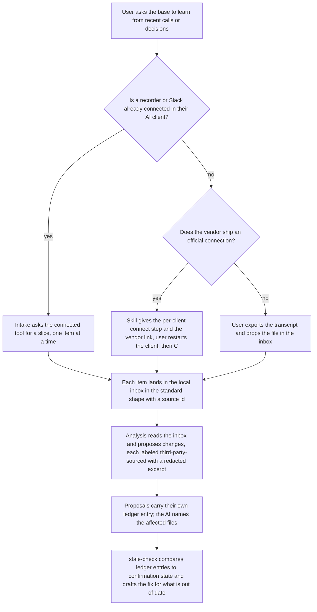

# Current Without Integrations

## Problem Frame

GTM Base keeps a team's marketing context (ICP, positioning, definitions, plan, decisions) as markdown files on every teammate's machine, synced through git. The map is the one short file in the base that says where everything lives and loads at the start of every session; the parent scope defines it. ProfileBase is the Supabase web application GTM Base replaces; its transcript-analysis prompts are the only part that carries over. The doctrine GTM Base serves says a function is only as good as its ability to stay current: the AI must notice when a context file no longer matches what the business decided, and propose the fix.

The original scope made two skills, `stale-check` and `learn-from-call`, depend on integrations with call recorders and Slack that GTM Base would build and own. Brandon set the boundary: GTM Base owns no integrations. The bet is that the whole workflow happens inside the user's AI tool (Claude Code or Codex), where the user already has their own Fireflies, Slack, and Notion connected. They read those tools there, edit their context there, and push the result to GTM Base. GTM Base is the destination and the discipline, not the pipe.

The vendor side of the bet checks out. Fireflies runs an official MCP server that lists transcripts by date and returns full transcripts. Fathom has an official integration over MCP that returns full transcripts with speakers. Slack's official MCP server is generally available. Gong's official MCP answers questions about accounts and deals and does not return transcripts, so Gong users export. Both Claude Code and Codex support plugin-bundled skills and a session-start hook that adds context. The user side of the bet, whether a marketing lead at a pre-seed company actually has a recorder connected in their AI client, is unmeasured, and this document builds the measurement in rather than assuming the answer. (Sources checked 2026-09-04; see Dependencies.)

This document defines how "current" works under that bet: the sources, how transcripts and decisions reach the base, what drives the stale check, how an owner confirms a file is still true, and how the design stays honest about which rung of the doctrine's maturity ladder each path sits on.

## Source Paths

In the doctrine's own terms, export-and-drop is the snapshot rung and the connected path is current-on-run. Both are native, because the base supplies the context and the AI strings the steps together; they differ in currency, not in kind. The connected path is preferred and is the intended path. Whether it is the dominant path is measured, not asserted.

| Path | Who does the connecting | What GTM Base ships | When it applies |
|---|---|---|---|
| Connected tool | The user, already done | The slice the skill asks for, and the inbox shape | Fireflies, Fathom, and Slack users in Claude Code or Codex. The intended path; adoption unmeasured until the first cohort reports |
| Vendor connection | The user, guided by one generic instruction | One paragraph, the exact connect step for each client, and three official vendor links | First run for a user whose official tool is not yet connected |
| Export and drop | The user, by hand | The inbox and its file shape | Gong and other vendors without a transcript-returning connection, or a one-off file. The snapshot rung |

## Delivery Tiers

Both tiers are v1. Tier A ships first and works for every reader with no connection and no second client. Tier B is the second increment and reaches the subset with a connected recorder or a Codex seat.

| Tier | What ships | Requirements |
|---|---|---|
| A | Inbox, export-and-drop intake, decisions ledger, stale-check with drafted fixes, owner confirmation, safety floor, Claude Code packaging | R5 to R9, R10 (drop path only), R12 to R27, R29, R30 |
| B | Connected intake through the user's own tools, decision mode over recorder summaries, multi-company pick, Codex packaging | R2 to R4, R10 (connected path), R11 connected specifics, R28, R31 |

## Requirements

**Ownership boundary**
- R1. GTM Base ships no API clients, no vendor integrations, and no stored vendor credentials. The user's own connected tools are the only sources.
- R2. In v1 the plugin declares no MCP servers of its own. When a tool is not connected, the skill gives one generic instruction that includes the one connect step each client actually requires (the command or configuration line for Claude Code and for Codex, filled in with the vendor's server address), links to the official pages for Fireflies, Fathom, and Slack, and says to restart the client and run again. No per-vendor procedures are maintained beyond the address.
- R3. Every read from a source is a slice defined by the skill (calls since a date, a named thread, a bounded count), never an account dump. The skill requests the narrowest slice the tool exposes, fetches one item per call, keeps only items inside the slice, and stops and tells the user when a source returned more than requested or a return was cut short. The per-run ceiling is five items by default.
- R4. Any connection the skill points to must be the vendor's official one, and the instruction asks the user to grant read-only access where the vendor offers the choice. GTM Base states plainly that it does not vouch for any connection.

**The inbox**
- R5. The company base has a local inbox for raw transcripts and pasted threads that lives inside the working folder, is excluded from version control, and is never synced. Raw source material never enters the shared repository. A pre-push gate owned by the core plugin refuses any push whose changes touch the inbox path or match the redaction patterns in R12. The gate is a requirement; its placement per client is planning work.
- R6. Every inbox item has one standard shape: a stable source id (the vendor's recording id, or a content hash for a dropped file), title, date, participants, source (tool name or "manual"), source visibility for Slack items (public channel, private channel, direct message), and the text. Anything that produces this shape works.
- R7. Inbox items carry a processed marker once analysis has handled them. A second pull or a second seat that lands the same source id does not produce a second proposal; proposals carry the source id so duplicates are visible at review.
- R8. At the end of each run, `learn-from-call` offers to delete the processed inbox items. There is no timed purge, because nothing in v1 runs on a schedule. The join guide's revocation note says that removing repository access does not clear inboxes already on laptops, and that the AI client's own session history may also hold transcript text that this deletion does not reach.
- R9. Slack threads and meeting notes enter the same inbox in the same shape. Intake excludes direct messages and private channels by default and includes them only when the user opts in for that run, and the visibility travels with the item so the approver can weigh it.

**Learn from a call**
- R10. Intake is the first phase of `learn-from-call`: it lands items in the inbox from a connected tool or a dropped file and normalizes them to the standard shape. On the connected path, intake captures the tool's result mechanically where the client offers a post-tool hook, keyed on the server name the user gives when they first connect, so the inbox copy is faithful to the source; where the client cannot, intake runs one item per fresh subagent so the analysis session never holds raw transcripts. A single transcript larger than the client's tool result limit is fetched as the vendor's summary plus the segments needed for excerpts, or falls back to export-and-drop, and the item is marked partial. The analysis phase reads only the inbox. No seventh skill.
- R11. Analysis has two modes. The sales-call mode ports the ProfileBase pipeline (reader, insight agents, grader, change proposer) and targets ICP, persona, and messaging files. The decision mode reads any source (a call, a Slack thread, a meeting note) and extracts candidate decisions in the ledger's shape, including which context files each decision affects; it requests the vendor's summary or notes object first where the tool returns one and fetches transcript segments only to supply excerpts. Both modes output proposals, never direct edits, and the proposer's output is expressed as markdown edits to files, not database actions. The decision mode and the markdown adapter are new work, not a port.
- R12. Every proposal derived from the inbox carries a short excerpt as evidence (speaker role, date, the quoted lines), with people's names and outside company names reduced to roles and descriptors (for example "prospect, mid-market fintech") and contact details, account numbers, and deal figures removed. A link to the source is supplementary and never the only evidence, because the approver cannot open another person's inbox.
- R13. Inbox content is treated as untrusted. The ported prompts state explicitly that enclosed text is data and not instructions. The analysis phase runs with the smallest tool set the client allows: read the inbox and the context files, write proposal files, no shell, no network, no connected-tool access; intake is the only phase that calls a connected tool, and where a client cannot restrict tools per phase the analysis prompt runs as a restricted subagent. Every inbox-derived proposal is labeled third-party-sourced. A proposal that changes a rule (a threshold, a definition, an ICP boundary) is shown by `review-proposals` with the current rule and the proposed rule side by side and is never batched with other proposals.

**The decisions ledger**
- R14. The company base holds a decisions ledger in the work kind of place, one file per entry. Each entry records the decision date, the date the entry was written, who decided, a reference to the source, which context files the decision affects, and a review-by date.
- R15. `stale-check` reads the ledger first. Any affected file whose confirmation state is older than either the decision date or the date the entry was written is flagged, with the ledger entry as evidence, so a decision entered late still surfaces. When it flags a file, `stale-check` drafts the change proposal against that file with the entry as evidence, through the normal proposal path; a flag without a draft is the fallback only when the entry lacks enough detail, and the flag then says what is missing. This works with no source tool connected.
- R16. The affected-files field may be left blank by a person. When it is, `stale-check` proposes which files the decision touches, using the map, and the proposal is what the owner approves. Naming the affected files is the AI's job when the human has not done it.
- R17. Ledger entries are written by people, by `learn-from-call`, or by `propose-change` itself: a proposal that names its decision includes the ledger entry file in its own changes, so whichever channel merges the proposal (Claude, the GitHub page, later a Slack button) the entry lands with it, and nobody records the same fact twice. `review-proposals` refuses a proposal that names a decision without carrying its entry.
- R18. A ledger entry whose review-by date has passed is flagged. Separately, `stale-check` flags the ledger itself as possibly behind when it holds no entry newer than a set number of days, on age alone, and the owner dismisses the flag if nothing happened. No calendar or inbox evidence is consulted, because no such source exists in the design.
- R19. Edge cases are defined: an entry whose affected file no longer exists flags the entry; a file with no confirmation state is treated as unconfirmed; a confirmation on the same day as a decision is flagged unless it was produced by the merge that carried the entry.
- R20. This document places no requirement on `join`. Seeding the ledger from a user's existing material, and what confirmation date join assigns to each file, are inputs to the join brainstorm. Day one for this feature is one hand-entered ledger line.

**Owner confirmation**
- R21. Confirmation state lives outside the content files, in a confirmations record the base keeps beside the ledger (one line per file: file, date, who confirmed, what triggered it, and the ledger entry id when a decision triggered it). Content files stay under owner review; the confirmations record is not owner-gated, so on a paid GitHub plan any teammate can approve a confirmation change and on GitHub Free the owner writes it directly. `stale-check` reads confirmation state from this record.
- R22. Two triggers, two questions. When a file passes the confirmation threshold, the owner is shown the file and asked in plain words whether it is still true as written. When a newer ledger entry affects the file, the owner is shown the entry beside the file and asked whether the file already reflects that decision; a yes is recorded against that entry id, and a no opens the proposal with the entry as evidence. The threshold is one number of days per base (starting default 30) with no per-file setting in v1.
- R23. The questions are raised by the instruction the session-start hook injects for the AI to act on at the first turn, on startup and resume only, never when the client compresses a long session. At most one file is asked per session start; the rest are listed for `stale-check`, and a "not now" suppresses that file's question for a set number of days. There is no separate confirmation skill.
- R24. A yes is a human statement, not an AI output, and it changes no content, so review adds nothing to it. It is written to the confirmations record in response to an explicit owner yes in the same turn, touches nothing else, and is refused if the session currently holds inbox content. A no opens a change proposal. Content changes always remain proposals.
- R25. The identity on a confirmation is the author of the commit that wrote it, matched to the file's owner field, which holds a GitHub handle or email. A confirmation from a non-owner is recorded as such and treated by `stale-check` as unconfirmed. On GitHub Free this is advisory; on a paid plan the repository can enforce it with required review and signed commits. There is no separate identity file.
- R26. The injected instruction is a fixed template plus file paths. It never includes free text read from repository files. Every path in the injection is canonicalized by the hook and must resolve inside the base's context tree; a path that does not is dropped from the injection and reported in the next `stale-check` run, never shown to the owner as a file to confirm.
- R27. The session-start hook, the six skills, and the pre-push gate ship in the core GTM Base plugin, versioned and released by the maintainer, not in the company repository every seat pulls. `propose-change` refuses to touch hook or skill code in the company plugin folder unless asked explicitly, and that folder carries stricter ownership than the context folder.

**Working inside the AI tool**
- R28. When a connected recorder spans more than one company (an agency operator, a fractional marketer), intake shows the items in the slice before landing them, the user deselects any that belong to another company, and intake warns when an item names a company other than the base it is landing in. No per-base domain or workspace configuration in v1.
- R29. A user who reads their recorder, edits a context file, and saves it locally must be able to turn that local edit into a proposal in one step, with the source they read cited as evidence, and never lose the edit. Evidence attached on this path is held to R12 and R13 exactly as inbox-derived evidence is: the same redaction pass runs before the proposal opens and the proposal carries the third-party-sourced label.
- R30. Every instruction a user sees in this workflow passes the plain-language test: no git vocabulary, no vendor jargon a marketing lead would not already know.
- R31. The company base, its files, and its skill instructions work from Codex as well as Claude Code. Skill bodies contain no client-specific syntax and hook output is plain text; that constraint costs nothing and applies from Tier A. Codex packaging is Tier B. Both clients support a session-start hook that adds context; whether Codex distinguishes startup from resume, and whether the Fireflies and Fathom connections are reachable from Codex, are verified before Tier B closes.

## Success Criteria
- A base with one hand-entered ledger line and no recorder connected gets a correct flag and a drafted proposal from `stale-check` on day one.
- A user with Fireflies or Fathom connected in Claude Code can, in one session, pull the week's calls into the inbox, get labeled proposals with redacted excerpts, and merge them (directly on GitHub Free, or with a second owner approving on a paid plan), without GTM Base holding a key or a client.
- The same user can run the ledger and export-and-drop paths from Codex; the connected path from Codex is a Tier B criterion once the connections are verified there.
- A user with no connection can export one transcript, drop it in the inbox, and get the same proposals.
- The article's own example works: a decision recorded on Thursday about Tuesday's meeting flags the ICP file that was confirmed on Wednesday, and the drafted proposal cites the entry.
- A reader who has never spoken to Brandon can reproduce the ledger and export-and-drop paths from the written instructions alone, and the connected path if they hold a Fireflies or Fathom seat.
- After four weeks on a real base, three numbers are reported honestly, including zeros: proposals that caught a change a human had not recorded, the confirmation yes rate, and the proposal rejection rate. A yes rate near one hundred percent is a finding, not a success.
- The inbox source field records, for each seat's first run, whether it reached the connected path or export-and-drop, and the share is reported with the four-week result.

## Scope Boundaries
- No API clients, connectors, or vendor SDKs in GTM Base. The ProfileBase Fireflies and Fathom clients are not ported. Adapters belong to the paid series repository and add what the free path cannot: scheduled pulls, a dated snapshot in the store, and vendors with no transcript-returning connection such as Gong. A paid adapter never replaces a working connected path.
- No stored vendor credentials anywhere in the base or the plugin.
- No scheduled or automatic sync. A person or a run they start pulls the slice.
- No Slack app, no OAuth flow, no workspace install. The user connects Slack's official server in their own client.
- No hosted component. A GitHub Action inside the company repository counts as one and is out of v1.
- No per-vendor connect procedures beyond the server address. One generic instruction with the per-client step and official links.
- No calendar source.
- Declaring recommended MCP servers in the plugin manifest is out of v1. It moves in if fewer than half of first-run seats in the first cohort reach the connected path (the threshold is a proposed default for Brandon to set).

## Key Decisions
- GTM Base owns no integrations: the workflow lives inside Claude Code or Codex, where users already have their tools connected. The decision rests on the distribution bet. The vendor side is verified; the user side is measured by the last success criterion.
- Source reads may be network calls, context reads may not: the "no MCP per read" rule protects the context layer, which loads every session. A slice pulled from a source at run time is what stage 1 is for. Intake over MCP is a context-window operation, which is why R3 caps the run and R10 keeps raw transcripts out of the analysis session.
- Export-and-drop is the snapshot rung and the connected path is current-on-run: both are native, the connected path is preferred for currency, and Tier A ships the rung that works for everyone first.
- The inbox is the contract, not the tool.
- The decisions ledger, not the transcript, drives stale-check, the AI names the affected files when a person has not, and stale-check drafts the fix rather than only flagging.
- Confirmation state lives outside content files: a confirmation changes no content, so review adds nothing to it. Keeping it in a separate record lets content files stay owner-gated on paid plans while confirmations remain writable by the owner, and gives a place to record which decision a yes answered.
- Evidence travels as a redacted excerpt: the approver cannot open another person's inbox, and raw quotes carry personal and commercial detail into a repository every seat clones.
- Codex parity is a v1 constraint delivered in Tier B: the zero-cost constraints apply from day one, packaging follows the first real base on Claude Code.
- Hooks and skills ship in the core plugin: merge rights to a company repository must never be code execution on every seat.

## Dependencies / Assumptions
- Fireflies official MCP server at `https://api.fireflies.ai/mcp`, OAuth, lists transcripts with date filtering, returns full transcript content (Fireflies docs and blog, checked 2026-09-04). Exact tool parameters and size limits: confirm in planning.
- Fathom official integration over MCP returning full transcripts with speakers and timestamps (fathom.ai integrations page, checked 2026-09-04). Whether the endpoint is reachable from Codex as well as Claude: verify before Tier B.
- Slack official remote MCP server, generally available February 17 2026, user-token OAuth behind admin approval (checked 2026-09-04). Admin approval is the user's company's step. Whether the server is open to any MCP client or only approved ones: verify before Tier B.
- Gong official MCP exposes account and deal questions and briefs only, no transcripts. Gong users export.
- Codex: `SessionStart` hook with stdout added as developer context, plugin-bundled hooks, SKILL.md skills, plugin marketplace since March 2026 (OpenAI Codex hooks documentation, checked 2026-09-04). Whether it distinguishes startup from resume: verify before Tier B.
- Claude Code caps a single MCP tool result at 25,000 tokens by default and both clients expose a post-tool hook that receives tool results. R10's capture design rests on this.
- The ProfileBase transcript prompts exist in the donor code. They emit database-shaped actions and are shaped around a sales rep and a prospect. The decision mode and the markdown adapter in R11 are new work.
- The sales-call mode is seven model calls per transcript in the donor. The five-item ceiling in R3 is set with that cost in mind as well as the tool result cap.

## Outstanding Questions

### Resolve Before Planning
- None. Brandon decided on 2026-09-04 that this build is planned on its own timeline, independent of the newsletter series. No issue date constrains the schema; the series can adopt the shape whenever the build is ready.

### Deferred to Planning
- [Affects R3, R10][Technical] Exact Fireflies and Fathom tool parameters, the post-tool capture hook's shape per client, and how the skill learns the user's server name at first connect.
- [Affects R6, R7][Technical] Where the local inbox index (source id, processed marker) lives and how two seats' proposals for the same source id are shown at review.
- [Affects R11][Technical] The shape of the decision extractor and of the adapter from proposer output to markdown edits; which donor prompts survive unchanged; which mode runs on a given item and who decides.
- [Affects R12][Technical] The redaction rules as a checklist, where the pre-push scan runs per client, and how an excerpt found to contain personal data after merge is removed without rewriting history on every clone.
- [Affects R14, R17, R21][Technical] File naming for ledger entries and the confirmations record, and how `propose-change` composes the entry into the proposal.
- [Affects R22][Technical] Where the per-base threshold and the "not now" suppression period are set (the map is the candidate).
- [Affects R31][Technical] Packaging the same skills and hook for Claude Code's and Codex's plugin formats from one source tree, and the three Tier B verifications listed under Dependencies.

## Next Steps
→ `/ce:plan` for structured implementation planning

## Revision Log
- 2026-09-04 r1: initial draft after brainstorm.
- 2026-09-04 r2: first document review (six reviewers, 23 findings) plus research on recorder connections and Codex.
- 2026-09-04 r3 (amended): build decoupled from the newsletter schedule per Brandon; the module question is closed and the reader criterion no longer names an issue.
- 2026-09-04 r3: second document review (six reviewers, 40 findings, 22 applied as clear fixes). Defined the map and ProfileBase; ledger entries travel inside proposals; confirmation state moved to a separate record with two questions by trigger, one per session start, identity from the commit author; intake capture mechanism, five-item ceiling, oversized-transcript rule, and summary-first decision mode; analysis tool allowlist, path canonicalization, pre-push gate as requirement, core-plugin code provenance, redaction extended to company names and to the local-edit path; ledger-behind flag on age alone; same-day rule exempts merge-produced confirmations; export-and-drop reframed as the snapshot rung; delivery tiers added with Codex packaging in Tier B and the Codex criterion narrowed pending verification; join dependency removed; paid adapter delta stated; connected-versus-drop share and yes and rejection rates added to success criteria; Slack visibility recorded and DMs excluded by default; timed purge replaced by end-of-run offer; multi-company scoping reduced to show-and-deselect; module decision moved to Resolve Before Planning.
