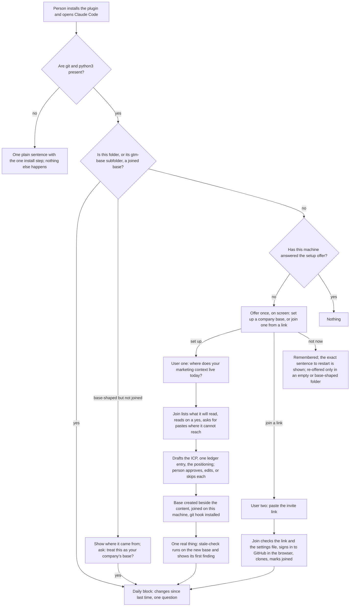

# Join and Onboarding

## Problem Frame

GTM Base is a Claude Code plugin (Codex second) plus a per-company folder of context files synced through git. The first feature, Current Without Integrations, assumes a base already exists and is joined on the person's machine. This document defines how a base comes to exist and how a person comes to be on it, for two people:

- **User one**, the first person at a company. They have marketing context scattered across a Notion page, a deck, a Google Doc, and a website, and no base. Their first ten minutes decide whether the product is ever opened a second time.
- **User two**, a teammate or an outside collaborator. A base exists; they need their machine connected to it with as little ceremony as the platform allows.

The interface is the chat inside Claude Code plus one folder that appears on the machine. Install is the only manual step for user one; everything after it starts on its own. Nothing the person already has is moved, renamed, or edited.

What onboarding delivers, in the doctrine's terms, is the map and a first pass at grounded: the base knows where things live and holds the company's own definitions. Current and joined arrive only through the first feature's loop in the weeks after. The end of the first session says so, rather than implying the base is finished.

## User Flows

| Moment | What the person sees | What happens underneath |
|---|---|---|
| First session after install | One line on screen offering to set up a base or join one from a link | The session-start hook found no joined base and no recorded answer, showed the offer as a visible message, and primed the assistant to act on a plain yes |
| User one says "set up" | A short working session: one question, a list of what will be read, then drafts to approve one file at a time | Join reads approved sources and pastes, drafts, writes only approved files into a new `gtm-base` folder beside the content |
| End of user one's session | The first stale-check finding on the new base, then: "Your base lives in this folder on this machine only. Open Claude Code here to use it. When you want a teammate on it, or a copy off this laptop, say so." | Base joined, owner email set for this base only, git hook installed, no remote |
| Later: "invite a teammate" or "back this up" | The remote is created and, for an invite, a plain-language message per person | GitHub CLI signs in through the browser and creates the private remote; otherwise the empty-repository page with the address pasted back |
| User two pastes the link | GitHub sign-in in the browser, then the daily block | Link and settings file checked, collaborator access confirmed, clone, marked joined |

## Requirements

**Prerequisites and the offer**
- J1. After the plugin is enabled, the first session on a machine with no joined base opens with a one-line offer, shown on screen and not only placed in the assistant's context, to set up a company base or join one from a link. The assistant is primed to act on a plain yes or no. The person types no command.
- J2. The offer is answered once per machine and the answer is remembered. "Not now" prints the exact plain sentence that restarts onboarding, and the offer is shown again only when Claude Code is opened in an empty folder or a base-shaped folder. Unrelated projects are never interrupted.
- J3. A folder that has the base layout but is not joined on this machine gets a different question: join shows where the folder came from (its remote address and owning account, or "no remote") and asks whether to treat it as the company's base. Folders join cloned itself are marked joined without asking.
- J4. If git or python3 is missing (a fresh Mac without the developer tools), the first session shows one plain sentence with the single install step and does nothing else until it is present.

**User one: drafting a base**
- J5. Join asks one opening question in plain words: where does your marketing context live today. It accepts names of tools, links, folders, and pasted text.
- J6. Join reads sources through the tools the person already has connected in their AI client (a Notion page, a Google Drive document, a public website) and asks for a paste or a dropped file where it cannot reach something. It stores no credentials and reads bounded slices. It does not read call recorders; transcripts enter through the first feature's inbox.
- J7. When the person names a folder, join lists the files it intends to read and reads them only on a yes. It never reads dotfiles, `.env` files, keys or certificates, `.git`, dependency folders, archives, or another base, and it stops and asks when the folder appears to hold more than one company's material.
- J8. Join drafts three required files, in this order: the ICP, one ledger entry (a recent decision found in the documents or given in answer to a question), and the positioning. The map's two settings are written with defaults and not drafted. Voice and every other file are offered as empty and named. Each draft carries an owner email.
- J9. Every draft is shown before it is written, with approve, edit, or skip, and each draft ends with "what is wrong with this?" so approval is not the only signal. Nothing is written without a yes. The base folder is created on the first approved file, and approving a file records a confirmation for it dated that day with the trigger "drafted," so the base is not flagged stale against itself.
- J10. Where the sources do not cover a required file, join asks the fewest plain questions needed and drafts from the answers.
- J11. Join quotes no duration until a measured run exists. It says the person can stop at any time and pick up later; a later run drafts only the required files not yet present in the base folder. Raw pulled content and pastes are held in the session and, if they must touch disk, only in the base's transient inbox folder, never in a committed path.
- J12. Local drafts keep customer names, deal figures, prices, and targets, because a grounded base needs them. Outside people's contact details are removed from every draft. Before the first push to any remote (backup or invite), join shows the person the named customers and figures that would leave the machine and asks before pushing; the first feature's gate scans the push as usual.
- J13. Join says once, before the first draft, that approved files may later be shared with everyone invited to the base.

**Where the base lives**
- J14. The base lives in its own `gtm-base` folder and is active when Claude Code is opened inside it or inside the folder that directly contains it. Join writes nothing to the person's global configuration or to any `CLAUDE.md` or `AGENTS.md` outside the base folder, and proposes no such line.
- J15. Join proposes the current folder's `gtm-base` subfolder when the current folder holds the company's content, otherwise a folder named for the company in the home directory with a `gtm-base` subfolder, and asks before creating either. Several bases can exist on one machine, each in its own folder, each with its own owner email.
- J16. When the folder the person names already has content, join reads it as a source (per J7) and creates the base beside it. Existing files are never moved, renamed, edited, or deleted.
- J17. At the end of user one's session join runs `stale-check` on the new base and shows its first finding, so the person leaves with one thing the base did, then states in plain words that the base lives in this folder on this machine only and how to come back to it.

**Identity and ownership**
- J18. The owner email on every drafted file defaults to the git author email of the person running join. If the machine has no git identity, join asks for the person's work email and records it for this base only, inside the base folder, never in global git settings.
- J19. At the end of user one's session the base is joined on this machine, the git pre-push hook is installed, and the next session in that folder (or its parent) opens with the daily block.

**Backing up, inviting, and joining**
- J20. User one's base is local until they ask for a copy off the machine or to invite a teammate. The daily block also offers a private backup once, in the first session after seven days or after the first accepted proposal, whichever comes first.
- J21. Creating the remote: join signs the person in to GitHub through the GitHub CLI's browser flow when the CLI is present, creates a private repository, and pushes; when the CLI is absent, join gives the one line that installs it, or the address of GitHub's empty-repository page with the new address pasted back. The template repository is not used for this, because the base already has its own history. When a remote is created, the base's provisional id is migrated to the remote-derived id.
- J22. Inviting: join collects each teammate's GitHub username, adds them as collaborators with write access, and produces a plain-language invite per person: accept the GitHub invitation, install the plugin (one line to paste), open Claude Code anywhere and paste this link when it offers to join. Join states, at remote creation, which protections the repository plan allows and which it does not.
- J23. The repository carries a settings file with exactly two keys, the GTM Base marketplace (a fixed public source pinned to a version) and the plugin enablement, and nothing else, so that a person who cloned by hand and trusts the folder gets the plugin installed. Join reads that file before it clones or offers to treat a folder as a base, and refuses, naming the difference, when it carries anything else.
- J24. User two joins by pasting the invite link: join checks that it is a GitHub repository address, shows the owning account, confirms through the GitHub CLI that the signed-in person is a collaborator, clones into a folder the person names, marks it joined, and the daily block appears. The invite tells them that Claude Code will ask them to trust the new folder and what that means.

**Plain language and learning**
- J25. Every sentence the person sees during onboarding passes the plain-language test: no git vocabulary, no vendor jargon a marketing lead would not know, and each step says what will happen before it happens.
- J26. The closing message offers one line, "what got in the way?", written to the base's corrections folder; the join guide asks the first ten users to share it.

## Success Criteria
- A person who has never spoken to Brandon installs the plugin, opens Claude Code, and has a first approved file within ten minutes of saying "set up," and an approved ICP, one ledger entry, and positioning with an owner email by the end of the session, on the paste path with no source connected, without typing a command to start.
- The same run with at least one source connected is timed separately and reported; join quotes no duration until then.
- At the end of session one, `stale-check` produces one finding on the new base.
- The next session in that folder or its parent opens with the daily block, and within seven days the person opens the base again and answers at least one question with yes or a correction.
- Checksums taken before and after user one's session match for every pre-existing file in the folder the person named, for any `CLAUDE.md` or `AGENTS.md` outside the base, and for the person's global git and Claude Code settings. The plugin writes only inside the new base folder and its own seat directory.
- User two, from a machine with Claude Code and the plugin installed and a GitHub account that has accepted the invitation, goes from pasting the link to the daily block in under five minutes; the GitHub sign-in step is timed separately.
- A second, unrelated project opened after "not now" shows no offer.
- Two bases on one machine can each be set up and opened without the other's offer, map, or daily block appearing.

## Scope Boundaries
- No hosted component, no GitHub App, no account creation in v1. The v2 hosted layer is a web app in Product Map's shape (decided 2026-09-05): GitHub sign-in, a GitHub App that creates and seeds the repository, a file view, and the same proposal review as Claude and the pull request page. When it exists it replaces the GitHub CLI and empty-repository steps in J21 and J24 for people without a terminal.
- No global "active base" or session-only switch beyond the parent-folder rule in J14.
- No connecting of tools on the person's behalf. Join points to the first feature's per-client connect step when a source is not reachable.
- No reading of call recorders and no transcript analysis inside join. Join ends by offering `learn-from-call` on a pasted transcript when the person has one.
- No import from the ProfileBase application; a person with a ProfileBase account exports their profiles as text and gives them to join as a paste.
- No editing of existing files anywhere, and no proposed line in any file outside the base.
- No scheduling, no automatic re-drafting, no re-running join on a complete base to refresh it.
- Codex follows when the first feature's Tier B lands; the offer there also needs the person to trust the plugin's hooks once, and the invite gains one install command then.

## Key Decisions
- Install is the only manual step and the offer starts on its own, on screen: the session-start hook already runs once the plugin is enabled; a marketing lead does not discover commands. "Not now" prints the sentence that restarts it, so re-entry is a sentence, not a command.
- Prerequisites are named, not assumed: a fresh Mac has stubs for git and python3 that open an install dialog; the hook says the one step instead of failing silently.
- Folder-scoped with the parent-folder rule, no global writes: keeps the client wall for consultants and the person's own setup untouched, and lets the company folder be the working folder without a pointer line, which would have loaded context with none of the loop.
- Draft first, then react, three required files: the weekly-planning pattern and the ProfileBase lesson. The ledger entry is second so the first ten minutes include something the person did not already have.
- Read existing content, build beside it, never overwrite, with a listed read set and exclusions: the folder is the best source at the moment it matters, and it also holds the things that must never reach a model or a remote.
- Local first, with two ways off the laptop: the second seat and a time-or-value trigger for a backup. A solo marketer's base must not die with a machine.
- Grounding wins over redaction for local drafts: a base without named customers and figures is the thin summary draft-first was chosen to avoid. Redaction and review apply where risk begins, at the first push.
- The session ends with one real thing: a base that only promises value next time is the churn moment; a stale-check finding is value now and teaches the daily block.
- User two's honest preconditions are stated: a private repository needs a GitHub account and a sign-in; the plugin needs one install line. The five-minute claim covers what join controls.
- The settings file is constrained and checked: trusting a folder that installs software is the most sensitive click in the flow, so the file may carry two keys only, the marketplace is public and pinned, and join reads the file before anyone is asked to trust.
- Owner is a repo-local git author email: keeps the first feature's identity rule without touching global configuration, and lets two bases on one machine carry different owners.

## Dependencies / Assumptions
- The first feature's plan, Amendment r2.1: the session-start hook shows the setup offer (as a visible message plus context) when no base is joined and no answer is recorded, checks for git and python3, and recognizes a joined `gtm-base` subfolder of the current directory. This is a forward dependency on Unit 3 of that plan.
- The first feature's Unit 2: provisional base ids for a base with no remote, migrated when a remote appears; confirmation lines with a "drafted" trigger.
- A repository's `.claude/settings.json` can carry `extraKnownMarketplaces` and `enabledPlugins` so the plugin installs after the trust dialog (Claude Code, verified 2026-09-04). The install takes effect for the next session, not the one in which the folder was trusted.
- The GitHub CLI signs in through a browser flow, creates private repositories, and adds collaborators by username. A marketing lead's machine may not have it; J21 covers that case.
- The plugin marketplace repository is public, so auto-install needs no credential. (Decision, recorded here because the earlier plan left it open.)
- Reading Notion and Google Drive relies on the person's own connected tools; the paste path is the primary path for a fresh install and is the one the first success criterion measures.
- Claude Code's own trust dialog appears for the new folder in Claude Code's wording; the invite and the closing message say it is coming.

## Outstanding Questions

### Resolve Before Planning
- None.

### Deferred to Planning
- [Affects J1, J2][Technical] How the hook distinguishes "no base joined on this machine" from "not in a base right now" once one base exists, and how the visible message and the context injection are both produced from one hook.
- [Affects J6][Technical] Which connected-tool reads join attempts and how it bounds each, and how it detects that a tool is connected from the model's tool list.
- [Affects J8, J9][Technical] The drafting prompts per file and the "what is wrong with this?" capture; the first feature's decision extractor is reused for the ledger entry from documents.
- [Affects J14][Technical] The parent-folder rule in base resolution when a folder contains more than one `gtm-base` subfolder.
- [Affects J21, J24][Technical] The exact GitHub CLI calls for sign-in, repository creation, collaborator addition, and collaborator verification, and what join does when the CLI is absent at user two's end.
- [Affects J22][Needs research] Which protections GitHub Free allows on a private repository at creation, so the statement in J22 is accurate.
- [Affects J23][Technical] The settings file's exact contents and the check join runs against it.
- [Affects J26][Technical] Where the "what got in the way" line lands and how the first ten users are asked to share it.

## Next Steps
→ `/ce:plan` for structured implementation planning

## Revision Log
- 2026-09-05 r1: written after the brainstorm (folder-scoped base, draft first, build beside).
- 2026-09-05 r2: document review, six reviewers, 45 findings. Resolved: prerequisites named and checked; offer shown on screen with a restart sentence and a bounded re-offer; parent-folder resolution replaces the `CLAUDE.md` pointer line; repo-local git identity; scoped checksum criterion; recorder reads and transcript redaction removed from join; three required files with the ledger entry second; grounding kept in local drafts with a pre-push review; end-of-session stale-check finding; backup trigger for solo users; honest user two preconditions and a constrained, checked settings file; public pinned marketplace; empty-repository fallback instead of the template button; listed read set with exclusions; drafted files confirmed at creation; use-based and ten-minute success criteria; Codex moved to scope boundaries; learning signal added.
