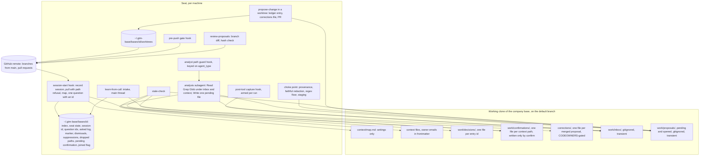
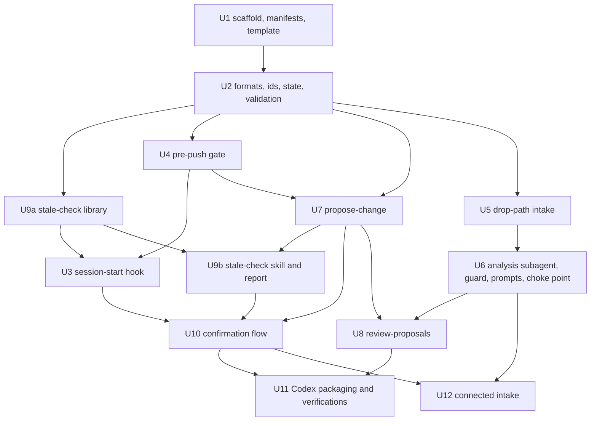

# feat: Current Without Integrations

**Target repo:** `gtm-base` (this repository, `~/Build/gtm-base`). It holds docs only today. This plan creates the plugin, the company-base template, and their tests.

## Overview

Build the part of GTM Base that keeps a team's context current without GTM Base owning any integration: a local inbox for transcripts, a `learn-from-call` skill that turns them into proposals, a decisions ledger and a `stale-check` skill that drafts fixes, owner confirmation asked at session start and recorded in a separate file, and a safety floor (pre-push gate, restricted analysis subagent with a path guard, hooks shipped only in the core plugin). Delivery is in three steps: Phase A1 proves the ledger path end to end with no transcript pipeline; Phase A2 adds export-and-drop intake and analysis; Phase B adds connected intake through the user's own tools and Codex packaging.

## Problem Frame

A marketing function is only as good as its ability to notice when a context file no longer matches what the business decided, and propose the fix. The origin document sets the boundary: GTM Base is the destination and the discipline, not the pipe. The user's own Fireflies, Fathom, and Slack connections in Claude Code or Codex are the sources; what reaches the base is an edited file and a proposal with evidence. Export-and-drop is the snapshot rung of the doctrine's ladder and the connected path is current-on-run; both are native (see origin: docs/brainstorms/2026-09-04-current-without-integrations-requirements.md, Source Paths and Key Decisions).

## Requirements Trace

Requirement ids are the origin document's R1 to R31. Each implementation unit names the ids it advances. Success criteria from the origin (SC1 to SC8) map as follows:

- SC1 (one hand-entered ledger line yields a correct flag and a drafted proposal): Units 2, 7, 9. Must pass before Phase A2 starts.
- SC2 (connected Fireflies or Fathom pull to merged proposals in one session): Units 12, 6, 7, 8 (Phase B).
- SC3 (ledger and drop paths from Codex; connected path Tier B): Unit 11.
- SC4 (export one transcript, get the same proposals): Units 5, 6, 7.
- SC5 (Thursday entry about Tuesday flags Wednesday's confirmation, with a drafted proposal citing the entry): Units 2, 7, 9. Must pass before Phase A2 starts.
- SC6 (a stranger reproduces the ledger and drop paths from written instructions): Unit 1 README and skill bodies, verified in Unit 10.
- SC7 (four-week numbers: catches, yes rate, rejection rate): Units 7, 9, 10 record the inputs, including a per-seat asked-questions log; reporting is a `stale-check` summary labeled as this seat's numbers.
- SC8 (first-run connected-versus-drop share): Units 5 and 12 record the intake path on each item; Unit 7 carries it into the corrections file.

## Scope Boundaries

Carried from the origin: no API clients, connectors, SDKs, or stored vendor credentials; no scheduled sync; no Slack app; no hosted component (a GitHub Action counts as one); no per-vendor procedures beyond the server address; no calendar source; no MCP servers declared in the manifest. Additionally for this plan:

- No `join` skill. Unit 1 ships the company-base template and a one-page join guide only; the join skill is its own brainstorm. The template must be enough for tests and for a person to create a base by hand.
- No `drift-grade` and no `propose-change` general features beyond what this feature needs (staging-file input, ledger entry composition, redaction floor, duplicate check).
- The ProfileBase grader is not ported in this feature. It scores rep messaging and has no consumer here; it belongs with `drift-grade`. Recorded under Open Questions.
- No stable file ids in frontmatter and no rename tracking. Files are keyed by repo-relative path; a rename reads as delete plus new file and R19 flags the entry. Deferred until a real base renames a file.
- No ordered merging or automatic re-sync of sibling proposals against the same file. A conflict is reported and the proposal can be re-opened from its staging copy.

## Context & Research

### Relevant Code and Patterns

- Plugin layout to mirror: the Compound Engineering plugin in the local cache (`.claude-plugin/plugin.json`, `skills/<name>/SKILL.md` with `references/`, `templates/`, `scripts/`; `agents/<group>/<name>.md` with a `tools` list; marketplace repo layout `plugins/<plugin>/` under a root `.claude-plugin/marketplace.json`). Its `AGENTS.md` rule: skill bodies reference co-located scripts by relative path, never `${CLAUDE_PLUGIN_ROOT}`, because SKILL.md files are copied unchanged to other clients. The rule applies to skill bodies, not to scripts.
- Hooks with executables: the Clay plugin in the local cache is the only local precedent. POSIX `sh` hooks; one script serves Claude, Codex, and Cursor by taking the client name as its first argument and emitting a per-client verdict; Claude hooks declared inline in `plugin.json`, Codex hooks in `hooks/codex-hooks.json`, both using `${CLAUDE_PLUGIN_ROOT}`. Clay gates Bash on Codex through `PermissionRequest`, not `PreToolUse`; the Tier B verification list carries that doubt.
- Company skill separation: `~/Gridwise/.claude/skills/weekly-planning/` splits `SKILL.md` (procedure), `config.md` (per-company settings, no secrets), `references/` (Python helpers with unittest files), and `templates/`. Secrets and history live out of tree.
- Donor prompts: `~/Build/profile-base-app/src/lib/prompts/transcript/` (reader, insight-new, insight-twist, insight-validated, grader, finalizer; change-proposer and assembler exist but are unwired) and `src/lib/transcript-pipeline.ts` (reader, then four specialists under `allSettled`, then finalizer: six calls). Input shape `NormalizedTranscript {text, metadata{title, date, duration, participants}}`. Fences are bare XML tags with no data-not-instructions statement; that clause is new text.
- Idempotency precedents: `~/.claude/skills/ea/.last-scan.json` tracks processed Fireflies meeting ids out of tree; the Gridwise scheduled-task skills check for today's entry before inserting.
- Trust-boundary template: `~/.claude/agents/daily-fireflies-reader.md` and `daily-slack-reader.md` state a hard rule (only this data class in, only this shape out, an empty result is a correct result).
- Brandon's only production hook (`~/Projects/agentboard/hooks/claude_hook.py`) always exits 0, swallows errors, and runs with a 10-second timeout. It does not branch on the SessionStart `source` field; this plan adds that branch.

### Institutional Learnings

- Subagents cannot use MCP servers whose calls need a permission prompt; the prompt renders only in the main thread (Gridwise memory). Connected intake therefore fetches in the main thread and isolates the copy on disk with the capture hook; the residual (raw text in the main thread's context during the fetch) is stated and narrowed, not removed.
- MCP server prefixes are not stable across sessions for claude.ai connectors. Store the vendor and match tool names by literal server substring, never a user-supplied regex.
- A newly added or authenticated MCP server does not appear in a running session; OAuth needs the interactive `/mcp` panel. The connect instruction says "connect, authenticate in `/mcp`, restart, run again."
- Secret scans must cover the staged tree and commit messages, include vendor URL-token shapes, and fail closed (Gridwise lessons 2026-09-04; quiz-rchosted 2026-09-02).
- After compaction a summary's pending list is a hypothesis; verify live state before writing. The confirmation write re-reads the confirmations record and requires a single-use question id issued this session.
- Codex has no enforceable per-agent tool allowlist; read-only agents are read-only by sandbox and prompt (Gridwise migration report). Tier B states which client enforces R13.
- `gh` acts as the user. Proposal bodies say they were AI-drafted.

### External References

All verified 2026-09-04 against the official pages; scratch copies in the session scratchpad.

- Claude Code hooks: SessionStart input carries `session_id` and `source` in `startup|resume|clear|compact|fork`; stdout and `hookSpecificOutput.additionalContext` are added to context, capped at 10,000 characters; PreToolUse and PostToolUse input carry `session_id`, `tool_name`, `tool_input`, `tool_response` (PostToolUse), and, when fired from a subagent, `agent_id` and `agent_type`; MCP tools match `mcp__<server>__<tool>`; PreToolUse returns `permissionDecision` `deny` (or exit 2); hooks receive `CLAUDE_PROJECT_DIR`, `CLAUDE_PLUGIN_ROOT`, `CLAUDE_PLUGIN_DATA`; default timeout 600 seconds; a hook timeout fails open.
- Claude Code plugins: `hooks/hooks.json` at plugin root; `scripts/` for hook scripts; `agents/<group>/<name>.md` registers as `plugin:group:name`; plugin-bundled agents may not declare `hooks`, `mcpServers`, or `permissionMode` in their frontmatter (so the path guard is a plugin-level hook keyed on `agent_type`); `userConfig` is Claude-only; `${CLAUDE_PLUGIN_DATA}` is exported to hook processes only, not to the Bash tool's environment.
- Claude Code skills: `context: fork` with `agent: <name>` runs the whole skill body as the prompt of a named subagent; tool restriction comes from the agent's `tools` and `disallowedTools` (which accept `mcp__*`); `${CLAUDE_SKILL_DIR}` resolves to the skill folder.
- Claude Code MCP: output limited to 25,000 tokens by default (`MAX_MCP_OUTPUT_TOKENS`), oversized results are persisted to disk and replaced with a file reference; `claude mcp add --transport http <name> <url>` with `--scope user`; OAuth via `/mcp`.
- Codex hooks: same three-level JSON; SessionStart `source` in `startup|resume|clear|compact` (no `fork`); stdout added as developer context, default limit 2,500 tokens per handler; PreToolUse `ask` unsupported (use `deny` or exit 2); `prompt` and `agent` handlers skipped; plugin hooks need per-hash user trust via `/hooks`; `CLAUDE_PLUGIN_ROOT` and `CLAUDE_PLUGIN_DATA` mirrored.
- Codex plugins: manifest at `.codex-plugin/plugin.json`; `skills/`, `hooks/`, `.mcp.json`; no `userConfig`, no `agents/`, no `bin/`; marketplace at `.agents/plugins/marketplace.json` with required `policy` and `category`; skills discovered under `.agents/skills` with `name` and `description` frontmatter only (so `user-invocable: false` has no effect on Codex); custom agents are TOML with `sandbox_mode`, no tool-name allowlist.
- Vendors: Fireflies official MCP at `https://api.fireflies.ai/mcp` (OAuth, list by date, full transcripts); Fathom official Claude integration over MCP (full transcripts with speakers); Slack official remote MCP generally available since February 2026; Gong MCP answers only.

## Key Technical Decisions

| Decision | Rationale | Rejected alternative |
|---|---|---|
| Scripts in Python 3 standard library, hooks as POSIX `sh` wrappers that call them; wrappers never need `jq` | The logic needs real code with unit tests, and `python3` ships on macOS with the developer tools. `sh` wrappers keep the hook contract tiny and let one script serve both clients (Clay pattern). | Pure `sh` plus `jq`; Node or Bun. |
| One command module per job under `plugins/gtm-base/lib/gtmbase/`; each `skills/<name>/scripts/*.py` and `scripts/*.py` file is a shim that locates `lib/` by walking up from its own location, then `$CLAUDE_PLUGIN_ROOT/lib` (mirrored on Codex), then a `GTM_BASE_LIB` override, and otherwise prints one fixed sentence naming the install step | Skill bodies stay portable; the environment-variable fallback is the Codex path when a skill folder is copied without the plugin tree. The packaging test builds both layouts. | Logic inside each skill's `scripts/`. |
| Repository is a marketplace root with `plugins/gtm-base/` and `templates/company-base/` | Mirrors the Compound Engineering layout and keeps the template beside the plugin that consumes it. | Plugin at repo root. |
| All per-seat state lives at one fixed location, `~/.gtm-base/` (override `GTM_BASE_HOME` for tests), with `bases/<base-id>/` per base and a global `armed` sentinel; `CLAUDE_PLUGIN_DATA` is not used | The plugin data variable reaches hooks but not the Bash tool where the skills' scripts run, so a split location would put the run marker where the capture hook never looks. One location, reachable from both, closes that. | `${CLAUDE_PLUGIN_DATA}` (the first draft). |
| Three state stores with four rules: the clone holds what the team shares; `~/.gtm-base/bases/<base-id>/` holds what a seat must remember and never commit (inbox index, seat state, current session id, issued question ids, asked-questions log, dismissals, suppressions, dropped paths, capture run marker, pending confirmation, joined-base flag); the remote holds proposals, each carrying its own post-merge state (ledger entry and corrections file); clone-held gitignored folders (`work/inbox/`, `work/proposals/`) are transient and the index is authoritative over them. `<base-id>` is a hash of the canonical remote URL; a clone with no remote yet gets a provisional id keyed by path that is migrated when the remote appears | Everything per seat must survive inbox deletion and never be in the repo. Making the index authoritative and the base id remote-derived closes the "delete or re-clone loses a processed-but-unproposed item" hole. | Index beside the inbox; base id from the directory path. |
| A base must be joined before any hook acts on it: base resolution requires a git clone, the map at the constant path, and the base id in the seat's joined list. The first skill run in an unjoined base asks once and records it; the session-start hook prints nothing, pulls nothing, and installs nothing for an unjoined base | Structural detection alone would make any cloned repository with the template layout trigger network fetches, file writes, and injected text before the first turn. | Structural detection (the first draft). |
| The session-start hook runs for every source and always records the current session id in seat state; it pulls, injects, and asks only on `startup` and `resume`; before fast-forwarding it refuses any incoming range that touches `.claude/`, `.codex/`, `.agents/`, `CLAUDE.md`, `AGENTS.md`, `.gitattributes`, `.gitmodules`, or any `*.sh`, `*.py`, `*.js` file, printing one fixed sentence and keeping the last-known-good map; it exits 0 always, 15-second timeout, never prints a token, and asserts HEAD is the default branch | Scripts run from the Bash tool have no other way to learn the session id, and the capture hook and question ids need it. Auto-pulling merged instructions or code onto every seat would make merge rights code execution regardless of R27, so the pull refuses those paths and asks the owner to review by hand. | Pull on every SessionStart; pull anything. |
| The four folder paths are constants in the plugin; the map carries only settings, range-checked on read, injected with a length cap and a trust note | The map is repository-controlled free text injected on every seat. | Paths in the map. |
| All git work by proposals and confirmations happens in detached worktrees under `~/.gtm-base/bases/<base-id>/worktrees/`, one per staging id and one for confirmations; the user's clone stays on the default branch and its dirty edits are never touched | Four operations otherwise act on one clone with no stated branch discipline; a session ending on a proposal branch would break the next pull, count unmerged corrections as confirmations, and push a confirmation onto the wrong branch. | Branching in the user's clone (the first draft). |
| Connected intake fetches in the main thread; a PostToolUse hook matching `mcp__.*` writes `tool_response` to the inbox only when a capture run is armed: the global `armed` sentinel exists and is unexpired, the current directory is a joined base, the hook's `session_id` equals the one in seat state, the tool name contains the stored vendor substring, and a selected recording id appears in `tool_input` (read, never stored), falling back to the response only when the request carries no id. The marker expires 20 minutes after arming, refreshed per fetch, and an expired or malformed marker is treated as disarmed and deleted | Subagents cannot answer MCP permission prompts, and server prefixes are unstable. An always-on hook would record unrelated answers weeks later. Keying on the request is more reliable than on the response because the skill composed the request. The sentinel lets the wrapper exit before reading stdin on every other MCP call. | Model writes the transcript back out; always-on capture; response-only keying. |
| The residual of connected intake is stated: during the fetch, raw transcript text is in the main thread's context. The intake skill body carries a data-not-instructions block covering tool results; the fetch loop is the last action of the intake phase; after a fetch the only permitted tool calls until analysis are the intake script and the run-end offer; the run marker is cleared on the same turn | The origin's restricted subagent protects analysis, not the fetch. Naming and narrowing the residual is honest; removing it would require the subagent to fetch, which it cannot. | Claiming the capture hook isolates the model's context (it isolates the disk copy). |
| Analysis runs as a Claude subagent with `tools: Read, Glob, Grep, Write`, `disallowedTools: Bash, mcp__*`, guarded by a plugin-level PreToolUse hook (matcher `Read|Write|Edit|Grep|Glob`) that acts when `agent_type` names the analyst: reads, greps, and globs allowed only under `work/inbox/` and `context/` with an explicit path parameter; writes allowed only to one new file per item under `work/proposals/pending/`; everything else denied; deny when `python3` is missing, the payload is malformed, or `agent_type` is absent on an out-of-root access; explicit 5-second timeout | Plugin agents cannot declare their own hooks, so the plugin-level hook keyed on `agent_type` is the only mechanism, not a fallback. Grep and Glob read outside the boundary unless guarded. Write is kept, narrowed to a single pending file per item, so the raw span never crosses into the main thread's model context; the main-thread choke point is Python, not the model. On Codex the restriction is prompt and sandbox only, and Tier B says so. | Agent-scoped hooks (unavailable in plugins); removing Write and returning the payload as the fork's message (puts raw text into the main thread's context). |
| The analyst's final message is a fixed-shape status line (items processed, pending files written, error codes) with no quoted content; the skill ignores any other text and proceeds to the choke point | The fork's return travels into the full-tool session. | Free-text return. |
| Redaction runs inside the subagent; the pending file carries the raw span and the redacted excerpt; the main-thread choke point verifies the raw span is a verbatim substring of the referenced inbox item under a length cap, verifies the redacted excerpt equals the raw span except at bracketed role tokens from a fixed vocabulary, runs the regex floor and the hidden-content class, rejects edits that target frontmatter or the map or anything outside `context/`, writes the staging file with the redacted excerpt only, and deletes the pending file; the raw span is never printed | A model cannot compute byte offsets, and offsets alone would prove nothing about the redaction. A deterministic diff against the raw span proves both provenance and faithful redaction, in Python, without the raw text entering the model's context. | Byte offsets (the first draft). |
| The pull request ships the ledger entry and the corrections file only; `stale-check` treats a merged corrections file citing (entry id, file path) as the merge-triggered confirmation only when the commit that introduced it also modified the cited context file and the file's post-merge content hash matches the hash recorded in the corrections file; `confirm.py` is the sole writer of the confirmations record; `corrections/` is CODEOWNERS-gated | A confirmation line composed at proposal time is authored and dated wrong and conflicts on the hot file. Deriving the merge confirmation from the corrections file removes a second writer. Requiring the co-modified file and the hash stops a forged corrections file from confirming anything. This amends origin R19 and R21 in mechanism, not in behavior. | Confirmation line inside the PR; `merge=union`. |
| Confirmations are one append-only file per context file under `work/confirmations/`, named by the repo-relative path with `/` replaced by `--`; a line carries the file path, date, UTC time, trigger, entry id, and question id, and no author field; identity is recomputed from the commit that added the line | Two owners must not conflict; one file per context file keeps appends local. Storing an author on the line invites forgery and trips the email scan; the commit already has the author. | One shared file; author on the line. |
| Owner identity is a git author email: `owner:` in context-file frontmatter holds one or more emails validated by the library; matching is exact email equality against the commit author; a GitHub handle, if wanted for CODEOWNERS, is a separate `owner_handle:` field never used for identity. The join guide says the owner's seat must commit with that email | A handle cannot be matched to a commit author offline except in the noreply form most people do not use. Without a stated rule every identity test is undefined. Per plan tier: on GitHub Free identity is a claim and the yes rate is self-reported; on paid plans signed commits and required review can back it. | Handles matched to authors (undefined). |
| Question ids are single-use, bound to the current session id, and expire after 60 minutes; the hook records each issued id with issued-at in seat state and appends to an asked-questions log; `confirm.py` consumes the id on first use | An id visible in the injection can be quoted back by other session content; single-use and expiry bound the damage, and the asked log gives the yes rate a denominator (yes over asked, not-now counted). | Ids keyed by date (reissued across sessions, never consumed). |
| Pre-push gate is a PreToolUse hook on `Bash` that inspects any command containing `git` or `gh` (tokenized, split on separators, with `env`, `command`, `sudo`, `nice`, and `-c` pairs stripped; denied when it cannot tokenize), treating `git push` and `send-pack` and the gated `gh` set (`pr create`, `pr edit`, `pr comment`, `pr review`, `issue create`, `issue comment`, `release create`, `api` with `-f`, `-F`, `--input`, or `--raw-field`) as pushes; it scans outgoing added lines, commit messages (`git log <upstream>..<ref> --format=%B`), the whole command string, and any referenced body file; denies `--no-verify`, force to the default branch, and any `core.hooksPath` or `hooks.path` override; denies above a size cap before scanning; plus a git `pre-push` hook the plugin installs into the directory `git rev-parse --git-path hooks` reports (chaining into a configured `core.hooksPath` when writable, renaming an existing hook to `pre-push.local` and chaining it, and otherwise recording a fixed code and printing one fixed sentence) | Two layers; both scan content and messages, not only names; both fail closed. A tracked hook would make merge rights code execution on every seat. The heredoc form Claude Code uses for bodies cannot be parsed as arguments, so the whole string is scanned. | `.gitignore` alone; tracked hooks path; argument parsing of bodies. |
| The gate scans added lines only; frontmatter `owner:` and `owner_handle:` lines and `CODEOWNERS` are exempt from the email class by format; the base allowlist lives at a constant tracked path under CODEOWNERS, holds exact literals one per line with caps on count and length, rejects regex syntax, can never allowlist the transient-folder or key classes, and is seeded from the template's owner values | Owner emails are legitimate content the scan would otherwise deny on the first real push; a regex-capable or per-seat allowlist would let one seat neutralize the gate for everyone. | Scanning context lines; free-form allowlist. |
| Staging ids derive from (source id, target file path, origin, sequence within the item), never from model text; idempotency comes from the marker search and row status | Model output differs between runs, so a text hash would give a false idempotency claim. | Hash of the decision block. |
| Proposals branch from the default branch, never from a sibling; a conflicting sibling is reported and can be re-opened from its staging copy | Rebasing onto a sibling lands the sibling's changes if it is later closed; ordered auto-merge is machinery no requirement asks for. | Ordered merges with automatic re-sync (the first draft). |
| Proposal staging file is the PR body template plus a list of file edits, with `origin` (inbox, ledger, local-edit, reject-keep), `schema: 1`, a deterministic staging id, and the redacted excerpt; gitignored; retired to `work/proposals/opened/` while its PR is open, deleted when merged or closed | One contract for four producers and one consumer; the opened copy lets a conflicting proposal be re-opened. | Analysis opens PRs directly; delete on open. |
| Approval in `review-proposals` renders the branch diff for edited files, recomputes the hash of the branch's proposed edits, and refuses when it differs from the corrections file's hash or when the branch touches files outside `context/`, `work/decisions/`, and `corrections/` | Prose derived from the body is what the reviewer reads; the branch is what merges. New commits are allowed on a branch after opening, so approval must check the branch. | Approving from the body alone (the first draft). |
| Source ids: vendor recording id when present, else SHA-256 of normalized text; drop-path duplicate check also compares normalized date plus title; a `partial` item is superseded by a later full fetch of the same source id | R6 and R7, plus re-exports of the same call. | Hash only. |
| Slice cursor per seat: a vendor timestamp, advanced only by the intake script, to the newest listed item such that every older item is landed, dismissed, or already indexed; default window seven days; oldest-first when the five-item ceiling cuts; deselections recorded as dismissals; a cursor older than 30 days asks once whether to resume or restart | Makes the failed-fetch, ceiling, and deselection interactions well-defined. | Newest-first; date-only cursor. |

## Execution Posture

Every implementation unit is executed by a subagent running Opus 5 at high reasoning effort, one unit per agent, with the orchestrating session holding this plan, the origin document, and the test suite. The orchestrator runs the tests and the plain-language lint after each unit and never merges a unit whose test scenarios are not all covered. Units marked with an execution note (test-first or characterization-first) carry that posture into the agent's brief. Decided by Brandon on 2026-09-05.

## Open Questions

### Resolved During Planning

- Exact Fireflies and Fathom tool parameters: not needed at plan level. Intake asks the connected tool for "transcripts since <date>" and "one transcript by id" in plain terms; the capture hook keys on the request's selected id first.
- Where the inbox index lives: `~/.gtm-base/bases/<base-id>/` (see decisions). Cross-seat duplicates are detected by searching open and closed pull requests and the corrections folder for the machine-readable marker before drafting; a previously rejected change is reported and re-proposed only after the user says so.
- Retention: end-of-run offer to delete applies only to terminal rows; index rows survive deletion; a landed row whose file is missing is reported as dropped before analysis and does not block confirmations.
- Decision extractor shape: one new prompt producing ledger-shaped entries with candidate affected file paths, run on the normalized text (or the vendor summary when present); the markdown adapter converts finalizer `section_changes` into edits addressed by file path and heading. Mode selection: sales-call mode when participants include an outside company or the user says so; decision mode otherwise.
- Skill and fork boundary: `learn-from-call` is a main-thread skill. It invokes the analyst through the Agent tool (subagent type `gtm-base:analysis:call-analyst`), once per unprocessed inbox item, passing only that item's path; when the fork returns its status line, the skill runs the choke point. No `context: fork` on the skill.
- Ledger and confirmations file naming: `work/decisions/<entry-id>.md` where the entry id is the staging id, and `work/confirmations/<path-with-slashes-replaced>.md`.
- Threshold and suppression period: `confirmation_threshold_days: 30` and `not_now_days: 7` in `context/map.md`, read as integers within 1 to 365.
- Client detection: the session-start hook receives the client as its argument and writes it into seat state; every script reads it there.
- Packaging for both clients: Claude manifest at `.claude-plugin/plugin.json` with hooks in `hooks/hooks.json`; Codex manifest at `.codex-plugin/plugin.json` pointing at `hooks/codex-hooks.json`; skill bodies shared unchanged; agents are Claude-only files with a Codex prompt-only fallback documented in the skill. On Codex the confirm skill is visible; its script prints a pointer to the pending-question list when invoked without a live question id.
- Grader: not ported here.
- Confirmation "skill": origin R23 says no separate confirmation skill. The write path behind the injected question is a non-invocable skill folder on Claude Code so the AI can load its instructions; recorded as a mechanism, not a new skill.
- Merge-triggered confirmation: derived from the corrections file with the co-modification and hash checks (see decisions). Amends origin R19 and R21 in mechanism; behavior preserved.
- Test seam for `gh`: every script that calls `gh` takes a runner it can be handed in tests; the test suite ships a fake `gh` that records calls and returns canned JSON.
- Yes rate definition: yes over questions asked, with not-now counted in the denominator, computed per seat from the asked-questions log and labeled as this seat's numbers.

### Deferred to Implementation

- Whether Fireflies' or Fathom's list tool honors a since-date filter or needs client-side filtering: discovered on the first real pull in Unit 12.
- Whether `tool_response` for these servers arrives as text or structured content, whether the fetch-by-id response echoes the id, and whether an oversized result arrives as a file reference under a stable persist directory: shapes the capture parser in Unit 12; if capture writes nothing, the skill reports it and offers the drop path for that call. Byte-faithful capture is a Unit 12 verification, not a premise.
- The exact `agent_type` string a plugin-bundled agent reports in hook payloads: recorded on the first Unit 6 run; the guard matches on the suffix `call-analyst` with the plugin prefix as an accepted variant. If an older build omits `agent_type`, the fallback is a documented copy of the agent into `~/.claude/agents/`, where frontmatter hooks are allowed.
- Whether plugin-bundled agents are discovered by the Agent tool in the current Claude Code build: verified on the first run of Unit 6; same fallback.
- The exact redaction regex set beyond emails, phones, key shapes, vendor URL-token shapes, and the hidden-content class: tuned against fixtures in Unit 7.
- The provisional base id for a clone with no remote and its migration when the remote appears: implemented in Unit 2 with a stated rule.
- Codex verifications (Tier B): Fireflies and Fathom reachable from Codex; Slack server eligibility for arbitrary MCP clients; whether Codex's `resume` and `compact` are distinguishable in practice; whether PreToolUse fires for Bash `git push` and `gh pr create` on Codex in the default sandbox mode (if not, register `PermissionRequest` as Clay does and record which is live); PostToolUse payload fields for MCP tools on Codex; an injected-text check in a fresh Codex session.

## High-Level Technical Design

> *This illustrates the intended approach and is directional guidance for review, not implementation specification. The implementing agent should treat it as context, not code to reproduce.*

Three stores, four rules. The clone holds what the team shares and stays on the default branch. The seat directory holds what a seat must remember and never commit, plus the worktrees where git work happens. The remote holds proposals, each carrying its own post-merge state. Clone-held gitignored folders are transient and the index is authoritative over them.

## Implementation Units

Dependency graph:

Phase A1 is Units 1, 2, 9a, 4, 3, 7, 9b, 10. SC1 and SC5 must pass end to end on a real base before Phase A2 begins. Phase A2 is Units 5, 6, 8. Phase B is Units 11 and 12.

### Phase A1: the ledger path, end to end

- [x] **Unit 1: Repository scaffold, plugin manifests, and the company-base template**

**Goal:** A marketplace repository with an installable (empty) plugin, a company-base template a person can copy by hand, a join guide in plain language, and a test runner.

**Requirements:** R5, R27, R30, SC6.

**Dependencies:** None.

**Files:**
- Create: `.claude-plugin/marketplace.json`, `plugins/gtm-base/.claude-plugin/plugin.json`, `plugins/gtm-base/hooks/hooks.json` (empty event map), `plugins/gtm-base/README.md`, `plugins/gtm-base/CHANGELOG.md`, `plugins/gtm-base/lib/gtmbase/constants.py` (folder paths, size caps, marker expiry, question-id window, allowlist path)
- Create: `templates/company-base/context/map.md`, `templates/company-base/context/strategy/icp.md` (example with `owner:` email and `owner_handle:`), `templates/company-base/context/metrics/.gitkeep`, `templates/company-base/context/plan/.gitkeep`, `templates/company-base/context/notes/.gitkeep`, `templates/company-base/work/decisions/.gitkeep`, `templates/company-base/work/confirmations/.gitkeep`, `templates/company-base/work/inbox/.gitkeep`, `templates/company-base/work/proposals/.gitkeep`, `templates/company-base/corrections/.gitkeep`, `templates/company-base/.gitignore`, `templates/company-base/CODEOWNERS`, `templates/company-base/gate-allowlist.txt`, `templates/company-base/README.md`
- Create: `docs/join-guide.md`, `tests/run.sh`, `tests/test_scaffold.py`, `tests/fakes/gh` (records calls, returns canned JSON)
- Create: `README.md` (repo root)

**Approach:**
- Marketplace entry points at `./plugins/gtm-base`. Plugin manifest carries `name`, `version` (`0.1.0`), `description`, `author`, `repository`, `license`, `keywords`; no `mcpServers` (R2).
- Template `.gitignore` excludes `work/inbox/` and `work/proposals/`. `CODEOWNERS` gates `context/**`, `corrections/**`, `plugins/**`, `.claude/**`, `CLAUDE.md`, `AGENTS.md`, `.gitignore`, `gate-allowlist.txt`, and `CODEOWNERS` itself to a placeholder owner, and leaves `work/confirmations/**` and `work/decisions/**` ungated (R21, R27). `context/map.md` contains the two settings lines and nothing else the plugin depends on. `gate-allowlist.txt` starts with the template's owner email.
- Every template context file has frontmatter `kind`, `owner` (email), `owner_handle` (optional), `last_confirmed`, `sources`, `status`.
- `docs/join-guide.md` is the manual join: copy the template, create a private repository, clone it, install the plugin, run the first skill so the base is joined and the git hook is installed, connect a recorder (per-client step, three official links, `/mcp`, restart), commit with the owner email, the identity note per GitHub plan tier, the gate's residual, and the revocation note that also names the client's session history (R8). Written to the plain-language test (R30).
- `tests/run.sh` discovers `tests/test_*.py` with `python3 -m unittest` and prepends `tests/fakes` to PATH.

**Patterns to follow:** Compound Engineering marketplace and plugin manifests; Gridwise `config.md` for the settings block; Clay `hooks` declaration shape.

**Test scenarios:**
- Happy path: both JSON manifests parse and the marketplace `source` path resolves to the plugin folder.
- Happy path: the template tree contains every folder named in `constants.py`, and `.gitignore` covers `work/inbox/` and `work/proposals/`.
- Edge case: `CODEOWNERS` has no rule matching `work/confirmations/` and does have rules for `corrections/`, `.gitignore`, `gate-allowlist.txt`, and `CODEOWNERS`.
- Happy path: every template context file has an `owner` that is a valid email.
- Lint: `docs/join-guide.md` contains none of the banned git words (commit, branch, pull request, merge, rebase).

**Verification:** `claude plugin marketplace add ./` followed by install succeeds on a clean machine with no hooks acting; a person can create a base from the template and the join guide without asking a question.

- [x] **Unit 2: File formats, ids, state, and validation (the shared library)**

**Goal:** One module every script uses to read and write the inbox item, the inbox index, seat state, ledger entries, confirmation lines, corrections files, pending files, and the proposal staging file, with strict validation, stable ids, and atomic writes.

**Requirements:** R6, R7, R12, R14, R19, R21, R26.

**Dependencies:** Unit 1.

**Files:**
- Create: `plugins/gtm-base/lib/gtmbase/__init__.py`, `formats.py`, `paths.py`, `state.py`, `ids.py`, `validate.py`, `shim.py` (the loader every script shim copies)
- Create: `plugins/gtm-base/templates/ledger-entry.md`, `confirmation-line.md`, `corrections-file.md`, `pending-item.json` (documented shape), `proposal-staging.md`, `pr-body.md`
- Test: `tests/test_formats.py`, `tests/test_paths.py`, `tests/test_state.py`, `tests/test_ids.py`, `tests/test_validate.py`, `tests/test_shim.py`, `tests/fixtures/`

**Approach:**
- Markdown with flat YAML frontmatter parsed by a small strict parser.
- `paths.py` resolves the base root, the seat directory (`GTM_BASE_HOME` or `~/.gtm-base`), the base id (hash of the canonical remote URL; provisional id keyed by path when there is no remote, migrated on first sight of a remote), the joined flag, the worktree directory, and canonicalizes any path to assert it sits inside `context/`. It also checks that HEAD is the default branch.
- `state.py` owns: the inbox index (JSON lines keyed by source id: status in landing, landed, processed, processed-elsewhere, closed; landed_at, seat, source, visibility, intake_path, staging ids, proposal ids); seat state (client, vendor substring, slice cursor, first-run path, last-seen commit, current session id, joined flag, pending confirmation code); issued question ids (id, session id, issued-at, consumed); the asked-questions log (question id, date, outcome in yes, no, not-now, unanswered); suppressions; dismissals; the ledger-behind dismissal; dropped paths; the capture run marker and the global `armed` sentinel. Writes are atomic and owner-only. Nothing may hold a URL, an option value, or a hook payload; detail is stored as fixed codes.
- `ids.py` produces source ids, deterministic staging ids from (source id, target path, origin, sequence), entry ids (equal to staging ids), and question ids (file path, trigger, entry id, session id, random suffix).
- `validate.py` range-checks map values, validates owner emails, checks file-name and id charsets, and validates the PR body's marker line.
- `shim.py` documents the loader: walk up for `lib/gtmbase`, then `$CLAUDE_PLUGIN_ROOT/lib`, then `GTM_BASE_LIB`, else one fixed sentence.

**Patterns to follow:** Gridwise `references/*.py` helpers with unittest siblings; EA skill's out-of-tree processed-id file.

**Test scenarios:**
- Happy path: round-trip parse and serialize for each artifact preserves every field.
- Happy path: a ledger entry with all fields validates; the same entry missing review-by fails naming the field.
- Edge case: decision date in the future, or review-by before the decision date, validates as malformed.
- Edge case: canonicalizing `../.env`, an absolute path outside the base, and a symlink escaping `context/` all raise; `context/strategy/icp.md` passes; a file name containing a newline or markdown link syntax is rejected.
- Edge case: source id for two exports differing only in whitespace is identical; staging ids for the same (source id, path, origin, sequence) are identical across runs regardless of content.
- Error path: index write interrupted mid-file leaves the previous index intact.
- Edge case: seat directory resolves identically whether or not `CLAUDE_PLUGIN_DATA` is set; base id is identical for the same remote in two clone directories; a clone with no remote gets a provisional id that migrates when a remote is added.
- Edge case: an owner value that is not an email fails validation; map values outside 1 to 365 fail.
- Happy path: the shim loader finds `lib/` from the plugin layout and from a copied skill folder when `CLAUDE_PLUGIN_ROOT` is set; with neither it prints the fixed sentence and exits non-zero.
- Edge case: a question id is marked consumed on first use and refused on second; an id older than the window is refused.

**Verification:** All library tests pass; the fixtures directory contains one valid example of every artifact.

- [x] **Unit 9a: `stale-check` library (compute only)**

**Goal:** The pure computation of what is out of date, shared by the session-start hook and the stale-check skill.

**Requirements:** R15, R16, R18, R19.

**Dependencies:** Unit 2.

**Files:**
- Create: `plugins/gtm-base/lib/gtmbase/stale.py`
- Test: `tests/test_stale.py`

**Approach:**
- Inputs: map settings, ledger entries, confirmations records with per-line commit authors (a blame runner injectable for tests), corrections files with their introducing commits and co-modified files, the seat's dropped-path report, and the asked-questions log. Outputs: per-file flags with evidence, affected-files proposals for blank entries, review-by question items, the ledger-behind flag, malformed items, and candidate confirmation questions for a given owner email.
- A file is confirmed against entry E when any owner-matched line carries E's id, or any merged corrections file cites (E, path) and its introducing commit modified the path and the recorded hash matches the file's content at that commit, or any owner-matched line's date is later than the later of E's decision date and written date. Threshold staleness uses the newest owner-matched date. Non-owner lines are ignored. Entries whose affected path no longer exists flag the entry. Malformed entries are excluded and reported. A corrections file citing (E, path) without co-modification or with a hash mismatch is reported as malformed.

**Patterns to follow:** Gridwise idempotency rules; stable ids not positions.

**Test scenarios:**
- Happy path (SC5): entry decided Tuesday, written Thursday, file confirmed Wednesday by the owner: flagged with E as evidence.
- Happy path: same entry, confirmed Friday by the owner: not flagged; confirmed Thursday with E's id on the line: not flagged.
- Edge case: merged corrections file citing (E, path) whose commit modified the path with a matching hash: confirmed; the same file whose commit did not touch the path, or whose hash differs: malformed, not confirmed.
- Edge case: a non-owner line newer than the decision and an older owner line: flagged.
- Happy path: blank affected list with a map naming the pricing file: one affected-files proposal item, no file flag.
- Edge case: affected path missing: the entry is flagged.
- Edge case: file with no confirmation line: unconfirmed and flagged against any affecting entry.
- Edge case: no entry newer than the window: ledger-behind item; with a dismissal for this window: none.
- Error path: review-by before decision date: malformed, excluded.
- Happy path: candidate questions for owner A include only files A owns, ledger-triggered first, suppressed files excluded.

**Verification:** The library reproduces every stale-check rule from the origin on fixtures, with no git or network access in tests.

- [x] **Unit 4: Pre-push gate**

**Goal:** Refuse any push, pull-request creation, or other GitHub write whose outgoing content touches a transient folder or matches redaction or hidden-content patterns, in both the AI client and plain git, failing closed.

**Requirements:** R5, R12, R27.

**Dependencies:** Unit 2.

**Files:**
- Create: `plugins/gtm-base/hooks/pre-push-gate.sh`, `plugins/gtm-base/scripts/push_gate.py` (shim), `plugins/gtm-base/lib/gtmbase/gate.py`, `plugins/gtm-base/lib/gtmbase/scan.py`, `plugins/gtm-base/lib/gtmbase/redaction_patterns.py`, `plugins/gtm-base/lib/gtmbase/install_git_hook.py`
- Modify: `plugins/gtm-base/hooks/hooks.json` (add `PreToolUse` with matcher `Bash`), `docs/join-guide.md`
- Test: `tests/test_gate.py`, `tests/test_scan.py`, `tests/test_redaction_patterns.py`, `tests/test_install_git_hook.py`

**Approach:**
- The wrapper triggers on any `git` or `gh` in the command; Python tokenizes and classifies per the decision table. For pushes it scans outgoing added lines and commit messages; for the gated `gh` set it scans the entire command string and any referenced body file, resolved against the hook's working directory. Any hit denies with a plain reason naming the file and the pattern class, never the matched value. Denies above the size cap, on `--no-verify`, on force to the default branch, on `core.hooksPath` or `hooks.path` overrides, and when the command cannot be tokenized or `python3` is missing.
- Pattern classes: transient folder prefixes, email (with the frontmatter and CODEOWNERS exemptions), phone, key shapes, vendor URL-token shapes, and the hidden-content class (HTML comments, zero-width and bidirectional control characters, raw HTML tags). The allowlist rules are in the decision table.
- `install_git_hook.py` runs on the first skill run in a joined base and from the session-start hook: it resolves the hooks directory with `git rev-parse --git-path hooks`, handles `core.hooksPath` and an existing hook as the decision table says, and records a fixed code when the terminal layer could not be installed.
- Documented residual: GUI clients without the git hook, an MCP GitHub server writing over the API, and Codex seats that have not trusted the hook; GitHub push protection recommended where available.

**Patterns to follow:** Clay's `PreToolUse` on `Bash`; Gridwise secret-scan lesson.

**Test scenarios:**
- Happy path: a push whose diff adds a redacted excerpt with roles only is allowed.
- Error path: a push adding a file under `work/inbox/` or `work/proposals/` is denied naming the path.
- Error path: `gh pr create --body-file body.md` with an email in the body is denied although the branch was already pushed; the heredoc form `--body "$(cat <<'EOF' ... EOF)"` containing a phone number is denied; `gh pr edit --body` and `gh api -f body=...` with an email are denied.
- Error path: a push whose only change is a commit message containing an email is denied.
- Edge case: an added frontmatter line `owner: jane@acme.com` is allowed; the same address in a body paragraph is denied unless it is in the allowlist.
- Edge case: the allowlist rejects a line with regex metacharacters; an allowlisted string under `work/inbox/` is still denied; an allowlisted key-shaped string is still denied.
- Edge case: `cd base && git push origin HEAD`, `env GIT_X=1 git push`, `sh -c 'git push'`, and `git -c core.hooksPath=/tmp push` are all denied or detected as pushes; `git pushover` is not a push; an untokenizable command is denied.
- Error path: diff larger than the cap: denied without scanning; `python3` missing: denied.
- Integration: the installed git hook blocks a push from a plain terminal; with a global `core.hooksPath`, the hook is chained there or a fixed code is recorded; an existing `pre-push` is renamed and still runs; `install_git_hook.py` never writes a tracked file.

**Verification:** From inside the client, an attempted push of an inbox file is refused with one plain sentence; from a plain terminal the same push is refused by git.

- [x] **Unit 3: Session-start hook**

**Goal:** On every session record the session id; on startup and resume only, fast-forward the working clone safely (refusing code and instruction paths), inject the map and a one-line change summary, and inject at most one confirmation question, with a single-use id, for a file this seat owns.

**Requirements:** R23, R25, R26, R30.

**Dependencies:** Units 9a, 4.

**Files:**
- Create: `plugins/gtm-base/hooks/session-start.sh`, `plugins/gtm-base/scripts/session_start.py` (shim), `plugins/gtm-base/lib/gtmbase/session_start.py`, `plugins/gtm-base/templates/injection.md`
- Modify: `plugins/gtm-base/hooks/hooks.json` (add `SessionStart`, no matcher, so every source is seen)
- Test: `tests/test_session_start.py`, `tests/fixtures/repos/`

**Approach:**
- The wrapper passes stdin and the client name to Python and exits 0 on any failure, writing nothing to stderr.
- For every source: resolve the base; if unjoined, write nothing beyond the session id and exit. Record the session id and client in seat state. For `startup` and `resume` only: assert HEAD is the default branch (otherwise one fixed sentence and stop); check for a dirty tree; fetch; diff the incoming range name-only and refuse the fast-forward when it touches the denied paths (fixed sentence, code recorded, last-known-good map); otherwise fast-forward with credential prompting disabled and a short timeout. On any failure keep last-seen unchanged, print one fixed sentence, inject the last-known-good map stamped "as of <date>", and skip the question. Retry a pending confirmation push if seat state has one.
- Print "since your last session: N changes" plus the map, capped, with a trust note. Ask the stale library for candidate questions for this seat's git email; take one; canonicalize; issue a question id bound to the session id; append to the asked log as unanswered; render the fixed template with the path, the question id, and for a ledger trigger the entry id and file name only. Under 2,000 tokens. Call `install_git_hook` if not yet installed.

**Patterns to follow:** Brandon's production hook posture; Clay's per-client argument.

**Test scenarios:**
- Happy path: `source: startup` on a joined clean clone behind the remote records the session id, pulls, prints the map and "since your last session: 3 changes," and updates last-seen.
- Happy path: `source: compact` records the session id and prints nothing else.
- Edge case: unjoined base with the template layout: nothing printed, no pull, no hook install.
- Error path: the incoming range adds `.claude/settings.json`: no fast-forward, fixed sentence, last-known-good map, exit 0.
- Happy path: seat owns `icp.md` with a newer ledger entry: injection carries the file, the entry id, the question, and a question id recorded as issued and unanswered.
- Edge case: two overdue owned files: one question; the other listed as pending.
- Edge case: suppressed file: not asked.
- Error path: dirty tree, or HEAD not on the default branch, or remote unreachable: fixed sentence, stamped map, no question, exit 0 within the timeout.
- Error path: a ledger entry names `../secrets.md`: dropped, recorded, not injected.
- Edge case: seat email matches no owner: no question and a one-line note.
- Security: no output and no seat-state file contains `://` followed by userinfo, a key-shaped string, or any option value.

**Verification:** Opening a session in a joined base shows the map and the summary line; a session started with `/clear` shows nothing new; a base whose remote just merged a hook file is not pulled.

- [x] **Unit 7: `propose-change` for staged proposals: worktree, regex floor, ledger entry, corrections file, pull request**

**Goal:** Turn a staging file into a pull request that carries the ledger entry and the corrections file, in a detached worktree, with a duplicate check, resumable on interruption, and correct no matter which channel merges it. In Phase A1 the producers are `stale-check` (origin ledger) and the local-edit path; inbox-origin files arrive in Phase A2 without changing this unit.

**Requirements:** R12, R13 (label), R14, R17, R29; SC1, SC5, SC7 and SC8 inputs.

**Dependencies:** Units 2, 4.

**Files:**
- Create: `plugins/gtm-base/skills/propose-change/SKILL.md`, `plugins/gtm-base/lib/gtmbase/compose_proposal.py`, `plugins/gtm-base/lib/gtmbase/duplicate_check.py`, `plugins/gtm-base/lib/gtmbase/worktree.py`, shims under `skills/propose-change/scripts/`, `plugins/gtm-base/skills/propose-change/references/pr-body-rules.md`
- Test: `tests/test_compose_proposal.py`, `tests/test_duplicate_check.py`, `tests/test_worktree.py`

**Approach:**
- For each staging file: duplicate check first (open and closed pull requests through the injectable `gh` runner, and `corrections/`, searched for the marker; a closed match is reported and re-proposed only if the user says so; a hit writes processed-elsewhere with the foreign PR number). Then create or reuse a detached worktree for the staging id from the fetched default branch, apply the edits there, write the ledger entry file when there is a decision block, write the corrections file (what changed, why, source id, intake path, mode, third-party label, content hash of the proposed edit, and the touched paths), run the regex floor and hidden-content scan over the excerpt, body, and entry, render the body (before and after prose, evidence, confidence, rule being changed, AI-drafted statement, marker line, a "keep the decision, drop the edit" hint), push and open the pull request through `gh` (which passes through the gate), write the proposal id to the index row, retire the staging file to `work/proposals/opened/`, and remove the worktree. The user's clone is never touched.
- Immutable once opened: ledger entry, entry id, source id, intake path, staging id, branch name. Mutable by new commits: the context edits, the body's before and after sections, and the corrections file's "what changed" section and hash (updated together with an "edited before merge by <handle>" note).
- The local-edit path (R29): builds a staging file with `origin: local-edit` from the clone's working-tree diff, asks for the source, runs the same pipeline, and reverts nothing in the clone; the provenance check is replaced by a length cap and the stated source.
- No sibling ordering. If the default branch has moved so the edit no longer applies, the proposal is reported as conflicting and can be re-opened from its staging copy.

**Patterns to follow:** Gridwise PR memory; CodeRabbit-before-humans lesson.

**Test scenarios:**
- Happy path: a ledger-origin staging file with one edit and a decision block produces a branch (in a worktree) with the edit, one ledger entry file named by the entry id, one corrections file with the marker, hash, and touched paths, a body with every required section, and the user's clone unchanged and still on the default branch.
- Error path: an excerpt still matching an email or containing a zero-width character: no pull request, the class named.
- Edge case: marker found in an open pull request: processed-elsewhere with the PR number; in a closed one: reported and skipped unless the user confirms.
- Edge case: interruption after the worktree exists and before the PR opens: re-run reuses it and opens exactly one PR; after the PR opens and before retirement: the row's proposal id is detected and the file retired.
- Edge case: the default branch moved and the edit no longer applies: reported as conflicting; re-open from the opened copy succeeds after the user asks.
- Happy path: the local-edit path turns a hand edit plus a stated source into a proposal with the label, leaving the clone's edit in place.
- Integration: after merge on a test repository from the GitHub page, a fresh clone contains the ledger entry and the corrections file, and the stale library counts the affected file as confirmed against the entry.

**Verification:** A proposal opened from a fixture staging file is reviewable on the GitHub page with no git vocabulary in the body, and merging it from the page leaves the base in the expected state.

- [x] **Unit 9b: `stale-check` skill and report**

**Goal:** Run the stale library, draft the fix for each flag, propose affected files when missing, flag the ledger on age, stay idempotent, refuse while unprocessed inbox items exist, and report the four-week numbers.

**Requirements:** R15, R16, R18, R19; SC1, SC5, SC7.

**Dependencies:** Units 7, 9a.

**Files:**
- Create: `plugins/gtm-base/skills/stale-check/SKILL.md`, `plugins/gtm-base/lib/gtmbase/stale_check.py`, `plugins/gtm-base/lib/gtmbase/report.py`, shims under `skills/stale-check/scripts/`, `plugins/gtm-base/skills/stale-check/references/rules.md`
- Test: `tests/test_stale_check.py`, `tests/test_report.py`

**Approach:**
- Asserts the clone is on the default branch and fast-forwarded, reads AI-written ledger entries and bodies inside a data fence, and calls the library. For each file flag writes a staging file with `origin: ledger` and hands to Unit 7; for a blank affected list stages the affected-files proposal (keyed by entry id plus "affects"); review-by items become type-1 questions listed for the hook; ledger-behind is reported with a dismiss option; malformed items are listed. Idempotent by (entry id, path): skips when an open or closed proposal or a corrections file already carries the pair. Refuses to draft while unprocessed inbox items exist. Retries a pending confirmation push if present.
- `report.py` produces the four-week summary: catches (corrections files citing a decision no human had entered before the run), yes rate from the asked-questions log (yes over asked, not-now counted), rejection rate (closed-unmerged over opened), and the first-run intake share, labeled as this seat's numbers.

**Test scenarios:**
- Happy path (SC1): one hand-entered entry affecting `icp.md` with no confirmation: one staging file citing the entry.
- Edge case: second run the same day with the proposal open: no duplicate.
- Happy path: blank affected list: affected-files proposal staged once.
- Edge case: ledger-behind reported; after dismissal, silent for the window.
- Error path: unprocessed inbox items exist: drafts refused with the reason.
- Error path: HEAD not on the default branch: stops with one sentence.
- Happy path: report on a fixture history yields the four numbers including zeros, with not-now in the yes-rate denominator.

**Verification:** SC1 and SC5 pass end to end on a test base with a real remote; running twice produces one proposal.

- [x] **Unit 10: Confirmation flow**

**Goal:** Record a yes as a confirmation line in a worktree, honor "not now," turn a no into a proposal, keep the write safe and tied to a single-use question the owner saw this session, and never lose a yes.

**Requirements:** R21, R22, R24, R25; SC7 inputs.

**Dependencies:** Units 3, 7, 9b.

**Files:**
- Create: `plugins/gtm-base/skills/confirm/SKILL.md` (`user-invocable: false`), `plugins/gtm-base/lib/gtmbase/confirm.py`, a shim under `skills/confirm/scripts/`
- Modify: `plugins/gtm-base/templates/injection.md`, `plugins/gtm-base/skills/stale-check/SKILL.md`
- Test: `tests/test_confirm.py`

**Approach:**
- The injected instruction tells the AI to show the file (and the entry for a ledger trigger), ask the one question in plain words, and call the confirm script with the answer and the question id in the same turn. The script requires an issued, unconsumed, unexpired question id bound to the current session id, consumes it, re-reads the confirmations record and the inbox index, refuses when unprocessed inbox items exist, then: a yes appends a line (path, date, UTC time, trigger, entry id, question id) in the confirmations worktree, commits only that file, runs the scanner directly, and pushes; on a non-fast-forward rejection it re-pulls and re-appends once; on a second failure it records a pending-confirmation code and the line, tells the owner in one sentence, and the next session-start hook or stale-check retries. A "not now" writes a suppression, records the outcome, and commits nothing. A no records the outcome and hands the file, the entry, and the owner's stated reason to Unit 7 as a staging file; for a threshold trigger with no entry the AI first asks what changed.
- On a paid plan where the default branch requires review, the yes goes as a branch and pull request against the ungated confirmations folder, and the skill says so. When invoked without a live question id (which Codex users can do), the script prints a pointer to the pending-question list.

**Patterns to follow:** "Verify live state after compaction"; Brandon's hook posture.

**Test scenarios:**
- Happy path: yes on a threshold trigger with a valid id appends one line with no author field, commits only that file, and the user's clone is untouched.
- Happy path: yes on a ledger trigger records the entry id; the stale library then does not flag the file for that entry.
- Edge case: not now: suppression written, outcome logged, no commit.
- Error path: unprocessed inbox items present: refused.
- Error path: a consumed id, an id from another session, an expired id, or a mismatched file: refused.
- Edge case: non-owner committer: line written; the stale library ignores it because identity comes from the commit.
- Edge case: push rejected twice: pending code recorded; the next hook run pushes it and clears the code.
- Happy path: no on a ledger trigger produces a staging file with `origin: ledger`.
- Integration: the pushed confirmation passes the scanner.

**Verification:** A session that opens with a question, answered yes, leaves one new line in the right confirmations file on the remote and nothing else changed.

### Phase A2: export-and-drop intake and analysis

- [ ] **Unit 5: `learn-from-call` intake phase, drop path**

**Goal:** Land dropped transcripts in the inbox in the standard shape with a source id, detect duplicates, record the intake path, keep the index consistent through crashes, and hand unprocessed items to analysis.

**Requirements:** R6, R7, R8, R9, R10, R30; SC4, SC8.

**Dependencies:** Unit 2.

**Files:**
- Create: `plugins/gtm-base/skills/learn-from-call/SKILL.md`, `plugins/gtm-base/lib/gtmbase/intake.py`, a shim under `skills/learn-from-call/scripts/`, `plugins/gtm-base/skills/learn-from-call/references/inbox-shape.md`
- Test: `tests/test_intake.py`, `tests/fixtures/transcripts/`

**Approach:**
- First run in an unjoined base asks once and records the base as joined. Scan `work/inbox/` for files with no index row, skipping any file whose frontmatter carries `derived_from`. Landing order: row with status `landing`, then the normalized copy (with `derived_from` and `intake_path: drop`), then flip to `landed`; a `landing` row older than the current run is rolled back. Recognizable exports are parsed; otherwise the skill asks for title, date, and participants. Duplicate by hash or by normalized date plus title reports "already handled" and skips. Malformed or empty files are reported with no row. Slack items require a visibility value.
- End of run: offer to delete processed items (terminal rows only); report orphaned rows and re-offer them.

**Execution note:** Implement intake test-first against the fixture exports.

**Test scenarios:**
- Happy path: a dropped Fireflies-style export produces an item with title, date, participants, `source: manual`, `intake_path: drop`, and a `landed` row.
- Happy path: a pasted Slack thread with "public channel" lands; the same without visibility is refused.
- Edge case: the same export dropped twice: no new row; the normalized copy is never treated as a new drop.
- Edge case: same call in two formats: the skill asks before landing the second.
- Error path: crash after the row and before the copy: next run rolls back the `landing` row.
- Error path: empty file: reported, no row.
- Edge case: a `landed` item whose file was deleted: reported as dropped before analysis, not counted as unprocessed.
- Integration: after intake, the index reports exactly the new items as unprocessed.

**Verification:** Dropping a real exported transcript into a joined test base and running the skill yields a normalized item and one row; running again changes nothing.

- [ ] **Unit 6: `learn-from-call` analysis phase: restricted subagent, path guard, ported prompts, decision mode, redaction, choke point**

**Goal:** Turn unprocessed inbox items into proposal staging files through a subagent that can only read the inbox and context files and write one pending file per item, with redaction done inside the boundary and provenance and faithfulness verified outside it by Python.

**Requirements:** R10, R11, R12, R13; SC2, SC4.

**Dependencies:** Unit 5.

**Files:**
- Create: `plugins/gtm-base/agents/analysis/call-analyst.md`, `plugins/gtm-base/hooks/analyst-path-guard.sh`, `plugins/gtm-base/scripts/analyst_path_guard.py` (shim), `plugins/gtm-base/lib/gtmbase/path_guard.py`, `plugins/gtm-base/skills/learn-from-call/references/prompts/reader.md`, `insight-new.md`, `insight-twist.md`, `insight-validated.md`, `finalizer.md`, `decision-extractor.md`, `redaction-checklist.md`, `plugins/gtm-base/lib/gtmbase/markdown_adapter.py`, `plugins/gtm-base/lib/gtmbase/stage_proposals.py`, shims under `skills/learn-from-call/scripts/`
- Modify: `plugins/gtm-base/skills/learn-from-call/SKILL.md` (analysis phase invokes the agent once per item and then the choke point), `plugins/gtm-base/hooks/hooks.json` (add the guard as `PreToolUse` with matcher `Read|Write|Edit|Grep|Glob` and a 5-second timeout)
- Test: `tests/test_prompt_guards.py`, `tests/test_markdown_adapter.py`, `tests/test_stage_proposals.py`, `tests/test_path_guard.py`, `tests/fixtures/digests/`, `tests/fixtures/pending/`

**Approach:**
- First action of the unit: verify that the Agent tool discovers the plugin agent and record the `agent_type` string the guard sees; apply the documented fallback if either fails.
- The agent declares `tools: Read, Glob, Grep, Write`, `disallowedTools: Bash, mcp__*`, model `inherit`, a hard-rule block, and a fixed-shape final status line. The guard behaves per the decision table.
- Prompts are ported with three changes: an explicit data-not-instructions statement inside every fence; output addressed to file paths and headings; rep and prospect fields optional. The subagent runs the redaction checklist last and writes exactly one pending JSON file per item containing the decision block, edits, mode, rule-change flag, the raw span, and the redacted excerpt.
- Mode selection as resolved. The skill invokes the agent once per item through the Agent tool and ignores any return text other than the status line.
- `stage_proposals.py` is the choke point in the main thread: provenance (raw span verbatim in the inbox item under the cap), faithful redaction (diff equals bracketed role tokens only), regex floor and hidden-content class, edit targets canonicalized into `context/` and never the frontmatter block or the map, deterministic staging ids, deletion of stale staging files for rows still `landed`, staging files written with the redacted excerpt only, pending files deleted, rows marked processed. The raw span is never printed.
- `review-proposals` and `stale-check` read AI-written text inside the same fence (asserted by the prompt-guard test).

**Execution note:** Add characterization tests for the adapter against captured donor outputs before changing prompt output shapes.

**Test scenarios:**
- Happy path: every ported prompt, the review prompt, and the stale-check prompt contain the data-not-instructions sentence inside their fence; the agent file lists no Bash and denies `mcp__*` and requires the status-line return.
- Happy path: a captured finalizer output with two adds and one replace produces three edits addressed to the right paths and headings.
- Edge case: a section not present in any file produces an "add heading" edit with a note.
- Happy path: a captured decision-extractor pending fixture yields one staging file with a valid decision block and two existing affected paths. (The live decision-mode run on the Slack fixture is a manual verification with a recorded transcript.)
- Error path: pending JSON invalid after fence stripping: reported per item, item stays unprocessed.
- Security: a pending file whose raw span is not in the inbox item is rejected; one whose redacted excerpt differs from the raw span outside bracketed tokens is rejected; one whose edit targets `.gitignore`, the map, a frontmatter block, or `context/../secrets.md` is rejected; an edit containing a zero-width character is rejected.
- Security: the guard denies a Write to `context/strategy/icp.md`, a Read of `.env`, a Grep with no path, a Grep with path `.`, and a Glob with pattern `**/*` and no path from the analyst; allows a Grep with path `context/` and a Write of a new file under `work/proposals/pending/`; denies a second Write to the same pending file; denies when `python3` is absent or the payload is malformed; completes under 200 ms on the fixture payload.
- Edge case: re-run after a simulated crash mid-staging produces the same staging ids and no duplicates (ids derive from source id, path, origin, sequence).
- Integration: after analysis, processed rows carry the staging ids, the staging folder contains exactly that many files, and no pending files remain.

**Verification:** Running the skill on the fixture inbox produces staging files without the subagent ever calling Bash or an MCP tool, and the only files it wrote are pending files under `work/proposals/pending/`.

- [ ] **Unit 8: `review-proposals` behaviors this feature needs**

**Goal:** Review proposals in plain prose inside Claude, verify the branch against what the reviewer sees, enforce the rules this feature adds, and support reject-but-keep-the-decision.

**Requirements:** R13, R17, R30.

**Dependencies:** Units 6, 7.

**Files:**
- Create: `plugins/gtm-base/skills/review-proposals/SKILL.md`, `plugins/gtm-base/lib/gtmbase/render_proposal.py`, `plugins/gtm-base/lib/gtmbase/approve.py`, shims under `skills/review-proposals/scripts/`, `plugins/gtm-base/skills/review-proposals/references/review-rules.md`
- Test: `tests/test_render_proposal.py`, `tests/test_approve.py`

**Approach:**
- Lists open pull requests for the base, renders each as before-and-after prose from the body inside a data fence, shows the raw markdown of any line the floor flagged, and offers approve, reject with a reason, edit-then-approve, or "keep the decision, drop the edit" (opens an entry-only proposal with `origin: reject-keep`).
- At approval: recomputes the hash of the branch's proposed edits and refuses when it differs from the corrections file's hash or when the branch touches files outside `context/`, `work/decisions/`, and `corrections/`; renders the branch diff for the edited files; refuses a proposal that names a decision but carries no ledger entry file; shows rule-changing proposals alone with current and proposed rule side by side. A conflicting proposal is reported with the offer to re-open it from its staging copy.
- On close without merge, writes `closed` and the PR number to the index row and deletes the opened staging copy.

**Patterns to follow:** "Approve exactly what the reviewer saw."

**Test scenarios:**
- Happy path: a body with the required sections renders as prose with no diff markers; a flagged line is shown raw.
- Error path: branch hash differs from the corrections hash: approval refused; branch touches `CODEOWNERS`: refused; a decision named without an entry file: refused.
- Edge case: a rule-change proposal is shown alone.
- Happy path: reject-but-keep produces an entry-only staging file with `origin: reject-keep`.
- Edge case: closing marks the row `closed` and removes the opened copy.

**Verification:** A reviewer who never opens GitHub can approve, reject, or keep-the-decision from Claude, and what merges is what they saw.

### Phase B: connected intake and Codex packaging

- [ ] **Unit 12: Connected intake through the user's own tools**

**Goal:** Pull a slice of calls from a connected recorder or Slack in the main thread, capture each result to the inbox mechanically when armed, respect the ceiling and cursor, and record the intake path.

**Requirements:** R2, R3, R4, R10 (connected), R28; SC2, SC8.

**Dependencies:** Units 6, 10.

**Files:**
- Create: `plugins/gtm-base/hooks/capture-tool-result.sh`, `plugins/gtm-base/scripts/capture_tool_result.py` (shim), `plugins/gtm-base/lib/gtmbase/capture.py`, `plugins/gtm-base/skills/learn-from-call/references/connect-instructions.md`
- Modify: `plugins/gtm-base/skills/learn-from-call/SKILL.md` (connected branch with the data-not-instructions block for tool results and the ordering rule), `plugins/gtm-base/lib/gtmbase/intake.py`, `plugins/gtm-base/hooks/hooks.json` (add `PostToolUse` with matcher `mcp__.*`)
- Test: `tests/test_capture.py`, `tests/test_intake_connected.py`

**Approach:**
- The skill reads the stored vendor substring or asks which tool the user has; when none is connected it prints the per-client connect step (the exact command for Claude Code and for Codex with the vendor address, the official link, the read-only note, `/mcp`, restart) and stops. When connected: list since the cursor (default seven days; older than 30 days asks resume or restart), show the list, record deselections as dismissals, apply the five-item ceiling oldest-first, write the run marker and the global sentinel, then fetch one item per call as the last action of the phase. The capture hook acts per the decision table, writing the raw response with frontmatter (source id, vendor, `intake_path: connected`) and never a row; `intake.py` writes rows from frontmatter. The cursor advances as resolved. Slack items require visibility and exclude DMs and private channels unless the run opted in. Oversized responses are read only from a reference under the client's known persist directory; otherwise marked partial. If capture wrote nothing for a selected call, the skill says so and offers the drop path. The marker and sentinel are cleared on the same turn.

**Execution note:** The capture parser is finalized only after the first real pull; byte-faithful capture is verified there.

**Test scenarios:**
- Happy path: the capture script with a live sentinel and marker, matching session id, matching vendor substring, and a selected id in `tool_input` writes the item; without the sentinel it exits before reading stdin; without a marker, from another server, for an unselected id, or with an expired marker it writes nothing and an expired or malformed marker is deleted.
- Edge case: six listed items, one fetch fails at item three: items landed, cursor at item two, next run absorbs the overlap.
- Edge case: a file-reference response under the persist directory is landed; a reference elsewhere is refused.
- Edge case: a selected call with no captured file: reported with the drop-path offer.
- Security: the skill body contains the tool-result fence and the ordering rule (asserted); the capture script never writes the payload to stdout or stderr and never stores `tool_input`.
- Integration: the run marker from a crashed run is removed on the next intake start.

**Verification:** A real Fireflies or Fathom pull in a joined test base lands the selected calls with `intake_path: connected` and nothing else is written by the hook during the session.

- [ ] **Unit 11: Codex packaging and Tier B verifications**

**Goal:** Package the same skills and hooks for Codex, document what Codex cannot enforce, and close the verifications the origin lists.

**Requirements:** R2, R31; SC3.

**Dependencies:** Units 8, 10.

**Files:**
- Create: `plugins/gtm-base/.codex-plugin/plugin.json`, `plugins/gtm-base/hooks/codex-hooks.json`, `.agents/plugins/marketplace.json`, `docs/codex-parity.md`
- Modify: the four hook wrappers (accept the client argument and emit the per-client verdict shape), `connect-instructions.md`, `call-analyst.md` (Codex note), `docs/join-guide.md` (Codex hook trust step)
- Test: `tests/test_codex_manifests.py`, `tests/test_hook_verdicts.py`, `tests/test_shim_resolution.py`

**Approach:**
- Codex manifest points `skills` at `./skills/` and `hooks` at `./hooks/codex-hooks.json`; the hooks file registers SessionStart (all sources), PreToolUse on Bash with `deny` only, PostToolUse on `mcp__.*`, and the path guard, all calling the same scripts with `codex` as the client argument. The marketplace entry carries `policy` and `category`.
- `docs/codex-parity.md` records every Tier B verification listed under Deferred, states that R13's restriction is enforced in Claude Code and prompt-plus-sandbox in Codex, notes that the confirm skill is visible on Codex, and records whether PreToolUse or PermissionRequest is the live Bash gate.
- Acceptance is behavior in a fresh Codex session, not manifest presence.

**Test scenarios:**
- Happy path: both manifests validate; every skill folder is visible from both.
- Happy path: each hook wrapper emits the Codex verdict shape for `codex` and the Claude shape for `claude`.
- Edge case: the Codex hooks file contains no `ask` decision and no `prompt` or `agent` handler.
- Happy path: every script shim resolves `lib/` under the Claude layout and, with `CLAUDE_PLUGIN_ROOT` set, under a copy placed in `.agents/skills`.
- Integration (manual, recorded): a fresh Codex session in a joined test base shows the injected map and one question; a push of an inbox file is denied by whichever Bash gate is live.

**Verification:** SC3's ledger and drop paths pass from Codex, and the parity document records which verifications passed.

## System-Wide Impact

- **Interaction graph:** four plugin hooks run on every seat (SessionStart on every source, PreToolUse on Bash, PostToolUse on MCP tools, PreToolUse path guard on file tools). The capture hook exits before reading stdin unless the sentinel exists. The path guard acts only when `agent_type` names the analyst.
- **Error propagation:** hooks never block session start and never surface stack traces or git stderr; scripts print fixed sentences and record fixed codes. Skills stop and report on tool errors (retry once). The gate and the path guard fail closed; everything else fails silent-but-visible.
- **State lifecycle risks:** the index is authoritative over transient folders; rows outlive files; landing is row-first; staging ids are deterministic from keys, not text; git work happens in worktrees so the clone never leaves the default branch; the cursor advances only after landing; confirmations are append-only with one writer; identity is recomputed from commits; question ids are single-use; a yes that cannot push is kept as pending and retried.
- **API surface parity:** the same skill bodies and scripts serve Claude Code and Codex; the agent restriction, `userConfig`, and `user-invocable` are Claude-only, and the parity document says so.
- **Integration coverage:** merge from the GitHub page leaving the ledger entry and corrections file; gate blocking from both the client and a plain terminal; two seats landing the same call; a question id refused across sessions; a merged corrections file without co-modification not counting as confirmation; the session-start pull refusing a merged hook file.
- **Unchanged invariants:** context files remain owner-gated content; the map stays short, settings-only, and loads every run; no MCP server is declared by the plugin; context reads during a session are local, and the only network calls are the session-start fetch on startup and resume, source slices at run time, and pushes; the plugin never writes a tracked file into the company repository except through a proposal or a confirmation.

## Risks & Dependencies

| Risk | Mitigation |
|---|---|
| Plugin-bundled agents are not discovered, or `agent_type` is absent from hook payloads, in the current build | Verified first in Unit 6; fallback is a documented copy of the agent into `~/.claude/agents/`, where frontmatter hooks are allowed |
| Prompt injection through transcripts or Slack threads | Restricted subagent with a path guard on all file tools, redaction inside the boundary, Python provenance and faithfulness checks, edit targets limited to `context/` bodies, hidden-content scan, second-order fences on reviewer reads, branch hash check at approval; residual: a reviewer approving a plausible bad paragraph that becomes cross-seat context, narrowed by the rule-change side-by-side view |
| Raw transcript text in the main thread during a connected fetch | Stated residual; tool-result fence, fetch last, restricted actions until analysis, marker cleared same turn |
| Capture hook over-collects | Sentinel plus marker with expiry, session id, literal vendor substring, selected id from the request; never logs the payload |
| Redaction misses a name or a figure written in words | Checklist inside the subagent, faithfulness diff, regex floor and hidden-content class outside, user sees the excerpt; the join guide says merged text is already exposed and how to request removal |
| Gate bypass (GUI clients, API-writing MCP servers, `--no-verify`, `core.hooksPath` tricks, untrusted Codex hooks) | Two layers, whole-command scanning, commit-message scanning, tokenizer with deny-on-failure, hooks-path denial and chaining, size cap; residual stated with a recommendation to enable GitHub push protection |
| Forged confirmation state (author field, corrections file) | No author on the line; identity from the commit; corrections count only with co-modification and a matching hash; `corrections/` gated |
| Merged instruction or hook files reaching every seat through the pull | Session-start pull refuses code and instruction paths and asks the owner to review by hand |
| Identity is a claim on GitHub Free | Stated per plan tier in the join guide; the yes rate is labeled self-reported; paid plans can add signed commits and required review |
| Hook environment leakage | Fixed-template output, git stderr never forwarded, credential prompting disabled, seat state holds codes only, owner-only files, a test asserting no userinfo or key shapes in any output |
| Vendor tools ignore a since-date filter or do not echo ids | Client-side filtering, list shown, ceiling applied, request-keyed capture with response fallback, drop-path recovery when nothing is captured |
| Codex cannot enforce the analysis tool restriction or may not fire PreToolUse for Bash | Stated in the parity document; PermissionRequest fallback recorded if needed |
| The five-item ceiling makes a busy week take several runs | The skill reports how many remain and the cursor continues |
| `python3` absent on a seat | Gate and guard fail closed with a plain message; the join guide lists the one install step |
| Unit 2 absorbs the schedule before anything visible exists | Land it per consuming unit (formats and state first, worktree and gate helpers with Units 4 and 7) rather than as one gate |

## Documentation / Operational Notes

- `docs/join-guide.md` is the only user-facing document in Phase A and must pass the plain-language lint. It carries the owner-email rule, the identity note per plan tier, the residual of the gate, the session-history caveat, and, in Phase B, the Codex hook-trust step.
- `plugins/gtm-base/CHANGELOG.md` records each unit as it lands.
- The four-week report from `stale-check` is generated, never hand-assembled, and labeled per seat.

## Sources & References

- **Origin document:** [docs/brainstorms/2026-09-04-current-without-integrations-requirements.md](../brainstorms/2026-09-04-current-without-integrations-requirements.md)
- Ideation record: [docs/ideation/2026-09-04-gtm-base-scope-ideation.md](../ideation/2026-09-04-gtm-base-scope-ideation.md)
- Parent scope: `~/Obsidian/Vault/Work/GTM-Base/2026-09-04-gtm-base-scope-v1.md`
- Donor code: `~/Build/profile-base-app/src/lib/prompts/transcript/`, `src/lib/transcript-pipeline.ts`, `src/lib/integrations/normalize.ts`
- Local plugin precedents: Compound Engineering 2.60.0 and Clay 2.13.0 in `~/.claude/plugins/cache/`
- External docs: code.claude.com/docs/en/hooks, /plugins, /plugins-reference, /skills, /sub-agents, /mcp, /plugin-marketplaces; learn.chatgpt.com/docs/hooks, /plugins, /build-skills, /extend/mcp; docs.fireflies.ai/getting-started/mcp-configuration; fathom.ai/integrations/claude

## Revision Log

- 2026-09-04 r1: written from the origin; deepened the same day (architecture, security, data integrity).
- 2026-09-04 r2: plan review by five reviewers, 41 findings. Fixed: provenance by byte offsets replaced with a raw-span sidecar and a faithful-redaction diff in Python; path guard made plugin-level and keyed on `agent_type`, extended to Grep and Glob, fail closed with a 5-second timeout; session id recorded by the hook on every source and read by scripts; all seat state moved to `~/.gtm-base/`; owner identity defined as a git author email; shim loader given an environment fallback; skill and fork boundary defined; git work moved to worktrees; `core.hooksPath` and existing-hook handling; gate extended to commit messages, whole-command scanning, the wider `gh` set, tokenizer bypasses, and an allowlist with fixed grammar; corrections-file confirmation requires co-modification and a hash match and `corrections/` is gated; session-start pull refuses code and instruction paths; bases must be joined; frontmatter and hidden-content rejection; fork return is a status line; marker expiry constant and request-keyed capture; question ids single-use and session-bound with an asked log for the yes rate; pending confirmation retry; approval checks the branch hash; stable file ids, `merge=union`, sibling ordering, and text-derived staging ids removed; dependency graph reordered so the ledger path (Phase A1) ships before the transcript pipeline; connected intake split into its own Tier B unit; stale-check split into library and skill; decision-mode live test relabeled manual; Codex visibility of the confirm skill and the Bash-gate event doubt recorded.
- 2026-09-06 r2.4: one-line pointer added so Unit 3's offer behavior follows the join plan's Amendment r2.1.

## Amendment r2.1 (2026-09-04): onboarding must start on its own

Brandon's direction: after installing the plugin, the user should not have to prompt anything; the join flow happens.

Changes to this plan:

- Unit 3 (session-start hook): when the plugin is enabled and the current directory is not a joined base, the hook does not stay silent. If no base is joined on this machine and the user has not yet answered the setup offer, it injects a fixed one-line offer to set up a company base now (or to join one from an invite link), and records that the offer was made. The answer (set up, join, not now) is stored in seat state; after "not now" the offer is suppressed on this machine until the user asks, so unrelated projects are never nagged. If the directory looks like a base (map at the constant path) but is not joined, it injects the "treat this as your base?" question instead. Test scenarios added: first session on a fresh machine shows the offer once; a second unrelated project after "not now" shows nothing; a cloned base folder shows the join question.
- Unit 1 (template and join guide): the template stays as the source the join skill scaffolds from, not a folder a person copies by hand. The join guide is rewritten around the automatic offer: install, open Claude Code, answer. The company template gains a `.claude/settings.json` with `extraKnownMarketplaces` and `enabledPlugins` so a teammate who clones the repository gets the plugin installed on trusting the folder.
- Key decision added: user one's base is local-first. A remote is created only when the user asks to invite a teammate, through the GitHub CLI when present, otherwise through the template repository's one-click button with the URL pasted back. This removes GitHub from user one's first session and matches the "second seat is the trigger" decision.
- The join skill itself remains out of this plan and is the next brainstorm; its inputs are recorded in the scope document.

## Amendment r2.2 (2026-09-05): inputs from the join brainstorm

The join requirements (docs/brainstorms/2026-09-05-join-and-onboarding-requirements.md, r2) change these points in this plan:

- Unit 3: the setup offer must be shown to the person on screen (a visible message) as well as injected as context, and the assistant primed to act on a plain yes or no. Before anything else on a fresh machine, the hook checks that git and python3 are present and, if not, prints the single install step and stops. "Not now" prints the exact sentence that restarts onboarding; the offer is shown again only in an empty folder or a base-shaped folder. For a base-shaped folder that is not joined, the question shows the folder's remote address and owning account first.
- Unit 2 (base resolution): a base is active when the current directory is inside a joined `gtm-base` folder or directly contains one. Add the "drafted" confirmation trigger to the confirmation line vocabulary.
- Unit 1 (template and join guide): the repository settings file carries exactly two keys (the public, pinned GTM Base marketplace and the plugin enablement); the join guide is rewritten around the automatic offer and names the prerequisites (Claude Code, the developer tools, and for inviting or backing up a GitHub account and the GitHub CLI). The template repository is not used to create remotes.
- Key decision: the plugin marketplace repository is public.
- Owner identity: when join sets a missing git identity it sets it repo-locally inside the base; nothing in this plan assumes a global identity.

## Amendment r2.3 (2026-09-05): the v2 hosted layer is a web app

Brandon's decision: the first hosted piece is a web app in the shape of Product Map's (GitHub OAuth, a GitHub App that creates and seeds the repository, a file view, proposals shown as accept or discard), not a Slack button. Nothing in Phases A or B changes. The proposal body remains the single artifact so the app renders it unchanged, and `corrections/` plus the machine-readable marker remain the app's source for proposal state. The app is out of this plan and will get its own brainstorm after the first real base has run for four weeks.

## Amendment r2.4 (2026-09-06): the offer follows the join plan

Unit 3's setup-offer behavior follows Amendment r2.1 of `docs/plans/2026-09-05-001-feat-join-and-onboarding-plan.md`: the offer reaches the person as part of the assistant's first reply, it is made once a session in any folder until they answer in words, and only after an explicit not now does it fall back to empty and base-shaped folders.
