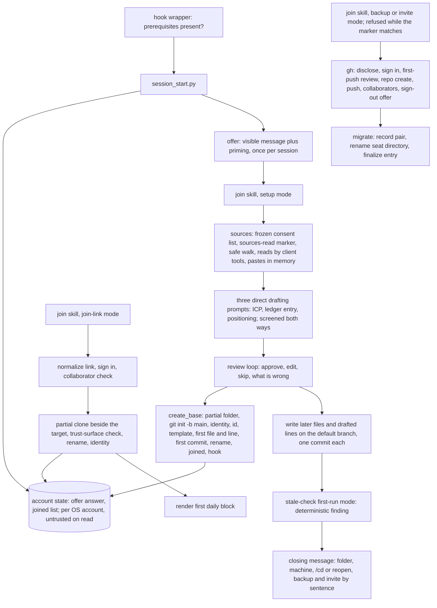
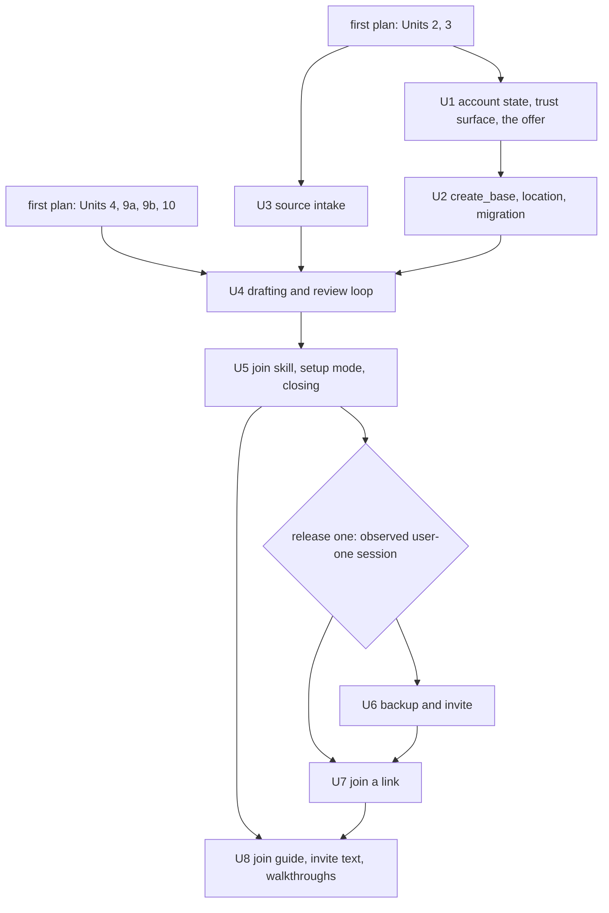

# feat: Join and onboarding

**Target repo:** `gtm-base` (this repository). Builds on the first feature's plan, `docs/plans/2026-09-04-001-feat-current-without-integrations-plan.md`, and extends its Units 1, 2, 3, 4, 9a, 9b, and 10. Where this plan changes a behavior that plan defined, the change is listed under "Changes to the first feature's units" so both plans stay true.

## Overview

Make a base come to exist and a person come to be on it with install as the only manual step. The session-start hook shows a setup offer on screen the first time the plugin runs on an account with no base. User one names where their marketing context lives; join lists what it will read, reads it, and drafts the ICP, one ledger entry, and the positioning one at a time for approval, creating the base beside their existing content without touching it. The session ends with a stale-check finding. Later, one sentence creates a private remote through the GitHub CLI for a backup or an invite. User two pastes an invite link and join verifies it, signs them in, clones, and marks the base joined.

Delivery is in two releases. Release one is Units 1 to 5 and the user-one walkthrough: everything user one experiences, on a local base. Release two is Units 6 and 7, the migration piece of Unit 2, and the user-two walkthrough, and it starts only after one real user-one session has been observed, which is what the origin's seven-day backup trigger and the March design note both ask for.

## Problem Frame

The first feature assumes a joined base. This feature is the first ten minutes that decide whether a marketing lead ever opens the product a second time, and the first hour of the consulting sprint made repeatable. Onboarding delivers the map and a first pass at grounded; current and joined arrive through the first feature's loop afterwards, and the closing message says so (see origin: docs/brainstorms/2026-09-05-join-and-onboarding-requirements.md, Problem Frame and Key Decisions).

## Requirements Trace

Requirement ids are the origin's J1 to J26; success criteria SC1 to SC8 in the order the origin lists them.

- J1 to J4 (the offer, prerequisites): Unit 1.
- J5 to J13 (sources, consent, drafting, approval, no duration, grounding kept, sharing notice): Units 3, 4, 5.
- J14 to J16 (folder placement, parent-folder rule, build beside): Units 1, 2.
- J17 (closing finding and message): Unit 5.
- J18 (repo-local identity): Units 2 and 7. J19 (joined and hook installed): Unit 2.
- J20 to J22 (backup trigger, remote creation, invites): Unit 6.
- J23, J24 (settings file and trust surface, user two): Unit 7, with the check itself built in Unit 1.
- J25, J26 (plain language, learning line): Units 5, 8.
- SC1 (first approved file within ten minutes on the paste path; three files by session end): Units 3, 4, 5, measured in Unit 8's walkthrough.
- SC2 (connected-source run timed separately): Unit 8.
- SC3 (one finding at session end): Unit 5.
- SC4 (daily block next session; second session within seven days with an answered question): Units 1, 5, and the first feature's Unit 10; the return and the answer are recorded in the asked log and in the walkthrough document.
- SC5 (checksums unchanged outside the base and seat directory): Units 2, 8.
- SC6 (user two under five minutes from link to daily block, sign-in timed separately): Unit 7.
- SC7 (no offer in an unrelated project after not now): Unit 1.
- SC8 (two bases on one machine independent): Units 1, 2.

## Scope Boundaries

Carried from the origin: no hosted component (the v2 web app is its own brainstorm), no session-only base switch beyond the parent-folder rule, no connecting of tools on the person's behalf, no recorder reads or transcript analysis inside join, no ProfileBase import, no edits to existing files anywhere, no scheduling, no re-running join to refresh a complete base, Codex after Tier B. Additionally:

- No non-CLI path for creating a remote. The origin's empty-repository page fallback is removed: pushing needs a credential, and the only credential flow a marketing lead can complete is the GitHub CLI's browser sign-in. Join gives the one install line when the CLI is absent. This amends origin J21.
- No branch protection at remote creation. Private repositories on GitHub Free have neither branch protection nor rulesets (verified 2026-09-05). Join states this plainly, and states that every invited collaborator can change every file.
- No document parsing beyond markdown, text, and CSV in this release. PDFs are read through the client's own file reader; Word and PowerPoint files are read as PDF exports or pastes. Standard-library parsing of `.docx` and `.pptx` is deferred until a walkthrough shows a person stalling on the export step.
- No web scraper. Public websites are read through the client's own web fetch tool.
- No brief pipeline. The three drafts are produced directly from the fenced sources with the donor's section and never-hallucinate rules. The ProfileBase conductor-and-specialist stage is deferred, with the trigger being a walkthrough where direct drafting fails on source volume.
- No drafting inside the restricted analyst in this release. The residual is named in Risks and is narrowed by a session marker the gate enforces. Moving local-file drafting into the analyst is the first hardening step once the first feature's Unit 6 exists.
- Join writes nothing to the inbox. Pastes and source text stay in memory for the session.
- No merging of two seat directories, no re-migration on a changed remote, no not-now expiry, no shipped allowlist of marketplace commits. Each is recorded under Deferred with its trigger.
- No `CLAUDE.md`, `AGENTS.md`, or `plugins/` folder in a company base in this release. The trust-surface check refuses them. When company skills and plugins arrive as their own feature, the check gains an explicit review step for that folder.

## Context & Research

### Relevant Code and Patterns

- First feature's plan, reused as-is: the seat directory at `~/.gtm-base/bases/<base-id>/`, the `armed` sentinel location, `lib/gtmbase/{formats,paths,state,ids,validate,shim}.py`, `constants.py`, the worktree helper, `install_git_hook.py`, the stale library (`stale.py`), `confirm.py`, `stale_check.py`, the session-start wrapper and script, the template under `templates/company-base/`, the gate, and the `tests/fakes/gh` seam.
- ProfileBase onboarding pipeline (`~/Build/profile-base-app/src/lib/`): the generator's ICP shape with always sections (firmographics, felt needs, use cases, current solutions) and only-if-signal sections (team structure, technographics, geography, trigger events) and its rule against placeholder content; the specialists' rule "leave fields empty, never hallucinate"; the onboarding chat's hypothesis-first rule and its data-not-instructions fence around external content; the messaging researcher's verbatim-first extraction, banned-word list, and no-em-dash rule. The conductor and specialist stage is recorded as the deferred escalation path.
- ProfileBase `anthropic.ts`: fence-stripping JSON parse, step-tagged errors, truncation never retried.
- Gridwise `weekly-planning` skill: draft the whole document first, mark the spots that are the person's call inline, ask up front only what would change the whole draft, keep per-company settings in `config.md` with fill placeholders.
- Brandon's reader agents (`~/.claude/agents/daily-*-reader.md`): a hard-rule block naming what may be read and what shape comes out; discover connector tools by capability because server prefixes change between sessions.

### Institutional Learnings

- ProfileBase memory: users abandoned onboarding because they thought it was broken, not slow; state the wait before each step. Segment confirmation offered only confirm-or-restart and had to gain an edit path. Users had no guidance after onboarding finished. Generation failures must return the person to the same step. Without a guard, the model interviewed users one field at a time. JSON from the model needs fence stripping and outermost-brace extraction with step-tagged errors.
- Personal lessons: pagination that exits on a short page silently drops most of an archive; advance by records returned and stop only on empty. Two independent tools truncated at 1,000 rows without a flag; verify a read against an independent count before drafting from it. Huge Notion pages exceed the connector's output limit and land as a file reference.
- metrics-game plan: first-time users get a local identity and play immediately; signing in does one thing (moves state off the device) and the interface says so.
- The landing-page quote about a freelancer calling the ICP "the clearest brief" is mock copy, not evidence; not cited anywhere in this plan.
- Design doc assignment (March): watch one real marketing lead before building team access. Acted on here by the release line between Units 5 and 6.

### External References

All verified 2026-09-05 against official pages; scratch copies in the session scratchpad.

- Claude Code hooks: plain stdout and `additionalContext` on SessionStart go to Claude as context and do not appear as a chat message; `systemMessage` in the JSON output is shown to the user; one JSON object can carry `systemMessage` beside `hookSpecificOutput` (documented as universal fields, no explicit combined example, so Unit 1 verifies it first); a hook's stdout must be either one JSON object or plain text, never both, so a fallback needs two hook entries; no way to pre-fill a first user turn in interactive mode; hook strings capped at 10,000 characters; `cwd`, `source`, and `session_id` are in the input; the input carries no client version.
- Claude Code `/cd`: moves the session to a new working directory, loads that directory's `CLAUDE.md`, prompts to trust it; requires v2.1.169, and only from v2.1.246 does it apply the new directory's hooks, skills, and plugins.
- Claude Code settings: a project `.claude/settings.json` may carry `extraKnownMarketplaces` (name to `source` object, where a `github` source takes `repo` and may take `ref` and `sha`) and `enabledPlugins`; it can also carry hooks, permissions, and env; marketplace and plugin entries apply only after the person trusts the folder; the docs are silent on whether the install lands in the same session, so the plan assumes the next session. Trust is keyed on the git repository root, and a nested git repository gets its own trust prompt. Trusting a folder also activates `.claude/commands/`, `.claude/agents/`, `.claude/settings.local.json`, a root `.mcp.json`, `CLAUDE.md`, and `AGENTS.md`, and Claude Code also loads a nested `CLAUDE.md` when working in its subdirectory.
- macOS: on a machine without the Command Line Tools, `/usr/bin/git` and `/usr/bin/python3` exist as stubs that open an install dialog and exit non-zero; `xcode-select -p` reports whether the tools are installed. `git init -b <name>` needs git 2.28 or later, which every supported macOS ships.
- GitHub CLI: `gh auth login --web` runs a browser flow; `gh auth status` exits non-zero when no host is authenticated; `gh repo create <name> --private --source . --remote origin --push` creates a private repository from an existing local repository and pushes; collaborators are added with `PUT /repos/{owner}/{repo}/collaborators/{username}` (201 creates an invitation the person must accept; `permission` is accepted only on organization repositories; 204 when already a collaborator); collaborator status is `GET` on the same path (204 or 404); the CLI ships a universal macOS installer and a one-line web installer. A `repo`-scoped token covers every repository on the account and stays on the machine until `gh auth logout`.
- GitHub plans: protected branches and rulesets exist on private repositories only from GitHub Pro, Team, and Enterprise. Template repositories serve only people with read access.

## Key Technical Decisions

Terms used below: **account state** is the one file per OS user account at `~/.gtm-base/machine.json`; the **seat directory** is the first plan's per-base directory at `~/.gtm-base/bases/<base-id>/`; the **base id** is the value in the clone's git config.

| Decision | Rationale | Rejected alternative |
|---|---|---|
| The offer is one hook output with both `systemMessage` (what the person sees) and `additionalContext` (what primes the assistant), emitted once per session id; if the combined form does not render, the fallback is two SessionStart hook entries, the first emitting only the visible message and the second emitting plain stdout and writing the once-per-session record | Stdout alone reaches only the model. A hook's stdout is parsed as one JSON object or as plain text, so "JSON plus text" is not a form. Keying on the session id keeps `resume` and `compact` from re-showing it. | Stdout only; a first-turn prefill (unsupported interactively). |
| The wrapper checks prerequisites before Python runs: on macOS `xcode-select -p`, elsewhere `command -v git` and `command -v python3`; when the check fails it prints the one install sentence as a visible message and exits 0 | On a fresh Mac the binaries exist as stubs, so `command -v` passes and the stub opens a dialog and fails; the install sentence must come from the shell. | `command -v` alone. |
| Account state holds the offer answer, shown-at with session id, and a joined list (root path, base id, canonical remote address or none). It is treated as untrusted input on every read (known keys only; each root must exist, hold `.git` and the map, and carry the recorded id; anything else is ignored and reported by code), written with a lock file and temp-plus-rename, directory 0700 and file 0600, never a symlink, and never holding a token, a login, or an address with userinfo. The joined list is append-only by root; the offer answer never downgrades (set-up and join beat not-now, not-now beats unset). It is the only joined record; the first plan's seat-state joined flag is removed | Before any base exists there is no base directory. Two Claude Code windows can start together. An injected instruction could otherwise forge an entry that makes the hook pull and install into an arbitrary repository. Two OS accounts each get their own offer, which is intended, and two humans on one account share one answer, which the guide says. | Offer answer in a base's seat state; two joined records. |
| The base carries its own id: at creation join writes a random id into the clone's untracked git config (`gtmbase.id`); the seat directory is `bases/<that id>/`; when a remote appears the base migrates to the remote-derived id. On a folder rename the seat directory does not move; the joined entry's root is rewritten when a base-shaped folder presents a known id whose old root is gone. When the old root still exists (a copy, not a move), the hook does not adopt the copy; it says a copy of a joined base was found and offers to give it a new id, which makes it a separate local base | A path-derived id orphans the seat directory the moment the person renames the company folder. Adopting a copy silently would make two folders share one inbox index, one session id, and one pending confirmation, which breaks SC8. | Provisional id keyed by path; silent adoption of copies. |
| "Set up" is recorded only when the base is created; an offer shown and never answered counts as "not now"; after not-now the offer reappears only in an empty folder or a base-shaped folder; the restart sentence is the join skill's trigger phrase and is printed by "not now" and by the "you can stop at any time" line in setup mode | Recording "set up" at the click would silence the offer for a person who stopped before the first approved file; an ignored offer must not nag; a person who quits mid-setup in their content folder needs the sentence too. The origin's re-entry mechanisms are enough; a time or version expiry would reintroduce the interruption SC7 forbids. | Once per machine forever; not-now expiry. |
| A base is joined at the first approved file; a required file is complete when it exists with a `status` other than `skipped`; the daily block checks the three required files and, when one is missing or skipped, offers to continue setup instead of asking a confirmation question, issuing no question id and writing nothing to the asked log | The folder is the resume state; joining early makes the parent-folder rule and the hook work immediately; a skip must leave a way back; a half-made base must not pollute the yes-rate denominator. | Join at session end; presence-only completeness. |
| Base creation builds everything in a sibling partial folder (`gtm-base.partial-<random>` under the target parent): `git init -b main`, repo-local `user.email` (defaulted to the global value, always written, validated), the base id in git config, template files, the two-key settings file, the allowlist seeded with that email, the first approved file (its `owner` stamped with that email) and its drafted confirmation line, and the first commit; the single rename of that folder to the target name is the commit point; then the joined entry is appended, then the git hook is installed. The approved draft stays in memory until the call returns and is re-offered on failure. Recovery: a `.partial-*` folder is never a base and is deleted on the next run after asking; a folder with a first commit but no joined entry is resolved by the hook's base-shaped question; a joined entry with no hook is fixed by the hook's install step; a seat directory whose base root has no commit is stale and removed | One rename cannot span three stores, so the plan names the commit point and one recovery rule per partial state. The person's first yes must never be lost. `-b main` removes a per-machine default-branch difference. Every drafted file must carry the owner email or the stale library treats every drafted line as a non-owner line. | "Atomic" creation; `git init` with the machine default. |
| In setup mode, `confirm.py`'s drafted mode appends the confirmation line and stages it but never commits; the caller (`create_base` for the first file, `review.py` for later files) writes the file, calls drafted mode, and makes one commit holding both. Drafted mode is allowed once per file path and only when the file is untracked or newly staged, and it never pushes and never records a pending push | `confirm.py` stays the sole writer of the confirmations record while the first commit can hold the file and its line, and later files land in one commit each. | Two commits per file; a second writer. |
| Company name asked once at the location step, validated (no leading dot, no separators, no `..`, capped length) and sanitized; join proposes `cwd/gtm-base` when `cwd` holds content the person named, otherwise `~/<Company>/gtm-base`; it warns when `cwd` is itself a git repository and proposes the home path; it refuses an existing target, a `cwd` with a stray `gtm-base` child, the home directory or above, and the seat directory | The home path needs the name; `.ssh` must never be a company; a nested repository surprises the parent's tooling. | Silent defaults. |
| `paths.resolve_base` is the sole resolver for all four hooks and every skill, consults only account state, treats a joined `gtm-base` child of the current directory as the base, and every git call runs against the resolved base root | The parent folder may itself be a repository; the capture and gate hooks must see the same base the session-start hook sees. | Per-hook resolution. |
| Drafted confirmation lines are dated today with trigger `drafted` and carry the join run id; the drafted ledger entry carries the same run id and `origin: join`; the stale library exempts a `drafted` line from the same-day rule only against an entry carrying the same run id. Both artifacts are committed, so every seat computes the same result. The source's date, when a source carries one, goes into the file's frontmatter `sources` field; sources with no date (pastes, websites, connector results that return none) record no date and are excluded from the date comparison rather than given one | A confirmation is a yes the owner gave, and the owner gave it today. Backdating by file modification time would record a yes on a day nothing happened. An exemption keyed on seat state would flag the ICP on every other seat. A fabricated source date would be a fabricated yes-date by another route. | Confirmation dated by source modification time; run id in seat state only. |
| The closing finding is computed by one stale-check first-run call after the last approve or date correction, never cached, in this order: a required file the person skipped; a drafted file whose `sources` date predates the drafted ledger entry's decision date (a review item: "this document is older than the decision"); otherwise "nothing is out of date yet" naming the review-by date it will watch. The finding text never claims more than the dates show | Origin J17 promises one real thing; the rule makes it deterministic and honest. | Hoping for a finding. |
| Setup mode writes approved files and their confirmation lines directly on the clone's default branch (clean-tree check first), only for files absent from the base and never as an edit; recorded as an amendment to the first plan's invariant | A worktree-based push cannot reach a clone that has no remote, and user one is alone on a local base. | Routing drafts through proposals. |
| Drafting is direct: three prompts (ICP, ledger entry, positioning) read the fenced sources and apply the donor's rules: always and only-if-signal sections with no placeholders, empty rather than invented, verbatim-first positioning with the banned-word list and no em dashes; the ledger entry uses the first feature's decision shape; every source sits inside a data-not-instructions fence; the hidden-content class runs over every source before it enters a prompt and over every draft before it is written; the email, phone, key-shape, and vendor-token classes run over every draft before it is written (with the frontmatter `owner` exemption) and a match returns the draft to the same step; the ledger entry's affected path is canonicalized into `context/` | A summary stage capped at 3,000 characters is exactly where the customer names and figures J12 wants kept would be dropped; a handful of bounded sources fits a direct prompt. Drafts become cross-seat context, so they are screened both ways. | The conductor-and-specialist brief pipeline (deferred with a trigger). |
| Sources are read in the main thread with the client's own tools, one bounded read per source with a count check, pastes held in memory; the consent list freezes the source set (any further read needs a new list shown to the person). When the consent list is accepted, join writes a sources-read marker (session id) under `~/.gtm-base/`; while the marker matches the current session, the gate denies every `gh` invocation and every `git push`, and backup, invite, and join-link modes refuse with the reason; the marker is cleared only when the session ends | Connectors need permission prompts only the main thread shows. The residual (hostile text in a session that holds a `repo`-scoped token) is real, and an ordering rule the model is asked to follow is not a boundary; the marker makes the gate enforce it. | Reading in the restricted analyst now; a skill-side flag only. |
| The named-folder walk never follows symlinks, checks the real path of every file stays under the real path of the named folder, excludes by case-insensitive name (dotfiles, `.env*`, `id_rsa*`, `*.pem`, `*.p12`, `credentials.json`, `.git`, dependency folders, archives, another base), sniffs the first line for key headers and skips on match, lists symlinks as skipped, reads only markdown, text, and CSV, and requires a second explicit yes for a folder that is the home directory or above | The folder a person names is also where secrets and other clients' material live. | Name-only exclusions. |
| Each draft is produced as a whole document and reviewed with approve, edit, skip, and "what is wrong with this?"; the answer routes into an edit of the same draft and nowhere else; a skip writes the file with `status: skipped`; a failed generation returns to the same step; progress is narrated before each wait | ProfileBase's field-by-field interviewing, confirm-or-restart, and silent waits were its three review failures. | Free-text feedback to corrections; a skipped file that looks complete. |
| The first push from a base is gated: at creation the seat state records that the first-push review has not happened; the gate and the installed git hook deny any push from that base until `push_review.py` records an approved review; the review shows a sweep of the whole outgoing range (currency symbols, figures with suffixes or in words, percent words, capitalized multiword candidates, document share-link shapes, absolute local paths) plus the customer names and figures the skill reads out of the drafted files, and asks; the record is consumed by the successful push. No per-draft kept-names list is maintained | J12 must hold on every path out of the machine, not only inside join's backup mode; at the first push there are at most three drafted files, so reading them is cheaper and more complete than a stateful list. | A kept-names list in seat state with its own lifecycle. |
| Backup and invite require the GitHub CLI; join detects it, gives the one install line, states before sign-in which scopes the CLI requests, that the token covers every repository on the account and stays on the machine until sign-out, and where it lives; shows before creation the signed-in login, the repository name, "private," and that the full history of every approved file leaves the machine; creates the repository from the base with `gh repo create --private --source --push`; then migrates the seat directory. Migration order: remote set and pushed, then the joined entry records the pair (base id, remote id, canonical address), then the rename, then the entry is finalized; the resolver falls back to the joined entry by root until then; migration refuses while any worktree exists, runs only from the join skill, and refuses when a seat directory for the remote id already exists (naming the folder already joined to that remote). Collaborators are resolved through the API so the display name and profile address are shown before each invitation, along with the sentence that this person will be able to change every file including the owner's; added by username without a permission parameter; recorded in seat state so a repeat sends no second call. Nothing from `gh` output is logged or stored. The closing message of backup and invite mode offers sign-out and says what it does and does not affect | Plain `git push` needs a credential the person does not have; personal repositories reject `permission` and grant write to every collaborator; a rename mid-push would strand the seat directory; typo-squatted usernames are real; a token that outlives its purpose is the least-privilege failure. | Empty-repository fallback; migration by bare rename; merging seat directories. |
| A remote that changes or disappears: the joined entry keeps the canonical address; on a mismatch the hook prints one sentence; a base that loses its remote keeps its last id. No re-migration in this release | Only join creates remotes in v1 and GitHub redirects renamed repositories; the last-id rule is enough. | Offered re-migration. |
| User two's join: normalize the link to `https://github.com/<owner>/<repo>` with charset-checked parts (userinfo, `git@`, `ssh://`, lookalike hosts, and `..` refused), show the owning account, sign in, confirm collaborator status (204 or 404, naming the signed-in login on failure), clone into a sibling partial folder under the named folder (`gtm-base.partial-<random>`, so the final rename is on one device; a leftover partial from a crashed run is deleted first), run the trust-surface check, rename to `<named folder>/gtm-base` (destination checked with `lexists`, canonicalized, refused inside the seat directory or another base), write the repo-local `user.email` (default to the global value, ask and validate when absent, never touch `~/.gitconfig`), record it joined, install the git hook, render the first daily block from the library, and say the trust prompt is coming | Nothing may be trusted before its whole trust surface is checked; a cross-volume rename fails; the parent-folder rule needs the `gtm-base` name; user two's confirmations need an identity as much as user one's. | Temporary clone under the seat directory; no identity step. |
| The trust-surface check (used before user two's rename and before the hook's "treat this folder as your base?" yes): the settings file holds exactly `extraKnownMarketplaces` and `enabledPlugins`, the marketplace source names the GTM Base repository literal and a 40-character commit `sha`, and the plugin key names the GTM Base plugin; every path component is compared after case folding and Unicode NFC normalization; the whole tree, not only the root, is refused for `CLAUDE.md`, `AGENTS.md`, `.claude/` contents other than `settings.json`, `.codex/`, `.agents/`, `.mcp.json`, `.gitmodules`, `.gitattributes`, `plugins/`, and any `*.sh`, `*.py`, or `*.js` file; no symlink anywhere in the checkout (tracked entries by `git ls-files -s` mode 120000, untracked non-ignored paths by a capped walk that fails closed at the cap); the map is a regular file. The base-shaped question also shows the clone's repo-local email and asks whether it is the joiner's | Trusting a folder activates a dozen paths, macOS volumes are case-insensitive, Claude Code loads nested `CLAUDE.md` files, and a fresh clone must not carry what a later pull would refuse. A handed-over clone would otherwise author the new person's confirmations as the old one. | Checking one file by exact name at the root. |
| "Pinned" means the repository literal and a 40-character commit `sha` in the settings file; no allowlist of known-good commits ships with the plugin; a pin bump is a new settings file committed by Brandon and pulled by hand on each seat, and the guide says the pin protects against a foreign marketplace, not against the GTM Base marketplace itself being compromised | A branch or tag is not a pin; a shipped allowlist adds a coordination step per bump for a marginal threat (rollback to an older commit of the same repository), which is recorded under Deferred with the web app as the place it is solved. | Branch ref; shipped allowlist. |
| The invite text carries the GitHub invitation step, the one install line, the restart sentence, and the trust-prompt warning; the closing message names the folder to open next time and adds that `/cd <folder>` moves there now on recent Claude Code versions, with no attempt to read the client version | After an account has answered the offer once, only the restart sentence gets user two into join; the hook input carries no client version and the binary may not be on the path, so gating on version has no mechanism. | Version-gated `/cd` advice. |
| The gate (first plan Unit 4) gains a denied-outright list of `gh` subcommands no skill ever uses (`repo edit`, `repo delete`, `repo archive`, `repo rename`, `repo fork`, `repo sync`, `secret set`, `variable set`, `gist create`, `ssh-key add`, `gpg-key add`, `auth token`, `auth refresh`, `auth setup-git`, `codespace`, `workflow run`), classifies `repo create` with `--push` or `--source` and `gh api` with any non-GET method as gated pushes, and its regex floor gains document share-link shapes and absolute local paths under `/Users/` or `/home/`; currency stays out of the floor | After the first backup every session holds a `repo`-scoped token; one injected `gh repo edit --visibility public` would publish the base with nothing pushed for the scanner to see. Share links and local paths are leaks a regex can catch; figures are grounding the base needs. | Leaving `gh` beyond the push set unclassified. |

## Changes to the first feature's units

- Unit 2 (library): `machine.py` (account state with the rules above) becomes the only joined record and the seat-state joined flag is removed; `resolve_base` treats a joined `gtm-base` child as the base and is the only resolver; the base id lives in the clone's git config and the provisional id is no longer path-derived; migration records the pair before renaming, refuses while worktrees exist, and refuses an existing remote id; the joined entry stores the canonical remote address; the `drafted` trigger and the run id field on confirmation lines and ledger entries; the first-push-review flag in seat state.
- Unit 3 (session-start hook): the wrapper runs the prerequisite check first (`xcode-select -p` on macOS); the offer (visible plus context, once per session id) per account state; the base-shaped question runs the trust-surface check, shows origin (address without userinfo, length-capped, control characters stripped) and the repo-local email; a copy of a joined base is not adopted; the continue-setup variant issues no question id and logs nothing; a base with no remote skips fetch and pull, prints no failure sentence, and still asks the question; git calls run against the base root. The earlier scenario "unjoined template-layout base prints nothing" becomes "no pull and no hook install; the base-shaped question only after the trust-surface check passes."
- Unit 4 (gate): the `gh` deny list and the widened push classification; two new floor classes; the sources-read session marker denies `gh` and `git push` while it matches the session; the first-push-review flag denies any push from a base until reviewed; the installed git hook enforces the same two conditions.
- Unit 9a (stale library): same-run exemption for `drafted` lines keyed on the run id carried by the line and the entry; a base with no remote is treated as fast-forwarded; files with no `sources` date are excluded from the date comparison.
- Unit 9b (stale-check skill): a first-run mode with the deterministic finding order and the honest report.
- Unit 10 (confirm): a `drafted` mode that needs no question id, appends and stages without committing, is allowed once per file path and only for an untracked or newly staged file, and never pushes.
- Unit 1 (template): the settings file with exactly two keys and the pinned `sha`; every template context file's `owner` is a placeholder the creation step replaces; the join guide rewritten by Unit 8 here.
- Invariant amended: tracked files are written only through a proposal, a confirmation, or join's setup mode for files absent from the base.
- SC5 clarification: `install_git_hook.py` may chain into a configured global `core.hooksPath` when writable; that directory is excluded from the checksum criterion, which otherwise covers the named folder, any `CLAUDE.md` or `AGENTS.md` outside the base, `~/.gitconfig`, and the Claude Code settings file.

## Execution Posture

Every implementation unit is executed by a subagent running Opus 5 at high reasoning effort, one unit per agent, with the orchestrating session holding this plan, the origin document, and the test suite. The orchestrator runs the tests and the plain-language lint after each unit and never merges a unit whose test scenarios are not all covered. Units marked with an execution note carry that posture into the agent's brief. Release two does not start until one real user-one session has been observed and its walkthrough written. Decided by Brandon on 2026-09-05.

## Open Questions

### Resolved During Planning

- Where the offer answer lives: account state at `~/.gtm-base/machine.json`, per OS account, untrusted on read, the only joined record.
- Visible offer plus priming: one JSON hook output, verified as Unit 1's first task; fallback is two hook entries.
- Which connected-tool reads join attempts: whatever the person names, one bounded read each, discovered by capability; the consent list freezes the set; the library never calls a connector.
- Drafting: three direct prompts over fenced sources with the donor's rules; no brief stage in this release.
- Parent-folder rule with more than one `gtm-base` child: the hook does nothing and prints one sentence naming both.
- GitHub CLI calls: as listed under External References; the collaborator check's exit code on 404 is confirmed on the first real run and the fake `gh` models both outcomes.
- GitHub Free protections: none on private repositories; join says so and says every collaborator can change every file.
- Trust-surface check: as in the decision table; the same check gates the hook's treat-as-base yes.
- "What got in the way" line: `corrections/` as a dated file of kind `onboarding-note`; the join guide asks the first ten users to paste it to Brandon.
- Origin J9 amended: drafted confirmations are dated today; the source date lives in the file's `sources` field when the source carries one.
- Origin J11 amended: join never spills to the inbox; pastes stay in memory.
- Origin J21 amended: the GitHub CLI is the sole path for backup and invite; the empty-repository page fallback is removed; join gives the one install line.
- Origin J22 amended: on GitHub Free there are no protections to state; join states the collaborator-write consequence instead.
- Origin J23 clarified: "pinned" is a 40-character commit `sha`; the check covers the whole trust surface, not the settings file alone.
- Injection residual in setup mode: named in Risks and enforced by the sources-read marker in the gate; moving local-file drafting into the restricted analyst is deferred.

### Deferred to Implementation

- Whether the combined `systemMessage` plus `additionalContext` output renders in the current Claude Code build: Unit 1's first check.
- How Notion and Drive connector results arrive, whether they carry a last-edited date, and what count check each allows: first real read in Unit 3; paste fallback.
- The exit code of `gh api` on a 404: first real run in Unit 7.
- Whether Claude Code verifies the marketplace `sha` against the fetched commit at install time or merely checks it out: observed on the first real join; if it falls back to a branch on an unreachable sha, the guide's statement about the pin is weakened accordingly.
- Where `gh auth login --web` stores the token on the target macOS builds (keychain or a plain file): read on the first real sign-in and reflected in the disclosure sentence.

### Deferred to later releases, with triggers

- Standard-library `.docx` and `.pptx` extraction: when a walkthrough shows a person stalling on the export step.
- The conductor-and-specialist brief stage: when direct drafting fails on source volume in a walkthrough.
- Local-file drafting inside the restricted analyst: after the first feature's Unit 6 lands.
- Merging two seat directories for one remote, re-migration on a changed remote, and a shipped allowlist of marketplace commits: when a real base hits the case; the web app is the place the rollback threat is solved.
- Company skills and plugins in a base, and the trust-surface review step they need: their own feature.
- Running the trust-surface check on every session start of a joined base as a report: when a second person is on a base.

## High-Level Technical Design

> *This illustrates the intended approach and is directional guidance for review, not implementation specification. The implementing agent should treat it as context, not code to reproduce.*

One skill with three modes (setup in Unit 5, backup or invite in Unit 6, join a link in Unit 7), all driving library functions; the hook only reads account state and prints. The user's clone stays on the default branch; setup mode writes new files there directly, everything else goes through proposals and confirmations.

## Implementation Units

Dependency graph:

### Release one: user one, on a local base

- [x] **Unit 1: Account state, the trust surface, and the offer**

**Goal:** The first session on an account shows the offer on screen once, remembers the answer safely, re-offers only where the origin allows, asks the base-shaped question with origin and the trust check, refuses to adopt a copy, and offers to continue a half-made base.

**Requirements:** J1, J2, J3, J4, J14, J23 (the check), SC7, SC8.

**Dependencies:** First plan Units 2 and 3.

**Files:**
- Create: `plugins/gtm-base/lib/gtmbase/machine.py`, `plugins/gtm-base/lib/gtmbase/trust_surface.py`, `plugins/gtm-base/templates/offer.md`, `plugins/gtm-base/templates/base-shaped-question.md`, `plugins/gtm-base/templates/continue-setup.md`
- Modify: `plugins/gtm-base/hooks/session-start.sh`, `plugins/gtm-base/lib/gtmbase/session_start.py`, `plugins/gtm-base/lib/gtmbase/paths.py`, `plugins/gtm-base/lib/gtmbase/state.py`
- Test: `tests/test_machine.py`, `tests/test_trust_surface.py`, `tests/test_session_start_offer.py`, `tests/fixtures/trust/` (checkouts with `claude.md`, `.Claude/commands/`, `context/CLAUDE.md`, a decomposed-Unicode `CLAUDE.md`, a `.py` file, a symlink, a `plugins/` folder, and a clean one)

**Approach:**
- First task: verify the combined hook output renders; record the result and apply the two-entry fallback if needed.
- The wrapper runs the prerequisite check per the decision table and prints the install sentence as a visible message when it fails, then exits 0.
- `machine.py` implements the account-state rules (validation on read, lock, atomic write, permissions, precedence, append-only joined list, no expiry).
- `trust_surface.py` implements the whole-surface check with case folding, NFC normalization, the whole-tree refusal set, `git ls-files -s` for tracked symlinks, and a capped walk for untracked paths.
- `session_start.py` resolution order: joined base at `cwd` or `cwd/gtm-base` (daily block; continue-setup when a required file is missing or `status: skipped`, with no question id and no log write; no fetch when there is no remote); base-shaped but unjoined (trust-surface check, then: known id with the old root gone means rewrite the root; known id with the old root present means the copy sentence and the new-id offer; unknown id means origin shown safely, repo-local email shown, question); more than one `gtm-base` child (one sentence); otherwise the offer rules, emitted once per session id.

**Patterns to follow:** The first plan's hook posture; Brandon's production hook.

**Test scenarios:**
- Happy path: fresh account, `startup` in an unrelated folder: visible offer plus priming; shown-at and session id recorded; a `resume` in the same session shows nothing.
- Edge case: offer shown and unanswered, second session elsewhere: nothing; in an empty folder: offer; in a base-shaped folder: the question, not the offer; after not-now, an unrelated folder a month later: nothing.
- Happy path: `cwd` is the company folder and `cwd/gtm-base` is joined: the daily block runs against the child; with no remote it asks a question and prints no failure sentence.
- Edge case: joined base with `positioning.md` at `status: skipped`, and separately with the file missing: continue-setup variant both times; the asked log is unchanged and no question id is issued.
- Edge case: a renamed company folder (old root gone): the joined entry's root is rewritten and the daily block runs; a copied folder (old root present): the copy sentence, no adoption, the new-id offer.
- Edge case: two `gtm-base` children: one sentence, nothing else.
- Security: an account-state entry whose root lacks the map or whose id does not match is ignored and reported by code; an unknown key is dropped; the file's mode is 0600 and the directory 0700; a symlinked file is refused; no output contains `://` with userinfo, a key shape, or a login.
- Security: each hostile trust fixture (`claude.md`, `.Claude/commands/`, `context/CLAUDE.md`, decomposed-Unicode `CLAUDE.md`, a `.py` file, a symlink, a `plugins/` folder) fails the check and the question is not asked; the clean fixture passes; a remote string with control characters is stripped and capped.
- Error path: on macOS with `xcode-select -p` failing, or elsewhere with `python3` absent: the wrapper prints the install sentence and exits 0; a stubbed `python3` that exits non-zero without output is treated the same.
- Edge case: two sessions start together on a fresh account: both read unset; the lock serializes the write; one shown-at survives and no joined entry is lost.

**Verification:** Installing the plugin on a clean account and opening Claude Code anywhere shows the offer as a message before the first prompt; declining is silent thereafter except in empty or base-shaped folders; a local-only base shows the daily block and a question.

- [x] **Unit 2: create_base, location, and migration**

**Goal:** Turn an approved first file into a joined base beside the person's content through a partial folder and a single rename, with repo-local identity, a base id in git config, template files, a first commit, and the hook installed; recognize and recover every partial state. The migration piece belongs to release two.

**Requirements:** J9, J14, J15, J16, J18, J19, SC5, SC8.

**Dependencies:** Unit 1; first plan Units 2 and 4.

**Files:**
- Create: `plugins/gtm-base/lib/gtmbase/create_base.py`, `plugins/gtm-base/lib/gtmbase/location.py`, `plugins/gtm-base/lib/gtmbase/migrate.py` (release two)
- Modify: `plugins/gtm-base/lib/gtmbase/paths.py`, `templates/company-base/.claude/settings.json` (two keys, repository literal, pinned `sha`), `templates/company-base/context/strategy/icp.md` (owner placeholder)
- Test: `tests/test_create_base.py`, `tests/test_location.py`, `tests/test_migrate.py` (release two)

**Approach:**
- `location.py` implements the naming, proposal, and refusal rules.
- `create_base.py` implements the partial-folder sequence, the commit-point rename, the joined entry, the hook install, the first-push-review flag, and the recovery table; it takes the approved first file and its confirmation line as inputs, stamps the file's `owner` with the repo-local email, and lets `confirm.py`'s drafted mode append and stage the line so the first commit holds both.
- `migrate.py` (release two) implements the ordered migration, the refusal while worktrees exist, and the refusal on an existing remote id.

**Patterns to follow:** The first plan's worktree helper for git invocation against a root; Gridwise config placeholders for the map defaults.

**Test scenarios:**
- Happy path: first approve with company "Acme" in a content folder: `cwd/gtm-base` exists with `.git` on branch `main`, repo-local `user.email`, `gtmbase.id` in git config, template tree, two-key settings file with the pinned sha, allowlist seeded with the email, one commit holding the approved file (with `owner` equal to that email) and its confirmation line carrying the run id, a joined entry, the git hook, and the first-push-review flag unset.
- Edge case: global `init.defaultBranch=trunk`: the base is still on `main`; global git email exists: repo-local email equals it and is written anyway; no global email: the asked, validated email is written repo-locally and `~/.gitconfig` is unchanged.
- Edge case: `cwd` is a git repository: warning and home-path proposal; `cwd` is the home directory: a second explicit yes is required; company name `.ssh` or `a/b`: refused.
- Error path: crash simulated after the partial folder is built and before the rename: the target does not exist, the next run finds the partial folder and asks before deleting it, and the approved draft is re-offered.
- Error path: crash after the rename and before the joined entry: the hook's base-shaped path recognizes it; after the entry and before the hook: the hook install step repairs it.
- Edge case: a stale seat directory for a root with no commit is removed before creation.
- Happy path (release two): migration after a remote appears records the pair, renames the seat directory, finalizes the entry with the canonical address; refuses while a worktree exists; refuses when a seat directory for that remote id already exists, naming the folder.
- Security: checksums of the parent folder, `~/.gitconfig`, and the Claude Code settings file are unchanged by creation.

**Verification:** A person can stop after the first approved file, close the session, reopen in the folder, and be offered to continue; renaming the company folder does not orphan the base; copying it does not silently share state.

- [x] **Unit 3: Source intake**

**Goal:** Turn what the person names into bounded, fenced, screened source text with a frozen consent list and a session marker the gate enforces.

**Requirements:** J5, J6, J7, J11, J13.

**Dependencies:** First plan Unit 2.

**Files:**
- Create: `plugins/gtm-base/lib/gtmbase/sources.py`, `plugins/gtm-base/lib/gtmbase/extract.py` (markdown, text, CSV), `plugins/gtm-base/lib/gtmbase/marker.py` (sources-read marker), `plugins/gtm-base/skills/join/references/reading-rules.md`
- Test: `tests/test_sources.py`, `tests/test_extract.py`, `tests/test_marker.py`, `tests/fixtures/sources/`

**Approach:**
- Listing implements the safe walk and returns the list the skill shows; nothing is read until the person says yes; accepting the list writes the sources-read marker for the session and freezes the set. A folder that appears to hold more than one company stops with a question. Office files are listed with the instruction to export to PDF or paste.
- Extraction reads markdown, text, and CSV and returns text with a label and the file's modification date (clamped to today) for the `sources` field; sources with no date return none.
- Every source text passes the hidden-content class and is wrapped in the data-not-instructions fence with its label before it reaches a prompt.
- The reading rules tell the skill how to read PDFs, sites, and connectors with the client's tools, one bounded read each, count before drafting, pagination by records returned, and that the gate will refuse `gh` and pushes for the rest of the session once sources are read.

**Execution note:** Implement the extractors and the walk test-first against the fixtures.

**Test scenarios:**
- Happy path: listing shows only allowed files and reports excluded classes by count; accepting writes the marker with the session id; the frozen list rejects a later addition without a new consent.
- Security: a symlink to `~/.ssh/id_ed25519` inside the folder is listed as skipped and never opened; a symlinked directory to the home folder is skipped; `.ENV` and `credentials.json` are excluded case-insensitively; a file whose first line starts with `-----BEGIN` is skipped; a source containing a zero-width character is flagged before fencing.
- Edge case: a `.docx` in the folder is listed with the export-or-paste instruction and not read; a file over the size cap is listed as skipped with the reason.
- Edge case: two companies' positioning files: stop and ask.
- Edge case: a source dated tomorrow is clamped to today and the clamp recorded by code; a paste returns no date.
- Integration: with the marker set for this session, the gate denies `gh auth login` and `git push`; a different session id is unaffected.

**Verification:** The reading rules let the skill read a PDF, a website, and a Notion page with the client's tools in a manual walkthrough, and every text arrives fenced, labeled, and screened.

- [x] **Unit 4: Drafting and the review loop**

**Goal:** From fenced sources, produce whole-document drafts of the ICP, one ledger entry, and the positioning directly, each reviewed with approve, edit, skip, and "what is wrong with this?", screened before write, and written only on a yes with a drafted confirmation dated today.

**Requirements:** J8, J9, J10, J12, J13.

**Dependencies:** Units 2, 3; first plan Units 4, 9a, and 10.

**Files:**
- Create: `plugins/gtm-base/skills/join/references/prompts/draft-icp.md`, `draft-ledger-entry.md`, `draft-positioning.md`, `plugins/gtm-base/lib/gtmbase/drafting.py` (prompt assembly with caps, fence-stripping parse, step-tagged errors), `plugins/gtm-base/lib/gtmbase/review.py`
- Test: `tests/test_prompt_guards_join.py`, `tests/test_drafting.py`, `tests/test_review.py`, `tests/fixtures/drafts/`

**Approach:**
- Three prompts apply the donor rules directly over the fenced sources; each carries the data-not-instructions sentence inside its fence. Order: ICP, ledger entry (needs the ICP path; the decision date is presented for correction; the entry carries `origin: join` and the run id), positioning. Map settings from defaults; voice and the rest empty and named.
- `review.py` stamps `owner` with the repo-local email, runs the hidden-content class and the email, phone, key-shape, and vendor-token classes over the draft (with the `owner` exemption) and returns to the same step on a match, canonicalizes the ledger entry's affected path, writes on approve (through `create_base` for the first file, directly on the default branch after a clean-tree check for later files) with `confirm.py`'s drafted mode appending and staging the line and one commit holding both, and writes `status: skipped` on a skip. Progress lines before each wait; a failed generation returns to the same step.

**Execution note:** Add characterization tests over captured drafts before changing prompt output shapes.

**Test scenarios:**
- Happy path: every prompt file contains the data-not-instructions sentence inside its fence and no em dash.
- Happy path: fixture sources produce an ICP with the four always sections and no empty optional sections; technographic signals add that section; sources with no pain points omit felt needs and tell the person.
- Happy path: a ledger entry draft carries all fields, `origin: join`, the run id, and the decision date presented for correction.
- Happy path: approve writes the file with `owner` set to the repo-local email and one drafted line dated today carrying the run id, in one commit; the source date sits in the file's `sources` field; a second drafted line for the same path is refused; the stale library counts the file as confirmed for that owner.
- Edge case: "what is wrong with this?" regenerates the same draft with the answer applied and writes nothing to `corrections/`; skip writes the file with `status: skipped`.
- Security: a draft with a zero-width character is rejected before write; a source with a prospect's email and phone yields drafts with neither, and a draft that still carries one is returned to the same step; an affected path of `../secrets.md` is rejected.
- Error path: invalid JSON after fence stripping: step-tagged error, same step.

**Verification:** On the fixture sources, a full pass yields three approved files, one entry, three drafted lines dated today with the run id, source dates in `sources` where known, and no contact details in any draft.

- [x] **Unit 5: The join skill, setup mode, and the closing**

**Goal:** One skill that runs the whole first session for user one and closes with the deterministic finding, the learning line, and the way back.

**Requirements:** J5, J9, J11, J13, J17, J19, J25, J26, SC1, SC3, SC4.

**Dependencies:** Units 2, 3, 4; first plan Units 9b and 10.

**Files:**
- Create: `plugins/gtm-base/skills/join/SKILL.md` (description carries the restart sentence), `plugins/gtm-base/skills/join/references/closing-rules.md`, `plugins/gtm-base/lib/gtmbase/not_now.py`, shims under `plugins/gtm-base/skills/join/scripts/`
- Modify: `plugins/gtm-base/skills/stale-check/SKILL.md`, `plugins/gtm-base/lib/gtmbase/stale_check.py` (first-run mode, no-remote handling, honest report)
- Test: `tests/test_join_setup_flow.py`, `tests/test_not_now.py`

**Approach:**
- The skill body: state what will happen; the "you can stop at any time" line with the restart sentence; the sharing notice before the first draft; the one opening question; the consent list; reads; drafts; review; no duration quoted; no interviewing field by field. Backup, invite, and join-link modes refuse while the sources-read marker matches the session.
- Closing: one first-run stale-check call after the last approve or correction, the finding per the deterministic order with honest wording, the "what got in the way" line to `corrections/` if given, then the closing message (this folder on this machine only; the folder to open next time, and `/cd <folder>` on recent versions; backup and invite by sentence; the offer to run `learn-from-call` on a paste).

**Patterns to follow:** Gridwise weekly-planning; ProfileBase onboarding chat's hypothesis-first rule.

**Test scenarios:**
- Happy path (library scenario): fixture sources through setup produce a joined base with three files, one entry, three drafted lines, and a first-run finding.
- Edge case: skipped positioning: the finding names it; a source dated August and an entry decided in September: the finding reports the older document as a review item; all sources newer than the entry, or undated: "nothing out of date yet" with the review-by date.
- Edge case: a corrected decision date after the ICP line was written changes the finding; the finding is recomputed, not cached.
- Edge case: the session read sources: "back this up" in the same session is refused with the reason.
- Happy path: not-now records the answer and prints the restart sentence that matches the skill description.
- Lint: the skill body and closing rules contain no banned git words and each step states what will happen before it happens.

**Verification:** A manual walkthrough from "set up" to the closing message on the paste path reaches a first approved file inside ten minutes and ends with a stated finding.

### Release two: off the laptop, and user two

Starts after one real user-one session has been observed and `docs/walkthroughs/2026-09-user-one-paste-path.md` is written.

- [ ] **Unit 6: Backup and invite**

**Goal:** One sentence, in a session that read no sources, creates a private remote through the GitHub CLI after disclosures and the first-push review, migrates the seat directory in order, and invites by username with each person shown before the call.

**Requirements:** J12, J20, J21 (amended), J22 (amended).

**Dependencies:** Units 2 (migration piece), 5; first plan Unit 4.

**Files:**
- Create: `plugins/gtm-base/lib/gtmbase/remote.py`, `plugins/gtm-base/lib/gtmbase/push_review.py`, `plugins/gtm-base/templates/invite.md`
- Modify: `plugins/gtm-base/skills/join/SKILL.md`, `plugins/gtm-base/lib/gtmbase/session_start.py` (backup offer once), `plugins/gtm-base/lib/gtmbase/gate.py`, `plugins/gtm-base/lib/gtmbase/redaction_patterns.py`, `plugins/gtm-base/lib/gtmbase/install_git_hook.py` (first plan Unit 4 changes)
- Test: `tests/test_remote.py`, `tests/test_push_review.py`, `tests/test_gate_gh.py`

**Approach:**
- Implements the decision-table sequence: detection and install line, scope and token disclosure, sign-in, pre-creation disclosure, first-push review (sweep over the outgoing range plus the skill's reading of the drafted files) recording approval, creation and push, ordered migration, plan statement, collaborator resolution with the write-access sentence and per-person confirmation, recorded invitations, invite text, sign-out offer. The runner captures all `gh` output and prints fixed sentences. The gate and the git hook gain the deny list, the widened push classification, the two floor classes, and the first-push-review condition.

**Test scenarios:**
- Happy path: signed in, review approved: the fake `gh` receives create with the expected flags after the disclosures; the pair is recorded before the rename; the seat directory is migrated; the entry holds the canonical address; the review record is consumed.
- Error path: CLI absent: install line only; signed out: sign-in first; a worktree exists: migration refused; a seat directory for the remote id exists: refused naming the folder.
- Edge case: the review shows a figure written as "two million," a Notion share link, and a local path found by the sweep, and two customer names the skill read from the drafted files; a "no" stops before any push and the flag stays unset.
- Security: a plain `git push` from a terminal before the review is blocked by the installed git hook; after an approved review the same push proceeds to the normal scan; `gh repo edit --visibility public` and `gh auth token` are denied outright by the gate; `gh repo create --private --source . --push` is classified as a push and scanned; `gh api -X PUT` is gated; a share link in an outgoing diff is denied by the floor; nothing from `gh` output, the device code, or the login appears in any file or printed line.
- Happy path: inviting two usernames shows each display name and the write-access sentence first, sends two collaborator calls without a permission parameter, records both, and a repeat sends none; the invite text carries the restart sentence and the trust warning; the closing message offers sign-out.
- Edge case: the backup offer appears once after seven days and never after it fired.

**Verification:** From a local base, "back this up" ends with a private repository holding the base's history and the seat directory renamed to the remote id; "invite Jess" ends with one invitation and a paste-ready invite text.

- [ ] **Unit 7: Join a link (user two)**

**Goal:** From a pasted invite link, verify, sign in, confirm access, clone safely beside the destination, check the whole trust surface, set identity, mark joined, and show the first daily block.

**Requirements:** J18, J23, J24, SC6.

**Dependencies:** Units 1, 6; first plan Unit 3.

**Files:**
- Create: `plugins/gtm-base/lib/gtmbase/join_link.py`
- Modify: `plugins/gtm-base/skills/join/SKILL.md`
- Test: `tests/test_join_link.py` (fake `gh`, local bare repositories, the hostile trust fixtures)

**Approach:**
- Implements the decision-table sequence: link normalization and refusals, owner display, sign-in, collaborator check naming the login on failure, partial clone beside the destination with leftover cleanup, trust-surface check, rename-only move with destination checks, repo-local identity, joined entry, hook install, first daily block from the library, trust-prompt note.

**Test scenarios:**
- Happy path: valid link, collaborator, clean surface: clone lands under `gtm-base`, repo-local `user.email` set and `~/.gitconfig` unchanged, entry written, hook installed, first block rendered.
- Error path: a link with userinfo, a `git@` form, a lookalike host, or `..`: refused naming the reason; 404 on the collaborator check: refused naming the signed-in login.
- Security: each hostile trust fixture: refused, nothing moved, the partial clone deleted; a destination inside the seat directory or resolving through a symlink: refused.
- Edge case: a base cloned by hand with no settings file but a map: the skill proposes the settings file as a first proposal and continues; a leftover partial clone from a crashed run is deleted before cloning; a destination on a different volume from the seat directory still succeeds because the partial clone is beside the destination.
- Edge case: the named folder already has a `gtm-base` child: refused with a proposal for another name.

**Verification:** A second machine account with the plugin installed and an accepted invitation goes from pasting the link to a rendered first daily block, and the next open in that folder shows the block on its own.

- [ ] **Unit 8: Join guide, invite text, and the two walkthroughs**

**Goal:** The user-facing words for onboarding, and the measured runs the success criteria demand. The user-one walkthrough closes release one; the invite text and the user-two walkthrough close release two.

**Requirements:** J25, J26, SC1, SC2, SC5, SC6.

**Dependencies:** Unit 5 (release one part); Units 6, 7 (release two part).

**Files:**
- Modify: `docs/join-guide.md`, `plugins/gtm-base/templates/invite.md`, `plugins/gtm-base/README.md`
- Create: `docs/walkthroughs/2026-09-user-one-paste-path.md`, `docs/walkthroughs/2026-09-user-two-invite.md`
- Test: `tests/test_plain_language.py`

**Approach:**
- The guide covers prerequisites, what the offer says, what set up does, where the base lives, backup and invite (including that every collaborator can change every file, the token's reach and the sign-out), the identity note per plan tier, the pin's meaning and the by-hand pull on a bump, that two humans on one account share one offer answer, the gate's residual, and the session-history caveat. The walkthrough documents record timings (self-recorded, labeled as such), checksums, the return within seven days and the answered question, and the "what got in the way" line after real runs.

**Test scenarios:**
- Lint: none of the user-facing texts contain commit, branch, pull request, merge, rebase, or clone; each numbered step in the guide begins with a verb and names its outcome; the write-access sentence and the sign-out sentence are present.
- Test expectation for the walkthrough documents: none, they are records.

**Verification:** A stranger following the guide reaches the offer and the first approved file without asking a question; the walkthrough documents hold real timings.

## System-Wide Impact

- **Interaction graph:** the session-start hook gains three branches and a prerequisite check; `paths.resolve_base` becomes the single resolver for all four hooks and every skill; the join skill drives the same library the first feature's skills use; `confirm.py`, `stale_check.py`, and the gate gain modes, classes, and two session-scoped conditions (sources-read marker, first-push review).
- **Error propagation:** the hook stays exit-0 with fixed sentences; the skill narrates waits and returns to the same step on failure; `gh` failures name the signed-in login and one next step; nothing from `gh` is logged.
- **State lifecycle risks:** account state is validated on every read and written under a lock; creation has a named commit point and a recovery rule per partial state; migration records before it renames and refuses on worktrees or an existing remote id; drafted lines are dated today, carry the run id, and are limited to one per path; the first-push flag is consumed only by a successful reviewed push.
- **API surface parity:** Codex is out until Tier B; the skill body carries no client-specific syntax.
- **Integration coverage:** a stopped run resumed through the continue-setup block; a base drafted in a folder that is itself a repository; a terminal push blocked before the first review and allowed after; user two's partial clone refused on a hostile trust surface; two bases with different repo-local owners; a renamed company folder; a copied one.
- **Unchanged invariants:** no MCP servers declared; context reads local; nothing outside the base, the seat directory, and a configured global hooks directory written; the proposal body remains the single artifact; tracked files are written only through a proposal, a confirmation, or setup mode for new files.

## Risks & Dependencies

| Risk | Mitigation |
|---|---|
| The combined visible-plus-context hook output does not render | Verified first in Unit 1; fallback is two hook entries |
| Prompt injection through the person's own documents in a full-tool session | Fences, hidden-content and contact-detail screening both ways, frozen consent list, the sources-read marker enforced by the gate (no `gh`, no push for the rest of the session), mode refusal; residual stated; local-file drafting moves into the restricted analyst as the first hardening step |
| An injected `gh` command publishes or deletes the base after the first backup | Deny list in the gate for `gh` subcommands no skill uses; `repo create` and non-GET `gh api` gated as pushes |
| Drafts read as paraphrase | Verbatim-first prompts, never-hallucinate rules, "what is wrong with this?" on every draft, the deterministic closing finding |
| Connector reads truncate silently | Count before drafting, pagination by records returned, file-reference results treated as partial, paste fallback |
| A marketing lead's machine lacks the developer tools or the GitHub CLI | The wrapper's `xcode-select` check and one install sentence; one install line from join |
| Customer names and figures leave the machine unreviewed | The first-push review is a gate condition on every push path, in the client and in the git hook |
| A hostile or lookalike base is trusted | Whole trust-surface check with case folding and NFC before any clone move and before the hook's treat-as-base yes; link normalization; pinned sha |
| A phishing invite to a valid-looking base | The owning account is shown before anything happens; the guide tells user two to read it; residual |
| A hostile or compromised collaborator | Write access is the only option on a personal repository and the inviter is told so per person; the pull refusal keeps instruction paths off seats; identity is a claim on Free; no read-only role and no history protection until a paid plan; residual |
| Forged account state | Validated on read, permissions, lock, no secrets |
| Approval fatigue | Three required drafts, whole documents, edit path, "what is wrong" prompt |
| Renamed or copied company folder | Id in git config; root rewrite on a move; no adoption of a copy |
| Reinstall or second person on one account | Restart sentence; empty-folder and base-shaped re-offer; the guide says two humans on one account share one answer |
| Pin bump needs a by-hand pull on every seat | Stated in the guide; the web app removes it later |
| The `repo`-scoped token outlives its purpose | Disclosed before sign-in; sign-out offered after every backup or invite; readable by any process as the OS user regardless, stated in the guide |

## Documentation / Operational Notes

- `docs/join-guide.md` is rewritten by Unit 8 and is the only user-facing document besides the offer, the closing message, and the invite.
- The walkthrough documents are the evidence for the success criteria and the gate between release one and release two.
- `plugins/gtm-base/CHANGELOG.md` records each unit as it lands.

## Sources & References

- **Origin document:** [docs/brainstorms/2026-09-05-join-and-onboarding-requirements.md](../brainstorms/2026-09-05-join-and-onboarding-requirements.md)
- First feature plan: [docs/plans/2026-09-04-001-feat-current-without-integrations-plan.md](2026-09-04-001-feat-current-without-integrations-plan.md)
- Donor code: `~/Build/profile-base-app/src/lib/prompts/onboarding-generator.ts`, `prompts/onboarding-chat.ts`, `prompts/messaging-researcher.ts`, `prompts/specialist-*.ts` (deferred stage), `onboarding-pipeline.ts`, `anthropic.ts`
- Local patterns: `~/Gridwise/.claude/skills/weekly-planning/`, `~/.claude/agents/daily-*-reader.md`
- External docs: code.claude.com/docs/en/hooks, /settings, /settings-reference, /permissions, /plugin-marketplaces; cli.github.com/manual; docs.github.com REST collaborators, protected branches, rulesets, template repositories; github.com/cli/cli install_macos

## Revision Log

- 2026-09-05 r1: written from the origin and research.
- 2026-09-05 deepened: architecture, security, and data-integrity passes (40 findings).
- 2026-09-05 r2: plan review by coherence, feasibility, security, and scope-guardian reviewers (33 findings; the adversarial reviewer did not complete). Cuts: the brief pipeline, `.docx` and `.pptx` parsing, the kept-names list, seat-directory merging, re-migration, not-now expiry, the shipped sha allowlist. Fixes: release line after Unit 5; `xcode-select` prerequisite check; two-entry hook fallback; run id carried on committed artifacts for the same-run exemption; drafted mode appends and stages without committing so one commit holds file and line; `git init -b main`; owner stamped with the repo-local email; completeness by `status`; copies not adopted; partial clone beside the destination; user two identity step; source dates only when a source carries one; contact-detail screening of drafts; trust surface widened (case folding, NFC, whole tree, pull refusal set, `plugins/`); `gh` deny list and widened push classification; first-push review as a gate condition on every push path; collaborator write-access disclosure; token lifecycle and sign-out; `/cd` advice without a version gate; account state as the only joined record; SC5 scope clarified; J21 amendment stated in full.
- 2026-09-06 r2.1: amended after the first live sessions on the desktop app. The offer is the assistant's first reply rather than an on-screen notice, and an offer shown and never answered no longer counts as not now. See Amendment r2.1 below.

## Amendment r2.1 (2026-09-06): what the desktop app can show, and how long the offer keeps asking

Recorded from live sessions on 2026-09-06, after Unit 1 and the two-entry hook shape shipped in 0.1.2 and 0.1.3.

**What was observed.**

1. The Claude Code desktop app renders no session-start hook output on screen. Not the combined object carrying both `systemMessage` and `additionalContext`, and not `systemMessage` on its own. Only the assistant's context arrives, and only as plain text on its own hook entry. So the offer can reach a person in one way only, as part of the assistant's first reply, after they have typed something.
2. Hook entries for one event run at the same time as each other, not in the order they are declared. That was found on 2026-09-06 and the code already accounts for it (0.1.2): neither half may wait on the other, and the half that prints what a person sees treats a record carrying this session's own id on a session that has only just begun as the other half making the offer right now.
3. With the r2 rule that an offer shown and never answered counts as not now, a person who typed hello, read the offer inside the reply, and moved on never saw the offer again in any of their project folders, and the reply carried no restart sentence. Brandon saw exactly this on his own machine.

**Amendment to J1 (the offer is shown on screen).** J1 is met by the assistant's first reply, not by an on-screen notice. The visible hook entry stays in the code and keeps printing its object, because a client that does render it costs nothing to keep serving and the command line client has not been checked either way. Nothing in the plan may claim the person sees the offer before they type. The two-entry hook shape is no longer a fallback; it is the shipped form.

**Amendment to J2 and to the Key Technical Decisions row "Set up is recorded only when".** The clause "an offer shown and never answered counts as not now" is withdrawn. The rule is now:

- The offer is made once a session, as part of the first reply, in any folder, for as long as the recorded answer is unset.
- Only three things are answers: set up, join, and not now. Being shown the offer is not one of them, and the shown-at record with its session id is history plus the once-a-session guard, never a substitute for an answer.
- After an explicit not now, the offer stays out of unrelated projects and comes back only in an empty folder or in a folder that already looks like a base. That part of J2 is unchanged, and so is SC7.
- Every not-now reply carries the restart sentence, and the reply version of the offer ends with the restart sentence too, so a person who reads the offer and does nothing still has the way back in front of them.
- Nothing changes for a joined base (the daily block) or for a folder that already looks like a base (the question, not the offer).

**Effect on the Unit 1 test scenarios.** The scenario "offer shown and unanswered, second session elsewhere: nothing" is replaced by "offer shown and unanswered, a later session with a different session id elsewhere: the offer again." The rest of that line stands: a second start or a resume inside the same session shows nothing, an empty folder shows the offer, a folder that looks like a base shows the question, and after not now an unrelated folder a month later shows nothing.

**Where this is implemented.** `plugins/gtm-base/lib/gtmbase/session_start.py` (`_offer`), `plugins/gtm-base/templates/offer.md` (the context block), and `docs/join-guide.md`. Shipped in 0.1.4.
