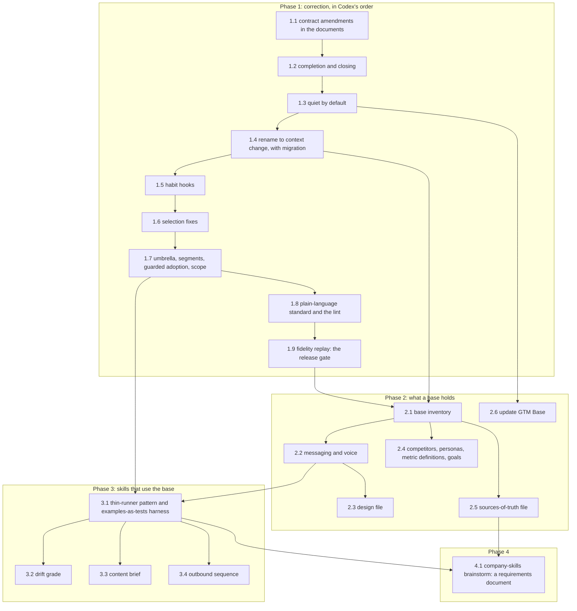

# feat: A base that produces work

**Target repo:** `gtm-base` (this repository). This plan carries out Amendment r2.4 of `docs/plans/2026-09-05-001-feat-join-and-onboarding-plan.md` and Amendment r2.5 of `docs/plans/2026-09-04-001-feat-current-without-integrations-plan.md`, under the conditions set in `docs/reviews/2026-09-19-codex-setup-shape-verdict.md`, and then takes the base past setup into the work it is supposed to produce. Where it changes a behavior either earlier plan defined, the change is named in the unit that makes it, so all three documents stay true.

## Overview

GTM Base today can be set up and can notice that a document is out of date. What it cannot do is produce marketing work, and after three real setup runs it also interrupts the person, uses a word for its own central idea that needed three explanations, and holds two files and no skills when setup ends. This plan closes that gap in four phases.

Phase 1 is the correction, in the order `docs/reviews/2026-09-19-codex-setup-shape-verdict.md` sets under "Smallest ordered change set and proving tests": amend the written contract first, then completion and closing, then quiet by default, then the rename to "context change", then the habit hooks, then selection, then the umbrella profile with segments and guarded adoption, then the plain-language standard, and finally the fidelity replay that gates the deferred summarize-first step.

Phase 2 grows what a base holds. A base inventory answers "what is my base missing?" and, on request, adopts or drafts each missing kind, in Brandon's order: messaging, voice, design, then competitors, personas, metric definitions, goals. Setup itself stays at two documents. The map grows into a sources-of-truth file, and a plain "update GTM Base" step exists because plugins do not refresh on their own.

Phase 3 is the point of all of it: three skills that read the base and produce work, each a thin runner over context files with owner-approved examples as its tests. Drift grade, content brief, outbound sequence. They ship in the core plugin ahead of backup and invite, because a base that produces nothing is not worth backing up.

Phase 4 schedules the brainstorm for company skills shared across seats, which needs a trust model before it needs a design.

## Problem Frame

Three real runs and one competitive read produced this plan. The runs are recorded in the two amendments; the read is `docs/ideation/2026-09-19-mkt1-multiplayer-ai-comparison.md`.

**The base holds two files and no skills.** At the end of setup a base holds `context/strategy/icp.md`, `context/strategy/positioning.md`, a confirmation line for each, and a template tree of empty folders. The parent scope (`~/Obsidian/Vault/Work/GTM-Base/2026-09-04-gtm-base-scope-v1.md`) promised `messaging.md`, `voice.md`, `competitors.md`, `personas/`, `metrics/`, `plan/`, six core skills and three starter skills. None of the skills that use a base exist. The MKT1 comparison is blunt about the consequence: the thing a marketing team is already building by hand is shared skills, and GTM Base's addition to that is the trust model and the approval flow, neither of which matters if there is nothing to trust.

**Setup summarizes finished work.** On the third run (2026-09-19, `~/Gridwise`, Gridwise Analytics, 97 consented files) the customer profile draft read twelve finished, reviewed segment pages and returned one document under four fixed sections. It rewrote material the person had already finished. Codex's verdict on G is that the volume was not the cause: the reported character count fits below the current input cap at `plugins/gtm-base/lib/gtmbase/constants.py` (`DRAFT_SOURCES_MAX_CHARS`), so the loss is in output shape and synthesis, and the deferral of a summarize-first stage has to be earned by a replay rather than assumed.

**The base interrupts.** The first real return session opened a working session by asking whether the base's own map was still right. That is the worst possible first sentence: it interrupts work to ask about the one file that carries no meaning, only settings. Amendment r2.5 makes the base quiet by default.

**The vocabulary confuses.** The decision entry step was not understood by the product's own designer after three explanations, and on the day it is written it changes nothing the person can see, because a file drafted in the same run as the entry is confirmed against it by the same-run exemption in `plugins/gtm-base/lib/gtmbase/stale.py`. Amendment r2.5 replaces the word: what the base tracks is a **context change**, and the asking sentence is "Tell me if anything about the context of the business changed that we should account for."

Six more findings from the third run carry into Phase 1: plan and metrics words matched engineering folders and proposed ten places where two were right; the narrowing question was asked again after the person had already chosen four folders; draft ordering read an older file and left out its final sibling and spent room on templates; the preview said files were left out without saying why a draft reads a limited amount; an approved file was saved with an unanswered `[your call: ...]` marker in it; and nothing in setup asked whether the base was for the whole company or for one product line.

## Requirements Trace

Each requirement is numbered P1 and upward, and names its source: a section letter of Amendment r2.4, a numbered section of Amendment r2.5, a condition from `docs/reviews/2026-09-19-codex-setup-shape-verdict.md`, or a decision Brandon made on 2026-09-19 that this plan carries rather than reopens.

| Id | Requirement | Source |
|---|---|---|
| P1 | Setup drafts two documents, the customer profile and the positioning. The context-change entry is not a required drafted step. J8, J9, J10, J17, join SC1 and SC3 are amended in writing before any code changes. | r2.4 A; Codex condition A and ordered step 1 |
| P2 | A base with two confirmed files and no recorded changes gets an honest baseline finding that says both documents were confirmed today, that no context change is recorded, that the base therefore cannot yet check whether a change has made either document out of date, and that names the date each confirmation comes up for review. It never says there is no date to watch. | r2.4 A; Codex condition A |
| P3 | The first feature's own SC1 (a hand-entered change yields a correct flag and a drafted proposal) keeps its independent test and is rerun unchanged after every Phase 1 unit. | Codex condition A and ordered step 6 |
| P4 | The optional closing question is asked once, after three plain sentences explaining what a context change is, why the base wants it, and how it is used, with one concrete example. Its words are "Tell me if anything about the context of the business changed that we should account for. One sentence is enough, or say skip." | r2.4 B and I; r2.5 "Context change, not decision" |
| P5 | A sentence given at the closing becomes a proposed entry shown whole before it is written: the date it happened, who decided, which documents it affects, and the review date are each the person's to correct. The entry does not carry the setup run's id, so the same-run exemption never applies to it. | r2.4 B; Codex condition B |
| P6 | For each affected document the person is asked separately whether that document already reflects the change. A yes writes a confirmation naming the change. A no leaves the document flagged and the fix goes through the proposal path, because setup never edits a file it has already written. | r2.4 B; Codex condition B |
| P7 | Skip is a complete answer. It dismisses the quiet-record reminder for one window and is counted apart from the file-confirmation yes rate. | r2.4 B; Codex condition C |
| P8 | At the start of a session the base loads its context and says nothing. No question leads the first reply and no question id is issued. | r2.5 item 1 |
| P9 | The base speaks up on its own in exactly one case: a document about to be used has been overtaken by a recorded context change. It names the document, the change, and the date, offers the fix it has already written, and asks whether to use the document as it is or fix it first. The check is a local lookup and makes no network call. | r2.5 item 2 |
| P10 | "Review my base" walks what is due and what has been proposed as one short list in one sitting. Question ids, the asked log, not now, and a no that becomes a prepared change all work as before, inside the review. | r2.5 item 3 |
| P11 | A weekly one-line nudge exists and is off by default. A person can turn it on, and can silence the base for a month or until they ask. | r2.5 item 4 |
| P12 | The map is never asked about. It is confirmed when the base is created, and the template's placeholder date is removed. | r2.5 item 5 |
| P13 | The AI always proposes and never applies without the owner's yes. Auto-apply is a later rung earned from a base's own record of approvals and corrections, and is out of scope here. | r2.5 item 6; Brandon 2026-09-19 |
| P14 | Everywhere a person reads it the word is "context change". Internally `work/decisions/` becomes `work/changes/`, the entry gains `kind: change`, and its fields keep their meaning with plainer names (`happened_on`, `written_on`, `noted_by`, `source`, `affects`, `review_by`). | r2.5 "Context change, not decision" |
| P15 | The one existing base is migrated by the plugin, and a base that still holds `work/decisions/` is read correctly. | r2.5; Brandon 2026-09-19 |
| P16 | A local hand edit to a context file asks what changed and why. A strategic answer travels with the proposal as its change entry. A typo fix records no change and is not blocked. | r2.4 C; Codex condition C |
| P17 | A quiet record is asked about inside the review, not at session start, at most once a session, with a dismissal that expires, outside the yes-rate accounting. An empty record is behind immediately rather than after the window, and the reminder's dismissal window is stated. | r2.4 C; Codex condition C |
| P18 | `context/strategy/icp.md` is the umbrella profile: who the company sells to overall, each segment in one short paragraph, and what they share. `context/strategy/segments/<slug>.md` holds one segment at full depth with `kind: segment`. A company with one segment has only the umbrella, at full depth. Segments are distinct from buyer personas, which keep their own folder. | r2.4 D |
| P19 | The segment inventory is settled before the umbrella is approved. A segment whose file is not yet in the base is listed in the umbrella as pending, in words, never as a link. An interrupted import resumes. | r2.4 D; Codex condition D and the umbrella write-order finding |
| P20 | A finished document may be adopted instead of redrafted only when it passes a per-file contract: named by the person as the authoritative version for one segment; original settings block discarded and a library-written one put in its place; hidden content removed and counted, then fence-marker, contact and key screens run on what is left; headings unambiguous for later editing; destination a safe slug that collides with nothing, under a folder that is not a link. | r2.4 D; Codex condition D |
| P21 | The person sees each cleaned body whole, with what was removed, and approval is bound to those exact bytes. A yes to many at once is allowed only after each has been shown, and individual exclusions are kept. Adoption never edits or moves the original. An adopted file is confirmed by the owner's own yes and by nothing else. | r2.4 D; Codex condition D, the batch-yes finding |
| P22 | The source-age finding looks only at files the change affects and only at open changes, so twelve segment files do not multiply unrelated findings. The first-backup review is rewritten for a base that can hold many files. | r2.4 D; Codex condition D, currency row |
| P23 | Setup asks once whether the base is for the whole company or for one part of it, when the person says so or the material plainly splits. The answer is recorded in the umbrella profile, not in the map, and is applied to selection and adoption as well as to the drafting prompts. | r2.4 E; Codex condition E |
| P24 | Plans and metrics count as marketing signals by default only in a place that also holds a profile, persona, or positioning file. A person can still add a standalone plans folder by name. | r2.4 F; Codex condition F |
| P25 | The consent record distinguishes a plain yes to the survey from an explicit choice of folders. An explicit choice is honored without a second narrowing question and gets a plain count to confirm. A changed list asks again. | r2.4 F; Codex condition F |
| P26 | The folder table says what each folder mostly holds, from paths only. Same-stem files are grouped as versions, a name carrying "final" outranks a newer date, a conflict between versions is said out loud, and templates and READMEs rank last. The preview says why a draft reads a limited amount. | r2.4 F; Codex condition F |
| P27 | An unanswered `[your call: ...]` marker is a state of its own, defined independently of `status`. A file carrying one is not confirmed and does not count as complete, the review step lists each marker and asks, and a later session can settle them without setup overwriting a file. The rule is enforced for adoption too. | r2.4 F; Codex condition F |
| P28 | Every step of every skill says what it is for in one sentence, shows output readable in seconds (a short list or a small table, never paragraphs), ties it back, then asks one thing. A context change is shown as four short lines: what changed, why, what it affects, when to look again. The plain-language lint grows to check this. | r2.4 H; Brandon 2026-09-19 |
| P29 | Before Phase 1 ships, three cases are replayed and read: the twelve finished pages, a company with several segments and no finished pages, and positioning inputs larger than one request. The check is whether segments, named deals, figures, and source versions survive. A fail builds the summarize-first step in this release. | r2.4 G; Codex condition G and ordered step 6 |
| P30 | A base inventory answers "what is my base missing?" against a named list of kinds, and adopts or drafts each on request. Setup stays at two documents. | Brandon 2026-09-19 |
| P31 | The map grows into a sources-of-truth file: for each kind of data, where it lives outside the base, which connected tool reads it, and the fallback. Context reads stay local. Source reads may be network calls and are never made at context-loading time. | MKT1 comparison item 3; Brandon 2026-09-19 |
| P32 | A plain "update GTM Base" step exists, because plugins do not refresh on their own. | MKT1 comparison item 5; Brandon 2026-09-19 |
| P33 | Three skills that use the base ship in the core plugin ahead of backup and invite: drift grade, content brief, outbound sequence. Each is a thin runner over context files, states which context files it reads, triggers the moment-of-use flag, keeps its rubric in a context file, and has owner-approved examples as its tests. | Brandon 2026-09-19; parent scope "rubrics live in context files and skills are thin runners", "an examples folder per skill" |
| P34 | Company skills shared across seats get a brainstorm whose deliverable is a requirements document. No code is written for them in this plan. | Brandon 2026-09-19; MKT1 comparison item 1 |
| P35 | Nothing is written outside the base, the plugin's own records folder, and a configured hooks directory. No MCP servers are declared. The logic atlas is updated in the same change as the code and republished. No invented number or timing appears anywhere, in the product or in the records. | Standing rules, Brandon 2026-09-19 |

### Success criteria

Adopted from `docs/ideation/2026-09-19-mkt1-multiplayer-ai-comparison.md`, stated honestly about what is in and out of scope.

**SC-A, the new computer test.** A person is fully productive on a new machine quickly. **In scope:** install the plugin, join a base from an invite link, and reach a rendered daily block and a working skill run without re-entering any context, which is the second-seat join plus a backup. **Out of scope in this plan:** the second seat and backup themselves are release two of the join plan and a later phase here; what this plan owes SC-A is that everything Phases 1 to 3 add travels in the base rather than on a laptop, so nothing new has to be re-entered. Measured by: every context file, rubric, and example added by Phases 2 and 3 is a tracked file in the base or in the core plugin, and no Phase 2 or Phase 3 behavior reads seat-local state for meaning.

**SC-B, the vacation test.** The work runs when the person is offline. **In scope:** every skill in Phase 3 runs from context alone with no person carrying context in, which is the doctrine's own test, and a run's output is a proposal a second person can approve. **Out of scope, stated plainly:** no scheduling exists in GTM Base and none is built here. Nothing in this plan makes a run happen without a person starting it, so the vacation test cannot pass in full, and this plan does not claim it does. What it can pass is the half that is a context problem rather than a scheduling problem.

## Scope Boundaries

Carried from both earlier plans, and added to here.

- **No scheduling.** Nothing runs on its own. The vacation test is partially out of reach and the plan says so rather than implying otherwise.
- **No hosted component.** The web app remains its own brainstorm. The review queue moving there is a later phase, one paragraph only.
- **No auto-apply.** The AI proposes; the owner approves. Auto-apply is a later rung earned from a base's record.
- **No company-skills build.** Phase 4 produces a requirements document and nothing else. The trust-surface refusal of `CLAUDE.md`, `AGENTS.md`, and `plugins/` in a base stands unchanged until that brainstorm says otherwise.
- **No MCP servers declared** in the plugin manifest, unchanged.
- **Setup stays at two documents.** Everything else a base holds arrives through the inventory, after setup, on request.
- **No redesign of the pre-push gate or the folder link.** Both shipped, both have real-run evidence behind them, and neither is in the path of anything here. Units that touch them touch them only as this plan names.
- **No re-running setup to refresh a complete base**, unchanged from the join plan.
- **No new document parsing.** Markdown, text, and CSV, as today.
- **No changes to the trust-surface check's refusal set**, which is what keeps a cloned base from carrying code onto a seat.

## Context & Research

### Relevant Code and Patterns

Every path below is real and was read for this plan.

- **The shared library**, `plugins/gtm-base/lib/gtmbase/`: `constants.py` holds every folder path, cap, window, and vocabulary the rest shares, including `DECISIONS_DIR`, `REQUIRED_CONTEXT_FILES`, `LEDGER_ORIGINS`, `LEDGER_STATUSES`, `CONFIRMATION_TRIGGERS`, `MARKETING_KINDS`, `DRAFT_RELEVANCE`, `DRAFT_SOURCES_MAX_CHARS`, `CONSENT_NARROW_*`, and `BANNED_GIT_WORDS`. Every unit that adds a vocabulary adds it here, append-only, because two agents editing shared modules concurrently is a recorded lesson.
- **`stale.py`** is pure computation over values handed in: `compute`, `_file_flags`, `_entry_flags`, `_affected_files_proposals`, `_review_by_items`, `_review_items`, `_ledger_behind`, `_line_confirms`. It fetches nothing. The same-run exemption and the confirmation expiry both live here. Units 1.2, 1.4, 1.5 and 1.7 change it; none of them may give it a network call.
- **`base_reader.py`** is the single way a base becomes those values: `read_base`, `context_files`, `ledger`, `confirmations`, `corrections`, `missing_required`, `usable_entries`. Codex verified that it reads every `.md` under `context/` recursively and accepts arbitrary `kind` and `status`, which is why segments and adopted files work on the read side while `drafting.py` rejects them on the write side. Tolerant reading of `work/decisions/` belongs here.
- **`stale_check.py`** turns the report into what a person reads: `first_run_text`, `finding_sentence`, `run`, `build_file_proposal`, `build_affected_files_proposal`, `save_review_by_items`, `_report_the_rest`. The honest baseline finding lands in `first_run_text`.
- **`session_start.py`** is where the base decides what to say: `_daily_block`, `_daily_work`, `_question_text`, `_offer`, `_base_shaped`, `_missing_required`, `render_output`. Quiet by default is mostly a subtraction here.
- **`join_flow.py`** is the setup flow end to end: `survey_sources`, `chosen_places`, `list_sources`, `freeze_sources`, `load_consent`, `narrow`, `preview_step`, `assemble_step`, `review_step`, `approve_step`, `skip_step`, `close_run`, `closing_message`, `write_onboarding_note`. Selection, scope, adoption and the closing question all touch it.
- **`sources.py`** holds the survey and the safe walk: `survey`, `kind_of`, `first_heading`, `counted_kinds`, `place_label`, `list_folder`, `narrow_to_folders`, `listing_digest`, `make_source`, `strip_hidden`, `removed_sentence`, `fence`, `_refuse_fence_markers`, `Consent`, `ConsentList`. Codex established that classification is filename and heading substrings, and that `listing_digest` establishes a file list and not content identity, which is exactly why adoption needs its own byte-bound approval.
- **`drafting.py`** and **`review.py`** are the write side: `order_sources`, `plan_sources`, `assemble`, `parse`, `check_words`, `skipped_text`; and `screen`, `stamp_owner`, `canonical_affects`, `ready_to_write`, `approve`, `skip`. `drafting.parse` enforces the four ICP sections and rejects unknown steps and kinds; `review.approve` writes absent-only after a clean-tree check. New document variants are added explicitly here rather than by weakening validation.
- **`compose_proposal.py`** carries the local-edit path and the section addressing. Codex found the real hazard: local-edit extraction overwrites duplicate heading keys while proposal application chooses the first matching heading, so a second `## Overview` can change the first. That is why the adoption contract requires unambiguous headings.
- **`confirm.py`** is the sole writer of confirmation lines: `answer`, `drafted`, `pending_questions`, `retry_pending`, `_yes`, `_no`, `_not_now`. Drafted mode appends and stages without committing, once per file path, for an untracked or newly staged file only.
- **`machine.py`**, **`paths.py`**, **`state.py`**, **`formats.py`**, **`validate.py`**: account state as the only joined record, `resolve_base` as the sole resolver, seat state, every file shape the plugin reads or writes, and the map settings and owner-email validators.
- **The skills**, `plugins/gtm-base/skills/`: `join/SKILL.md` with `references/closing-rules.md`, `references/reading-rules.md`, and `references/prompts/draft-icp.md`, `draft-positioning.md`, `draft-ledger-entry.md`; `stale-check/SKILL.md` with `references/rules.md`; `propose-change/SKILL.md` with `references/pr-body-rules.md`; `confirm/SKILL.md`, which is not user-invocable and carries the instructions for asking one question. Every sentence a person reads lives in a skill body, a reference file, or a template, and that rule holds for everything added here.
- **The templates**: `plugins/gtm-base/templates/` (`injection.md`, `offer.md`, `base-shaped-question.md`, `continue-setup.md`, `ledger-entry.md`, `confirmation-line.md`, `corrections-file.md`, `proposal-staging.md`, `pending-item.json`, `pr-body.md`), plus the company-base template at `templates/company-base/` and its plugin-side copy at `plugins/gtm-base/templates/company-base/`, which a test holds identical file for file. `context/map.md` in both copies carries `last_confirmed: 2026-01-01`, the placeholder date P12 removes.
- **The tests**: `tests/run.sh` runs `python3 -m unittest discover` with the fakes ahead of the real tools on `PATH`. `tests/support.py` provides `FakeGitRunner`, `Sandbox`, `TempHome`, `make_base`, `commit`, `trust_checkout`, `RecordingGh`, `IndexingGh`, `base_with_a_shared_copy`. `tests/plain_language.py` provides `find_banned`, `find_dashes`, `assert_plain`, today checking only the banned git words from `constants.BANNED_GIT_WORDS` and the two dash characters. There is no `tests/test_plain_language.py`; the lint is asserted from the tests that own each text. Unit 1.8 changes that.
- **`docs/join-guide.md`** is the only user-facing document besides the offer, the closing message, and the invite. **`plugins/gtm-base/CHANGELOG.md`** records each unit as it lands, in plain language, with the real-run evidence that caused it.
- **`brandkit/brand-lock.json`** is the model for the design context file in Unit 2.3. Its top-level keys are `version`, `brand_context` (name, offering, industry, positioning, audience, tone), `concept` (visual premise, research principles, reference preferences, avoid), `visual_axes`, `authoritative_assets` (logo with construction and colour rules, fonts, references), `palette` (primary, accent, neutral, semantic roles, forbidden), and `typography` (display, body, metadata). It is a decided record with a forbidden list, which is the shape a context file wants, and it is not a stylesheet.

### Institutional Learnings

From `tasks/lessons.md`, `plugins/gtm-base/CHANGELOG.md`, and the three real runs.

- **Probe only against a temp home.** Probing a hook wrapper against a real repository path creates the real records folder; point the home override at a temp folder first. (`tasks/lessons.md`, 2026-09-05.)
- **A gate that allows what it cannot parse fails open.** The default is refusal, and the false-refusal rate is accepted. Any new scanning in this plan inherits that posture.
- **Two agents editing shared modules concurrently need explicit file ownership and append-only rules for constants.** This plan gives one unit per agent and names the files each unit owns.
- **macOS caches bytecode**; a stale cache made a correct fix look broken. Clear it before calling a test failure real.
- **A whole-command regex scan must exempt path classes**, or every legitimate push is refused. Decide per class whether a rule applies to commands or only to content.
- **From 0.2.2 and 0.2.3:** a list of files offered for one yes reads as a list about to be copied somewhere unless the sentence says otherwise; one unreadable document must not end a session; a step with nothing left to draft from is refused rather than handed an empty request. All three are wording lessons and all three came from a real run, not a test.
- **From 0.2.5 and 0.2.6:** a yes nobody could read through is not a yes, which is why the narrowing rule exists; and the person least likely to know where their own material sits should not be the one asked to find it, which is why the survey proposes places. Unit 1.6 must not undo either while fixing the double ask.
- **From 0.1.5 and 0.1.3:** a step planned in a skill that does not exist yet writes nothing, and the desktop app renders no session-start hook output on screen. Both are reasons to check a live run rather than a test for anything a person reads.
- **From the three runs:** every defect in Amendment r2.4 was found by a person using the product, and none was found by the 1127 tests. That is the whole justification for the live check before any release that touches setup wording.

### External References

Limited to what this repository already cites, and not re-verified here.

- Claude Code hooks, settings, plugins, skills, and MCP behavior, as recorded under "External References" in `docs/plans/2026-09-04-001-feat-current-without-integrations-plan.md` and `docs/plans/2026-09-05-001-feat-join-and-onboarding-plan.md`.
- The AI-native definition block in `~/Personal/CLAUDE.md`: six properties, five kinds of place, five stages, the three arrows back, and the rule that context reads stay local while sources are read through APIs. This plan's sources-of-truth file is the "mapped" property, and its skills are stage 4.
- The parent scope, `~/Obsidian/Vault/Work/GTM-Base/2026-09-04-gtm-base-scope-v1.md`.
- `docs/ideation/2026-09-19-mkt1-multiplayer-ai-comparison.md`, itself a summary of a partly paywalled page by a small model, labeled as such in the document and treated here as direction rather than evidence.

## Key Technical Decisions

| Decision | Rationale | Rejected alternative |
|---|---|---|
| **The rename is a vocabulary change plus a folder move plus a field rename, done in one unit while one base exists.** `constants.DECISIONS_DIR` becomes `work/changes`, `formats` gains the change entry with `kind: change` and the fields `happened_on`, `written_on`, `noted_by`, `source`, `affects`, `review_by`, and every sentence a person reads says "context change". | Doing it later means migrating many bases instead of one, and the word is the thing that confused the designer, so it cannot wait behind nine other units. Doing the folder, the fields, and the words separately would leave three half-renamed states in the tree at once. | A user-facing alias over the old internals (leaves `decisions` in every file name a person can see); deferring the rename until after the second seat. |
| **Migration is performed by the plugin, once, on the base it finds, and is idempotent.** A dedicated `changes.py` moves `work/decisions/` to `work/changes/`, rewrites entry field names, leaves the entry ids untouched, and records what it did in `corrections/`. It refuses on a dirty tree and reports rather than raising. | Entry ids are the join key for confirmations, corrections, proposals, and the index; changing them would orphan every one of them. Recording the migration in `corrections/` is the product's own mechanism for "what a run changed", so the migration is visible to the person the same way any other change is. | A script the person runs by hand; renaming ids to match the new vocabulary. |
| **Old layout is read, never written.** `base_reader.ledger` reads `work/changes/` first and falls back to `work/decisions/`, and accepts both the old and new field names on an entry. Every writer writes the new layout only. | A second seat, a stale clone, or a base restored from a backup can present the old layout at any time, and a reader that refuses it turns a rename into data loss. Writing both would create two sources of truth for one entry. | Refusing the old layout with a message; writing both layouts during a transition window. |
| **Scope is stored in the umbrella profile's frontmatter as a `covers:` field, validated like any other field, and passed to selection, adoption, and drafting.** | Codex condition E: the map is settings only and its parser ignores free text, so a descriptive scope line there is both a contract break and inert. The profile is the document scope is about, it is owned, and it is confirmed, so scope inherits an owner and a review date for free. Wording alone cannot keep another product line's material out of an adopted file, so the value has to reach selection, not just the prompt. | A line in `context/map.md`; a prompt-only instruction; a separate `context/strategy/scope.md`. |
| **The adoption contract is a per-file manifest, checked in `adopt.py`, and approval is bound to the exact saved bytes.** The manifest names the segment, the authoritative version, and the destination. The checks run in this order: canonicalize the destination and reject unsafe slugs, normalized collisions, symlink parents and trust names; discard the original metadata; run `make_source` so hidden content is removed and counted; then run fence-marker, contact and key screens on what is left; then reject duplicate headings at one level; then write the library-generated frontmatter; then show the cleaned body whole with the removals; then bind the yes to a hash of those bytes. | Every clause answers a verified finding in the Codex verdict's compatibility table: classification by filename establishes neither "finished" nor "one file equals one segment"; fence-marker rejection must run after hidden-content removal; the trust-surface check examines paths, not instructions inside markdown, so adopted content must stay data on later reads; variable destinations need the checks that fixed destinations get from `lexists`; and first-matching-heading addressing makes duplicate headings a correctness problem, not a style problem. | A batch yes over titles and sizes; `listing_digest` as the approval binding; weakening `drafting.parse` to accept anything. |
| **"About to use a document" is detected at skill time, not by watching the filesystem.** Two mechanisms, and no third: every core skill that opens a context file calls `moment.check(path)` before it reads, which is a local lookup against the recorded changes and the confirmations; and the session context carries an instruction telling the assistant to run the same check before it uses a context file outside a skill. | This is the honest limit. There is no filesystem watcher, no editor integration, and no way to know what the person is about to type. Inside a skill the check is deterministic and testable. Outside a skill it depends on the assistant following an instruction, which is a real mechanism with a real failure rate, and the plan records it as such rather than claiming coverage it does not have. | A file watcher (nothing to hang it on, and it would fire on reads the person never made); a hook on the Read tool (would fire on every file in every repository, which 0.1.4 already retreated from for the gate); claiming the coverage is complete. |
| **The review is a new entry point on the existing stale-check skill, not a new skill.** "Review my base" runs `stale_check.run` in a review mode that walks what is due and what has been proposed as one short list, issues the question ids the hook used to issue, and hosts the quiet-record ask. | The computation, the idempotency rules, the question-id lifecycle, and the proposal path already live there, and the review is the same walk with a different trigger and a different first sentence. A second skill would duplicate all of it and then drift from it. The confirm skill's entry point moves from the injected question to this review and to the moment-of-use flag, and `confirm.pending_questions` already exists for the case where a question is answered outside the turn that issued it. | A new `review-base` skill; leaving the question at session start behind a setting. |
| **The inventory's list of kinds is a constant plus a documented reference.** `constants.BASE_KINDS` holds the ordered list with, for each kind, its destination path, whether it may be adopted, and whether it may be drafted. `plugins/gtm-base/skills/stale-check/references/base-kinds.md` says in plain words what each kind is for and what a good one contains. | A list that lives only in prose cannot be enumerated by the inventory, and a list that lives only in code cannot be read by the person deciding whether they want one. The two are kept in step by a test that asserts every constant has a section and every section a constant, which is the pattern already used for the map settings and the rules reference. | Hard-coding the list in the skill body; deriving it from the template tree (which holds empty folders, not kinds). |
| **The sources-of-truth file is `context/sources-of-truth.md`, one row per kind of data, with where it lives, which connected tool reads it, and the fallback. Nothing reads it over the network at context time.** It is an ordinary context file with an owner, a confirmation, and a review date. | This is the "mapped" property, and the doctrine is explicit that context reads stay local while sources are read through APIs. Making it a context file rather than a skill means it goes stale like everything else and gets caught by the same machinery, which is the whole product. Keeping the network out of context loading keeps session start quiet, offline-safe, and cheap. | A skill that queries each tool for freshness; folding it into `context/map.md` (settings only); a JSON file no person reads. |
| **Phase 3 skills are thin runners; the judgment lives in context files; examples are the tests.** Each skill reads a named set of context files, applies a rubric that lives in a context file, produces a work product, calls the moment-of-use check first, and ships an `examples/` folder whose owner-approved input and output pairs are executed by a test harness. | Parent scope, verbatim: rubrics live in context files and skills are thin runners, with an examples folder per skill. It is also the only way a company can change the judgment without changing code, which is what "the context improves and the model is swapped" means in the definition. Examples as tests is the MKT1 lifecycle step that applies without a trust model. | Rubrics inside SKILL.md (uneditable by the company, unconfirmable, invisible to staleness); snapshot tests over model output (non-deterministic). |
| **The update step checks the installed version against the marketplace pin and tells the person the one thing to do; it never updates anything itself.** `update_check.py` compares `plugins/gtm-base/.claude-plugin/plugin.json` with what the seat has recorded and prints one sentence. | Plugins do not refresh on their own, which both MKT1 and this repository hit. But the plugin cannot reinstall itself, and a step that silently changed what code runs on a seat would be exactly the thing the trust model exists to prevent. Telling the person the single step is honest and sufficient. | Running the install command on the person's behalf; a background check at session start (breaks quiet by default and needs the network). |
| **Every unit that changes a sentence a person reads gets a live check by Brandon before release.** | Three real runs found nine defects that 1127 tests did not. The tests assert the sentence that was written; only a person discovers that the sentence was the wrong one. | Relying on the plain-language lint alone. |

## Execution Posture

Decided by Brandon on 2026-09-19.

Implementation units are built by Opus 5 agents at high reasoning effort, one unit per agent, together with "Sol" agents. What "Sol" refers to is to be confirmed with Brandon and is recorded here exactly that way; it is not guessed at, and it is listed under Open Questions for Brandon.

Reviews are done by Astra, through the Codex CLI, run from a script file, and by Fable 5.1. Three review points: the plan before any build; a security pass and a correctness pass before each release; and design questions during the build, taken to whichever reviewer fits the question.

The orchestrating session holds this plan and the test suite. It runs `sh tests/run.sh` and the plain-language lint after every unit, and never merges a unit whose test scenarios are not all covered. Units that touch setup wording (1.1, 1.2, 1.3, 1.5, 1.6, 1.7, 1.8, and every Phase 2 unit that asks a question) get a live check by Brandon before release, because three real runs found defects no test caught.

While the GTM Base plugin is live in a build session, its gate reads every Bash command. Keep git on its own command line, commit with a message file, never name the plugin's records folder or its environment variable on a command line, and run Codex from a script file.

## Open Questions

### Resolved During Planning

- **Where scope lives:** the umbrella profile's frontmatter, as `covers:`, validated and passed to selection, adoption, and drafting. Not the map.
- **Whether the review is a new skill:** no. A new entry point on the stale-check skill, hosting the question ids and the quiet-record ask.
- **Where the weekly nudge setting lives:** seat state, not the map, because it is a per-person preference and the map is what the team shares. The silence window is recorded the same way, as a date the seat is quiet until.
- **How the old ledger layout is handled:** read both, write one. Migration by the plugin, idempotent, recorded in `corrections/`.
- **What the moment-of-use check is:** a skill-time local lookup plus an instruction in the session context, with the instruction's reliability named as a risk rather than assumed away.
- **Whether adoption may take a document with duplicate headings:** no. It is refused with the reason and the offer to draft that segment instead, per Codex's "restrict incompatible heading structures initially".
- **Whether the closing question can confirm its own entry:** no. The entry carries no run id, and each affected document is reconciled separately.
- **Where the inventory's kinds list lives:** `constants.BASE_KINDS` plus a plain-language reference file, held in step by a test.
- **Whether Phase 3 skills may read a source tool:** no. They read context files only. Source reads belong to the sources-of-truth file's own later phase.

### Deferred to Implementation

- The exact wording of the honest baseline finding, which is written in Unit 1.2 and then read aloud by Brandon in the live check before release.
- Whether `_review_items` can be corrected to affected-and-open without changing any currently passing scenario in `tests/test_stale.py`, or whether one existing scenario is genuinely wrong and must be rewritten. Decided by reading the test, not by assumption.
- The exact command Claude Code exposes for refreshing an installed plugin, verified against the docs at the time Unit 2.6 is built, because the sentence the update step prints has to be the real one.
- Whether the migration can run inside the session-start hook's budget or must be offered as a step the person accepts. Measured on the one real base before it is wired.
- The slug rules for `context/strategy/segments/<slug>.md` beyond the safety checks: how a segment named in prose becomes a file name that a person recognizes a year later.
- How many examples per skill the harness needs before an example set is meaningful, decided when the first set exists rather than picked now.

### For Brandon

1. **What "Sol" refers to.** The execution posture says implementation units are built by Opus 5 agents together with "Sol" agents. This is recorded exactly as given and not guessed at. Needed before the first unit is briefed, because it changes what each unit's brief contains.
2. **The design file's contents.** Unit 2.3 proposes `context/strategy/design.md` with sections modeled on `brandkit/brand-lock.json`: palette, type, logo rules, forbidden devices, tone. Confirm the section list, and confirm that design belongs under `context/strategy/` rather than a folder of its own. It stays a context file, not a stylesheet.
3. **The canonical list of kinds for the inventory.** Brandon's order is messaging, voice, design, competitors, personas, metric definitions, goals. Confirm that list is complete and closed for now, and confirm whether `context/notes/` and `context/plan/` beyond goals belong in it. The constant and the reference file are written from the answer.
4. **Who scores the fidelity replay, and on what material.** Only one real base exists. The three cases in P29 need real material, and case two (several segments, no finished pages) does not exist in the Gridwise material. Confirm whether Brandon supplies it, whether a fixture stands in and the result is labeled as a fixture result, or whether case two is dropped and the gate is two cases.
5. **Whether the logic atlas gains new figures.** The atlas has figures 1 to 8 and none of them is a skill run or an update step. Phase 2 and Phase 3 have nowhere to land. Confirm either that new figures are added (a skills figure and an update figure) or that skills stay out of the atlas and the plan says so.
6. **Scheduling of the live checks.** Eight Phase 1 units and several Phase 2 units need a live check before release. Confirm whether they batch into one check per release or one per unit, because that decides whether Phase 1 ships as one release or several.
7. **Whether the company-skills brainstorm may reopen the trust-surface refusal set.** Today a base may not hold `CLAUDE.md`, `AGENTS.md`, `plugins/`, or any `.sh`, `.py`, or `.js` file, and that refusal is what makes a cloned base safe. Company skills are, by definition, code on every seat. Confirm the brainstorm is allowed to propose changing that, since the answer shapes its whole question set.

## High-Level Technical Design

> *This illustrates the intended approach and is directional guidance for review, not implementation specification. The implementing agent should treat it as context, not code to reproduce.*

### The lifecycle of one context file

Directional guidance. Every state is observable from the file plus the base's own records, and no state is inferred from a modification time.

| State | How it is reached | How it is recognized | What the base does in it |
|---|---|---|---|
| **drafted** | Setup or an inventory draft writes it after a yes | File present, library-written frontmatter, one confirmation line with trigger `drafted` dated today | Counts as complete; the confirmation starts the review clock |
| **adopted** | The adoption contract passes and the owner's yes is bound to the cleaned bytes | File present, frontmatter written by the library with `sources` naming the original path and its date | Identical to drafted for every rule. `status: adopted` carries no freshness meaning of its own |
| **confirmed** | The owner answers yes, inside the review or at the moment of use | A confirmation line whose commit author matches an owner email in the file's frontmatter | Clock restarts; any change the line names is settled for that file |
| **flagged** | A recorded context change affects the file and no owner confirmation settles it | Computed by `stale.compute`, never stored | The moment-of-use flag fires when the file is about to be used; the review lists it; a fix is drafted as a proposal |
| **unanswered marker** | An approved or adopted file carries `[your call: ...]` | Detected by scanning the body, independent of `status` | Not confirmed and not complete. The review lists each marker and asks. Settling one later goes through the proposal path, never a setup overwrite |
| **skipped** | The person skips a document during setup | Present with `status: skipped` and no body | Not complete. The continue-setup path offers to finish it. Never counted in the yes rate |

## Implementation Units

### Phase 1: the correction, in the Codex order

Ordered exactly as `docs/reviews/2026-09-19-codex-setup-shape-verdict.md` sets out under "Smallest ordered change set and proving tests". No unit in this phase starts before the one above it has merged with its scenarios covered.

- [ ] **Unit 1.1: Contract amendments to the documents**

**Goal:** Every written promise matches what is about to be built, before a line of code moves. Nothing in the repository still says setup drafts three documents, or that a base with no recorded change is up to date.

**Requirements:** P1, P2, P4, P5, P6, P7, P18, P19, P23, P27, P29.

**Dependencies:** None. This is the first unit in the phase.

**Files:**
- Modify: `docs/brainstorms/2026-09-05-join-and-onboarding-requirements.md` (J8, J9, J10, J17, SC1, SC3 recorded as amended, each with a one-line pointer to Amendment r2.4), `docs/plans/2026-09-05-001-feat-join-and-onboarding-plan.md` (the Overview's three-draft wording, the Key Technical Decisions rows "A base is joined at the first approved file", "Drafting is direct", "The closing finding is computed by", Units 4 and 5), `docs/plans/2026-09-04-001-feat-current-without-integrations-plan.md` (a pointer from Units 9a, 9b and 10 to Amendment r2.5), `plugins/gtm-base/skills/join/SKILL.md` (the description, step 1, step 6's fixed order, step 7), `plugins/gtm-base/skills/join/references/closing-rules.md` (the finding order and both closing messages), `docs/join-guide.md` ("What setting up does")
- Create: `docs/plans/2026-09-19-001-acceptance-matrix.md` (one row per state in the file-lifecycle table above, with what setup, the review, the moment-of-use check, and the stale computation each do in that state)

**Approach:** Amend in place and record the amendment, never silently rewrite, because both plans are the record of why things are the way they are. Each amended requirement keeps its id and gains an "(amended 2026-09-19, r2.4 section A)" marker. The acceptance matrix is the consistency proof Codex asked for in ordered step 1: it is a table, not prose, and every later Phase 1 unit adds its own row rather than inventing a state.

**Execution note:** Documents only. This unit writes no code and no test beyond the lint. It is the unit most likely to be rushed and the one whose omissions cause the rest of the phase to contradict itself, so its brief carries the whole Codex verdict, not a summary.

**Patterns to follow:** The existing amendment sections r2.1 to r2.5, which state what was observed, what changed, and where it is implemented, in that order.

**Test scenarios:**
- Lint: no amended text contains a banned git word or a long dash, asserted by `tests/plain_language.py` over each modified user-facing file.
- Happy path: a search of the repository for the phrase "three documents" and for "one decision" in user-facing text returns nothing outside the historical amendment sections.
- Edge case: the acceptance matrix has a row for every state in the lifecycle table and a column for each of setup, review, moment of use, and stale computation, with no cell left empty.
- Integration: `sh tests/run.sh` still passes unchanged, since no behavior moved.

**Verification:** A reader who has never seen the code can read `plugins/gtm-base/skills/join/SKILL.md` and `references/closing-rules.md` end to end and describe exactly what setup writes and what the closing says, with no contradiction against either plan.

**Atlas: figures 7 and 8.** Figure 7 ("Setting up a base, step by step") loses the third draft; figure 8 ("Confirmations and the stale rules") gains the honest baseline state.

- [ ] **Unit 1.2: Completion and closing**

**Goal:** Setup completes on two documents, the closing tells the truth about a base with nothing recorded, the map is never asked about, and the source-age finding stops multiplying.

**Requirements:** P1, P2, P3, P12, P22.

**Dependencies:** 1.1.

**Files:**
- Modify: `plugins/gtm-base/lib/gtmbase/constants.py` (`REQUIRED_CONTEXT_FILES` confirmed at two and documented as the completion contract; a new finding code for the honest baseline), `plugins/gtm-base/lib/gtmbase/stale.py` (`first_run_finding` gains the baseline state and loses the "no date to watch" claim; `_review_items` restricted to files the entry affects and to open entries), `plugins/gtm-base/lib/gtmbase/stale_check.py` (`first_run_text`, `finding_sentence`), `plugins/gtm-base/lib/gtmbase/session_start.py` (`_missing_required` and the continue-setup branch stop expecting an entry), `plugins/gtm-base/lib/gtmbase/join_flow.py` (`close_run`, `closing_message`), `plugins/gtm-base/skills/join/references/closing-rules.md`, `templates/company-base/context/map.md` and `plugins/gtm-base/templates/company-base/context/map.md` (placeholder date removed), `plugins/gtm-base/lib/gtmbase/create_base.py` (the map is confirmed at creation)
- Test: `tests/test_stale.py`, `tests/test_stale_check.py`, `tests/test_session_start.py`, `tests/test_join_setup_flow.py`, `tests/test_create_base.py`, `tests/test_scaffold.py` (the two template copies stay identical)

**Approach:** The baseline finding is a new state in the existing fixed order, not a new code path: skipped file first, then an unanswered marker, then a source older than an affecting change, then the baseline, then nothing-out-of-date. The map is confirmed by `create_base` at the moment the base exists, with a confirmation line like any other file, which is what lets the placeholder date go without leaving the map unconfirmable. `_review_items` is corrected to compare only against entries that both affect the file and are open; the currently passing scenarios are read first and any scenario that only passed because of the wider comparison is rewritten with its reason recorded in the test.

**Patterns to follow:** The deterministic finding order already in `closing-rules.md`; the rule that the finding is recomputed and never cached.

**Test scenarios:**
- Happy path: two confirmed files, no entries: the finding states both were confirmed today, that no context change is recorded, that the base cannot yet check whether a change made either document out of date, and names the review date for each confirmation. It does not say nothing is out of date and does not say there is no date to watch.
- Happy path (P3): the first feature's SC1 scenario, a hand-entered change affecting `context/strategy/icp.md` with no confirmation, still produces one flag and one staged proposal, unchanged.
- Edge case: positioning skipped: the finding names the skipped file and nothing else changes.
- Edge case: a file carrying an unanswered `[your call: ...]` marker outranks the baseline in the finding order. (The marker detection itself lands in 1.7; this unit asserts the ordering slot exists and is empty until then.)
- Edge case: twelve context files and one open change affecting two of them: `_review_items` returns items for those two only; the other ten produce nothing.
- Edge case: a closed change older than a file: no review item.
- Error path: a base whose map has no confirmation line (a base created before this unit): the map is not asked about and the absence is reported as a code, not as a question.
- Integration: a full setup run through `tests/test_join_setup_flow.py` ends with two files, two drafted confirmation lines, a confirmed map, and the baseline finding.

**Verification:** A real setup run that approves both documents and records nothing else ends with a sentence Brandon reads aloud and agrees is true of that base.

**Atlas: figures 5, 7, 8.**

- [ ] **Unit 1.3: Quiet by default**

**Goal:** The base says nothing at session start, speaks only when a document about to be used has been overtaken, answers "review my base" on request, offers an opt-in weekly line, and can be silenced.

**Requirements:** P8, P9, P10, P11, P13.

**Dependencies:** 1.2.

**Files:**
- Create: `plugins/gtm-base/lib/gtmbase/moment.py` (the moment-of-use check and its sentence), `plugins/gtm-base/templates/moment-of-use.md`, `plugins/gtm-base/templates/weekly-line.md`
- Modify: `plugins/gtm-base/lib/gtmbase/session_start.py` (`_daily_block` and `_daily_work` stop selecting a question and stop issuing a question id; the map, the change summary, and the moment-of-use instruction remain), `plugins/gtm-base/templates/injection.md`, `plugins/gtm-base/lib/gtmbase/state.py` (weekly-line preference, silence-until date), `plugins/gtm-base/lib/gtmbase/stale_check.py` (`run` gains the review mode), `plugins/gtm-base/skills/stale-check/SKILL.md` (the "review my base" entry point and its first sentence), `plugins/gtm-base/skills/stale-check/references/rules.md`, `plugins/gtm-base/skills/confirm/SKILL.md` (entered from the review and from the moment-of-use flag rather than from a session-start question), `plugins/gtm-base/lib/gtmbase/confirm.py` (question ids issued by the review; `pending_questions` is the way back)
- Test: `tests/test_session_start.py`, `tests/test_stale_check.py`, `tests/test_confirm.py`, `tests/test_state.py`, and new `tests/test_moment_of_use.py`

**Approach:** Session start becomes a subtraction: record the session, bring the shared copy up to date under the existing path refusals, hand over the map and the change summary, and stop. The question-id machinery is not deleted, it moves: the review issues ids bound to the session exactly as the hook did, so single use, expiry, the asked log, and the yes rate keep working with a different issuer. `moment.check(path)` returns either nothing or a four-line block (what changed, why, what it affects, when to look again) plus the already-drafted fix and the one question, and it never touches the network. The weekly line and the silence window live in seat state because they are one person's preference.

**Execution note:** The moment-of-use instruction that goes into the session context is the part that depends on the assistant following an instruction. Write it as a hard rule in the same shape the reader agents use, and record in the CHANGELOG that its reliability is unmeasured.

**Patterns to follow:** The hook posture (always exit 0, fixed sentences, never a stack trace); the existing question-id lifecycle in `confirm.py`.

**Test scenarios:**
- Happy path: session start on a joined base with two overdue files: the map and the change summary are injected, no question text appears, no question id is issued, and the asked log is unchanged.
- Happy path: `moment.check` on a file affected by an open change returns the four lines, the change's date, and the drafted fix; on an unaffected file it returns nothing.
- Edge case: `moment.check` on a file with an unanswered marker returns the marker prompt rather than a change block.
- Happy path: "review my base" lists what is due and what has been proposed as one list, issues one question id per item asked, and records outcomes in the asked log exactly as the hook did.
- Edge case: a no inside the review becomes a prepared change, and a not now writes a suppression, both unchanged from the shipped behavior.
- Edge case: the weekly line is off by default; after it is turned on it appears once in a week and not twice; after a silence of a month is set, nothing appears until the date passes or the person asks.
- Security: `moment.check` makes no git call that reaches a remote and no network call of any kind, asserted with a runner that fails on any fetch.
- Error path: a base whose records cannot be read: the check returns nothing and records a code; it never guesses.
- Integration: a session that opens silently, runs a skill that calls `moment.check`, is flagged, answers yes, and leaves one confirmation line in the right file.

**Verification:** Brandon opens `~/Gridwise` and gets a working session with no question in it, then asks "review my base" and walks the list in one sitting.

**Atlas: figures 2 and 5.**

- [ ] **Unit 1.4: The rename to context change, with migration and tolerant reading**

**Goal:** One word everywhere a person reads, one folder name and one set of field names inside, the existing base migrated, and the old layout still read.

**Requirements:** P14, P15.

**Dependencies:** 1.3.

**Files:**
- Create: `plugins/gtm-base/lib/gtmbase/changes.py` (migration and the old-layout reader), `tests/test_changes_migration.py`
- Modify: `plugins/gtm-base/lib/gtmbase/constants.py` (`DECISIONS_DIR` becomes `work/changes`; the old value kept as a read-only fallback constant; `LEDGER_ORIGINS` and `LEDGER_STATUSES` keep their values and gain the `change` kind), `plugins/gtm-base/lib/gtmbase/formats.py` (the change entry and its field names, reading both spellings, writing one), `plugins/gtm-base/lib/gtmbase/base_reader.py` (`ledger` reads the new folder first and falls back), `plugins/gtm-base/lib/gtmbase/stale.py` and `stale_check.py` (vocabulary in every sentence), `plugins/gtm-base/lib/gtmbase/session_start.py`, `join_flow.py`, `compose_proposal.py`, `confirm.py`, `review.py`, `plugins/gtm-base/templates/ledger-entry.md` (renamed `change-entry.md`), `injection.md`, `proposal-staging.md`, `pr-body.md`, `plugins/gtm-base/skills/*/SKILL.md` and every `references/*.md`, `plugins/gtm-base/skills/join/references/prompts/draft-ledger-entry.md` (renamed `draft-change-entry.md`), `templates/company-base/` and `plugins/gtm-base/templates/company-base/` (`work/decisions/` becomes `work/changes/`, and `context/map.md`'s "where things live" paragraph), `docs/join-guide.md`
- Test: `tests/test_formats.py`, `tests/test_base_reader.py`, `tests/test_stale.py`, `tests/test_stale_check.py`, `tests/test_compose_proposal.py`, `tests/test_confirm.py`, `tests/test_join_setup_flow.py`, `tests/test_scaffold.py`, `tests/fixtures/ledger-entry.md` and `tests/fixtures/drafts/ledger-entry.md` (kept as old-layout fixtures and joined by new-layout ones)

**Approach:** Three changes in one unit because splitting them leaves the tree half-renamed: the folder, the fields, and the words. Entry ids are untouched, which keeps confirmations, corrections, proposals, and the index joined. `changes.migrate` moves the folder with git so history follows, rewrites field names in place, refuses on a dirty tree, is safe to run twice, and writes a dated file in `corrections/` saying what it did. The old fixtures stay in the suite as the tolerant-reading evidence.

**Execution note:** This unit touches more files than any other in the plan and owns all of them for its duration. No other unit runs concurrently with it.

**Patterns to follow:** The append-only rule for `constants.py`; the migration ordering pattern from `migrate.py` (record before you rename).

**Test scenarios:**
- Happy path: a base holding `work/decisions/` with three entries migrates to `work/changes/`, keeps all three entry ids, rewrites the field names, and records one correction file. Running the migration again changes nothing.
- Happy path: a base already holding `work/changes/` is read normally and the migration is a no-op.
- Edge case: a base holding both folders: the migration refuses and reports, rather than merging.
- Edge case: an entry written with the old field names inside the new folder is read correctly and the values land in the right places.
- Error path: a dirty tree: the migration refuses with one sentence and writes nothing.
- Edge case: a confirmation line naming an entry id survives the migration and still settles that entry for its file.
- Lint: no user-facing text contains the word "decision" as the name of what the base tracks; the words "context change" and "change" appear instead, and the full term appears before the short one in every text.
- Integration: a full setup run, a local edit proposal, and a review all work end to end on a migrated base, with `tests/test_stale.py` scenarios passing against both layouts.

**Verification:** The one real base at `~/GTM Bases/Gridwise/gtm-base` migrates in a live run, keeps every entry id, and its next review reads identically to the one before.

**Atlas: figures 1 and 8.**

- [ ] **Unit 1.5: Habit hooks**

**Goal:** The base learns about context changes at the two moments a person actually has one to give: when they have edited a file by hand, and at the closing of setup. Neither moment confirms itself.

**Requirements:** P4, P5, P6, P7, P16, P17.

**Dependencies:** 1.4.

**Files:**
- Modify: `plugins/gtm-base/lib/gtmbase/compose_proposal.py` (the local-edit path asks what changed and why; a strategic answer becomes the proposal's change entry, and `decision_block=None` stops being unconditional), `plugins/gtm-base/skills/propose-change/SKILL.md` (the two questions and the four-line display), `plugins/gtm-base/lib/gtmbase/join_flow.py` (`close_run` asks the optional closing question and runs per-document reconciliation), `plugins/gtm-base/skills/join/SKILL.md` (step 7), `plugins/gtm-base/skills/join/references/closing-rules.md` (the three explaining sentences, the example, the exact question), `plugins/gtm-base/lib/gtmbase/review.py` (`stamp_entry` writes a closing entry with no run id), `plugins/gtm-base/lib/gtmbase/stale.py` (`_ledger_behind`: an empty record is behind immediately; the dismissal window and its expiry), `plugins/gtm-base/lib/gtmbase/stale_check.py` (the quiet-record ask lives in the review), `plugins/gtm-base/lib/gtmbase/confirm.py` (a confirmation that names a closing change), `plugins/gtm-base/templates/change-entry.md`
- Test: `tests/test_compose_proposal.py`, `tests/test_join_setup_flow.py`, `tests/test_stale.py`, `tests/test_stale_check.py`, `tests/test_confirm.py`, `tests/test_review.py`

**Approach:** The closing question is asked once, after the three plain sentences and the example. A sentence becomes a proposed entry shown whole, as four short lines plus the date, the person who decided, the affected documents, and the review date, each correctable. It carries no run id. Then, for each affected document separately, the person is asked whether that document already reflects the change: a yes writes a confirmation naming the change, a no leaves the document flagged and hands the fix to the proposal path. Skip writes nothing, dismisses the quiet-record reminder for one window, and is recorded outside the yes-rate denominator. On the local-edit path the two questions are asked once; a typo answer records no change and the proposal proceeds unchanged, which is the case that must keep working.

**Execution note:** Codex's condition C is that these hooks are built before they are presented as the replacement habit. The unit is not done when the code exists; it is done when the closing and the local-edit path have both been run live.

**Patterns to follow:** The existing review loop (approve, edit, skip, what is wrong) for the entry preview; the four-line display from P28.

**Test scenarios:**
- Happy path: a closing sentence produces a proposed entry shown whole; correcting the date changes the entry; approving writes it to `work/changes/` with no run id.
- Happy path: an entry affecting both documents asks twice, once per document; a yes on the profile writes a confirmation naming the change, a no on the positioning leaves it flagged and produces one staged proposal.
- Edge case (the case Codex named): the approved profile targets small fleets and the closing sentence says the company stopped selling to small fleets. The earlier same-run confirmation does not settle it, the reconciliation question is asked, and a no flags the file.
- Edge case: skip writes nothing, dismisses the quiet-record reminder for the stated window, and does not appear in the yes-rate denominator; `tests/test_report.py` confirms the denominator is unchanged.
- Edge case: an empty record is behind immediately rather than after the window; after a dismissal it is silent until the window expires, then returns once.
- Happy path: a local edit with a strategic answer produces a proposal carrying a change entry with the stated source; the same edit with a typo answer produces a proposal with no entry and the edit intact.
- Error path: a refused proposal leaves the person's own edit and the stated source in place, unchanged.
- Edge case: the quiet-record ask happens at most once a session and only inside the review, never at session start.
- Integration: setup, closing sentence, reconciliation no, proposal, review, approve, and the affected file ends confirmed against that change.

**Verification:** Brandon runs a setup closing live and, separately, hand-edits a context file and raises it, and in both cases the base ends holding a change entry he recognizes as his own sentence.

**Atlas: figures 5 and 8.**

- [ ] **Unit 1.6: Selection fixes**

**Goal:** The survey proposes the right places, an explicit choice is honored once, versions are ordered deterministically with conflicts said out loud, and the preview says why.

**Requirements:** P24, P25, P26.

**Dependencies:** 1.5.

**Files:**
- Modify: `plugins/gtm-base/lib/gtmbase/sources.py` (`survey` and `kind_of`: plans and metrics count only beside a profile, persona, or positioning file; `Place` gains what the folder mostly holds, from paths only; per-file candidates in the survey output; same-stem version grouping with "final" outranking a newer date and a conflict reported), `plugins/gtm-base/lib/gtmbase/constants.py` (`MARKETING_KIND_WEIGHTS` and the version and template ranking vocabulary), `plugins/gtm-base/lib/gtmbase/join_flow.py` (`chosen_places` and `freeze_sources` record explicit selection distinctly from a plain yes; a changed manifest asks again; `preview_step` says why a draft reads a limited amount), `plugins/gtm-base/lib/gtmbase/drafting.py` (`order_sources` ranks templates and READMEs last), `plugins/gtm-base/skills/join/SKILL.md` (step 5: the count confirmation for an explicit choice, and the narrowing question asked at most once)
- Test: `tests/test_sources.py`, `tests/test_join_setup_flow.py`, `tests/test_drafting.py`, and the fixture tree under `tests/fixtures/sources/`, which already holds an `engineering/` folder with `deploy-plan.md`, `queue-notes.md`, `retry-rules.md`, `runbook.md`, `schema.md` and a `marketing/` folder with `_spine.md`, `icp-fintech.md`, `persona-ops-lead.md`, `positioning.md`, plus a top-level `metrics.csv`

**Approach:** Provenance is the heart of it. The consent record gains a field distinguishing a plain yes to the survey from an explicit list the person named, because Codex established that a plain yes also populates selected folders, so checking whether folders exist preserves the broad-list problem. An explicit choice is honored without a second narrowing question and gets a plain count to confirm; a changed manifest re-consents. The plans-and-metrics rule keeps manual inclusion by name, because Codex's trade-off is that requiring a profile nearby also hides a legitimate standalone `Plans/` folder. Version grouping is deterministic: same stem groups together, a name carrying "final" outranks a newer modification time, and when two versions disagree the conflict is stated rather than silently ordered away, because modification time is not review authority.

**Patterns to follow:** The frozen consent list and the listing digest; the rule that narrowing only ever takes part of a list already agreed to and never widens it.

**Test scenarios:**
- Happy path: the fixture tree's `engineering/` folder is not proposed as a marketing place although it holds a plan and a schema; `marketing/` is proposed with its counts.
- Edge case: a top-level `Plans/` folder with no profile beside it is not proposed, and adding it by name works and is recorded as an explicit inclusion.
- Happy path: the person names four folders: the narrowing question is not asked again, a plain count confirms the list, and the consent record shows an explicit choice.
- Edge case: a plain yes to a survey of the same four folders is recorded as a plain yes, and the narrowing backstop still applies to it.
- Edge case: the chosen list changes between the survey and the freeze: consent is asked again and the old manifest is not reused.
- Happy path: `positioning.md` and `positioning.final.md` group as one version set, the final wins, and the fact that a newer sibling was not used is stated.
- Edge case: two versions whose bodies disagree: the conflict is reported in words, not resolved silently.
- Edge case: a template and a README rank last in `order_sources` and are the first things the cap drops.
- Happy path: the preview says how many files this draft reads, how many it leaves out, which ones, and why a draft reads a limited amount at all.
- Integration: preview and assemble include exactly the same files for the same narrowing, asserted by comparing their label lists.

**Verification:** A live survey of `~/Gridwise` proposes the places Brandon would have picked, asks the narrowing question at most once, and the preview explains itself.

**Atlas: figure 7.**

- [ ] **Unit 1.7: Umbrella profile, segments, guarded adoption, scope, and the unanswered-marker state**

**Goal:** A company that sells to eleven segments gets an umbrella plus a file per segment, finished documents are adopted under a contract rather than rewritten, scope is recorded and enforced, and an unanswered marker is a real state.

**Requirements:** P18, P19, P20, P21, P22, P23, P27.

**Dependencies:** 1.6. This is the largest unit in the plan and the one Codex conditioned most heavily.

**Files:**
- Create: `plugins/gtm-base/lib/gtmbase/adopt.py` (the per-file contract, in the order in the decisions table), `plugins/gtm-base/lib/gtmbase/segments.py` (the inventory, slugs, the umbrella's pending references, resumption), `plugins/gtm-base/skills/join/references/prompts/draft-umbrella.md`, `plugins/gtm-base/skills/join/references/prompts/draft-segment.md`, `plugins/gtm-base/skills/join/references/adoption-rules.md`, `tests/test_adoption.py`, `tests/test_segments.py`, `tests/fixtures/adoption/` (a clean finished profile; one with embedded frontmatter; one with a fence marker hidden inside a comment; one with `owner:` and a phone number in the body; one with a private key block; one with two `## Overview` headings; one whose name slugs into a collision with another; one under a symlinked folder)
- Modify: `plugins/gtm-base/lib/gtmbase/drafting.py` (explicit document variants for `umbrella` and `segment`, added rather than validation weakened), `plugins/gtm-base/lib/gtmbase/review.py` (`approve` accepts an adopted file bound to a byte hash; the screens run in the contract's order; destination checks for variable paths: canonicalization, safe slug, normalized-collision check, symlink-parent rejection, trust-name rejection, before any write), `plugins/gtm-base/lib/gtmbase/validate.py` (the `covers:` scope field), `plugins/gtm-base/lib/gtmbase/join_flow.py` (the scope question asked once; the segment inventory settled before the umbrella is approved; adoption offered per file; resumption of an interrupted import), `plugins/gtm-base/lib/gtmbase/stale.py` (an unanswered marker is a state independent of `status`; a file carrying one is not complete and not confirmed), `plugins/gtm-base/lib/gtmbase/base_reader.py` (marker detection), `plugins/gtm-base/lib/gtmbase/constants.py` (the segment kind, the marker pattern, the slug rules), `plugins/gtm-base/lib/gtmbase/push_review.py` is not yet built, so instead `plugins/gtm-base/skills/join/references/closing-rules.md` and `docs/join-guide.md` record that the first-backup review must be rewritten for many files before release two starts, `plugins/gtm-base/skills/join/references/prompts/draft-icp.md` (the umbrella shape, and the `[your call: ...]` instruction reconciled with the marker rule), `templates/company-base/` and `plugins/gtm-base/templates/company-base/` (a `context/strategy/segments/` folder)
- Test: `tests/test_review.py`, `tests/test_drafting.py`, `tests/test_stale.py`, `tests/test_base_reader.py`, `tests/test_join_setup_flow.py`, `tests/test_prompt_guards_join.py`, `tests/test_scaffold.py`

**Approach:** Order is the whole design. The scope question is asked once, early, and its answer reaches selection and adoption, not only the prompt. The segment inventory is settled next, before the umbrella is drafted, so the umbrella never points at a file that was later skipped; a segment not yet in the base is named in the umbrella in words, as pending, never as a link. Adoption then runs per file through the contract, in the exact order the decisions table gives, and the yes is bound to a hash of the cleaned bytes that were shown. A yes covering several files is accepted only after each body has been shown whole, and excluding one does not disturb the others. An interrupted import resumes from what is already written, because the two required files have already made the base complete and a half-finished import must not make it incomplete again. Where no finished page exists, a segment draft is written with a prompt that asks for depth and forbids compression.

**Execution note:** Build the contract test-first against the hostile fixtures before any adoption code writes a file. Every fixture in `tests/fixtures/adoption/` exists to fail a specific clause, and a clause with no failing fixture is not built.

**Patterns to follow:** `trust_checkout` in `tests/support.py` as the model for hostile fixtures; the absent-only write with `lexists` in `drafting.py` and `review.py`; the partial-folder-then-rename commit point from `create_base.py` for resumable imports.

**Test scenarios:**
- Happy path: twelve finished segment pages, all adopted after each is shown: twelve files under `context/strategy/segments/`, each with library-written frontmatter, `sources` naming the original path and its date, and one drafted confirmation line; the umbrella names all twelve; every original file is byte-identical afterwards.
- Happy path: a company with one segment gets only the umbrella, written at full depth.
- Edge case: the person excludes two of the twelve: the other ten are adopted, the umbrella names the two as pending in words, and no link points at a missing file.
- Error path: the import is interrupted after six: the next run resumes, adopts the remaining six, and writes no duplicates.
- Security: the embedded-frontmatter fixture has its original metadata discarded and the library's applied; the hidden fence marker is caught after hidden-content removal, not before; the body `owner:` and phone number are refused with the class named and never the value; the private key block is refused; the two `## Overview` headings are refused with the reason and the offer to draft that segment instead.
- Security: a destination that slugs into a collision with an existing file is refused; a destination under a symlinked folder is refused; a slug matching a trust-refused name is refused; all refusals happen before any write.
- Security: the approval hash is taken over the exact cleaned bytes; changing the source file between the showing and the yes invalidates the approval and the person is asked again.
- Edge case: an adopted file is confirmed only by the owner's own yes; copying the consent from the batch does not produce a confirmation, and `status: adopted` gives the file no freshness of its own.
- Edge case: twelve adopted segments and one open change affecting one of them produce one review item, not twelve.
- Happy path: the scope answer is written to the umbrella's `covers:` field, is validated, and narrows both the selection list and the adoption offer, not only the prompt text.
- Edge case: a file carrying `[your call: ...]` is not complete and not confirmed whatever its `status`; the review lists each marker and asks; settling one later goes through the proposal path and no setup step overwrites the file.
- Integration: a second seat reading the same base computes the same flags for the adopted files, with no seat-local state involved.

**Verification:** A live replay of the Gridwise material produces an umbrella Brandon recognizes, twelve segment files whose bodies are the ones he already reviewed, and no file he did not see whole before it was written.

**Atlas: figures 1 and 7.**

- [ ] **Unit 1.8: The plain-language standard, applied everywhere, with the lint extended**

**Goal:** Every step of every skill says what it is for, shows something readable in seconds, ties it back, and asks one thing. The lint checks it rather than trusting it.

**Requirements:** P28.

**Dependencies:** 1.7. Runs last among the behavior units because it rewrites the sentences the earlier units wrote.

**Files:**
- Modify: `tests/plain_language.py` (new checks beside `find_banned` and `find_dashes`), `plugins/gtm-base/skills/join/SKILL.md`, `plugins/gtm-base/skills/join/references/closing-rules.md`, `reading-rules.md`, `adoption-rules.md`, `plugins/gtm-base/skills/stale-check/SKILL.md` and `references/rules.md`, `plugins/gtm-base/skills/propose-change/SKILL.md` and `references/pr-body-rules.md`, `plugins/gtm-base/skills/confirm/SKILL.md`, every file under `plugins/gtm-base/templates/`, `docs/join-guide.md`
- Create: `tests/test_plain_language.py` (the lint's own tests, which do not exist today)

**Approach:** The lint gains four checks, each deliberately mechanical, because a lint that tries to judge prose fails: a step section must open with a sentence stating what the step is for, before any imperative; a step must ask exactly one question, counted by question marks in the asking block; an output block must be a list or a table rather than a paragraph, measured by consecutive prose lines above a stated cap; and a context change shown to a person must be four labeled lines. Every existing text is brought to the standard in the same unit, so the lint never lands red. The closing question about what got in the way gains the three things P28 requires: that it is feedback for the people who make GTM Base, that it is optional, and where it is kept.

**Execution note:** The checks will produce false positives on texts that are correct. Each exemption is written into the test with its reason rather than by loosening the check, so the exemption list is itself reviewable.

**Patterns to follow:** `assert_plain` and how each test file asserts the texts it owns; the four-line change display from 1.5.

**Test scenarios:**
- Lint: every SKILL.md and every reference file passes all four new checks; the exemption list is empty or every entry carries a reason.
- Happy path: a fixture step that asks two questions fails; one that asks one passes.
- Happy path: a fixture step that opens with an imperative fails; one that opens with a purpose sentence passes.
- Happy path: a fixture output block of six prose lines fails; the same content as a five-row table passes.
- Happy path: a change shown as a paragraph fails; the same change as four labeled lines passes.
- Edge case: the existing banned-word and dash checks still catch what they caught, asserted against the fixtures that already exercise them.
- Integration: `sh tests/run.sh` passes with the lint asserted over every user-facing file in the plugin, not only the ones whose tests happen to call it.

**Verification:** Brandon reads three steps he has never seen and can say, in one sentence each, what the step is for and what it is asking him.

**Atlas: figures 5 and 7.**

- [ ] **Unit 1.9: The fidelity replay, as the release gate on Phase 1**

**Goal:** Decide with evidence whether the summarize-first step must be built in this release, instead of deferring it a third time.

**Requirements:** P29, P3.

**Dependencies:** 1.8. Nothing in Phase 1 ships until this passes or the summarize-first step is built.

**Files:**
- Create: `docs/walkthroughs/2026-09-fidelity-replay.md` (the record: what was read, what survived, what did not, and the decision)
- Modify: `docs/plans/2026-09-05-001-feat-join-and-onboarding-plan.md` (the deferred brief pipeline's entry records the replay result), `plugins/gtm-base/CHANGELOG.md`

**Approach:** Three cases, replayed through the flow as Phase 1 leaves it. Case one: the twelve finished Gridwise pages, which after 1.7 go through adoption rather than drafting, so what is being tested is the umbrella and the positioning that are still written from them. Case two: a company with several segments and no finished pages, so every segment is drafted. Case three: positioning inputs larger than one request. What is read, in each case: whether every segment the material names appears in the output, whether named deals survive, whether figures survive with their units, whether the source and version each claim came from is attributable, whether unresolved choices are marked rather than invented, and what a reviewer had to correct. The pass bar is stated before the replay is run, not after: every segment present, no figure altered, no named deal dropped, every claim attributable, and no invented content. A fail on any of those builds the summarize-first step in this release, as a stage between reading and drafting, with its own unit written then.

**Execution note:** This unit produces a record and a decision, not a feature. The record holds real results only. If a case cannot be run because the material does not exist, the record says so and names which case was not run, and the gate is decided on the cases that were.

**Patterns to follow:** `docs/walkthroughs/2026-09-05-phase-a1-sc1-sc5-test-base.md` as the shape of a walkthrough record; the standing rule that walkthrough records come from real runs only.

**Test scenarios:**
- Not a code unit. The proving test is P3: the first feature's hand-entered-change flag-and-proposal scenario in `tests/test_stale.py` and `tests/test_stale_check.py` is rerun independently after the replay, to prove Phase 1 did not break the path the whole product rests on.
- Integration: `sh tests/run.sh` passes in full immediately before the gate decision is recorded, and the test count is recorded with the decision.

**Verification:** The record names the three cases, states the bar, states the result against the bar, and states the decision, with no estimate anywhere in it.

**Atlas: figure 7**, which gains the note about what a draft reads and why.

### Phase 2: what a base holds

Starts after Phase 1 ships. Setup stays at two documents throughout.

- [ ] **Unit 2.1: The base inventory**

**Goal:** A person can ask "what is my base missing?" and get a short answer against a named list, with the offer to adopt or draft each one.

**Requirements:** P30, P28.

**Dependencies:** 1.4 (the vocabulary), 1.7 (adoption).

**Files:**
- Create: `plugins/gtm-base/lib/gtmbase/inventory.py`, `plugins/gtm-base/skills/stale-check/references/base-kinds.md`, `tests/test_inventory.py`
- Modify: `plugins/gtm-base/lib/gtmbase/constants.py` (`BASE_KINDS`: ordered, each with destination path, adoptable, draftable), `plugins/gtm-base/lib/gtmbase/stale_check.py` (the inventory is part of the review), `plugins/gtm-base/skills/stale-check/SKILL.md` ("what is my base missing?")
- Test: `tests/test_stale_check.py`, `tests/test_scaffold.py`

**Approach:** The inventory is a read over `base_reader.context_files` against `BASE_KINDS`, returned as a small table: the kind, whether the base has it, and when it was last confirmed. It offers adopt or draft per kind on request and does nothing on its own. The reference file says in plain words what each kind is for and what a good one contains, and a test holds the constant and the reference in step.

**Patterns to follow:** The review's one-list-in-one-sitting shape; the map-settings-and-reference pattern.

**Test scenarios:**
- Happy path: a base with the two setup files reports the other kinds as missing, in the stated order, as a table.
- Happy path: a base holding messaging reports it present with its last confirmation date.
- Edge case: a kind present but carrying an unanswered marker is reported as present and not confirmed.
- Edge case: a kind whose file exists with `status: skipped` is reported as skipped, not present.
- Error path: an unreadable file is reported as unreadable and does not make the kind missing.
- Integration: every entry in `constants.BASE_KINDS` has a section in `base-kinds.md` and every section has an entry.

**Verification:** Brandon asks the question on the Gridwise base and gets a table he can act on without a follow-up question.

**Atlas: figure 1.**

- [ ] **Unit 2.2: Messaging and voice, adopted or drafted**

**Goal:** The two kinds Brandon wants first in his own base arrive through the same guarded path as segments.

**Requirements:** P30, P20, P21, P28.

**Dependencies:** 2.1.

**Files:**
- Create: `plugins/gtm-base/skills/join/references/prompts/draft-messaging.md`, `draft-voice.md`, `templates/company-base/context/strategy/messaging.md` and `voice.md` (and the plugin-side copies), `tests/fixtures/drafts/messaging.md`, `voice.md`
- Modify: `plugins/gtm-base/lib/gtmbase/drafting.py` (two explicit document variants), `plugins/gtm-base/lib/gtmbase/inventory.py`, `plugins/gtm-base/lib/gtmbase/constants.py`
- Test: `tests/test_drafting.py`, `tests/test_inventory.py`, `tests/test_review.py`, `tests/test_prompt_guards_join.py`

**Approach:** Both kinds go through the adoption contract when a finished document exists and through a drafting prompt when it does not. The voice prompt is the one place where verbatim-first matters most, because a voice document written in the model's voice is worse than none, so it quotes the person's own sentences and marks anything it could not ground. Neither is required, and skipping either leaves the base complete.

**Patterns to follow:** The donor's verbatim-first rules and banned-word list already in `draft-positioning.md`; the always and only-if-signal section rule from `draft-icp.md`.

**Test scenarios:**
- Happy path: fixture sources produce a messaging document with no invented claim and a voice document quoting the sources' own sentences.
- Edge case: sources with nothing about voice produce a document that says which sections had no signal rather than filling them.
- Security: a draft carrying a contact detail is returned to the same step; a draft with a long dash or a banned word is refused.
- Happy path: a finished messaging document is adopted under the full contract, with its original metadata discarded.
- Edge case: skipping voice leaves the base complete and the inventory reports it skipped.
- Integration: both files are read by `base_reader`, owned, confirmed, and flagged by a change that affects them.

**Verification:** Brandon's own base holds a messaging document and a voice document he would send to a writer.

**Atlas: figure 1.**

- [ ] **Unit 2.3: The design file**

**Goal:** A base can hold the visual decisions a piece of work has to respect, as a context file rather than a stylesheet.

**Requirements:** P30, P28. Section list pending Brandon's answer to open question 2.

**Dependencies:** 2.2.

**Files:**
- Create: `templates/company-base/context/strategy/design.md` and the plugin-side copy, `plugins/gtm-base/skills/join/references/prompts/draft-design.md`, `tests/fixtures/drafts/design.md`
- Modify: `plugins/gtm-base/lib/gtmbase/drafting.py`, `constants.py`, `inventory.py`, `plugins/gtm-base/skills/stale-check/references/base-kinds.md`
- Test: `tests/test_drafting.py`, `tests/test_inventory.py`

**Approach:** The proposed sections are modeled on `brandkit/brand-lock.json`, which is a decided record with a forbidden list rather than an asset bundle: palette (named roles, not hex lists for their own sake), type (display, body, metadata families and how each is used), logo rules (construction, colour, the one-ink treatment, what may never be done to it), forbidden devices, and tone. It stays prose a person can confirm, with no code in it, because a stylesheet is an artifact and this is context about artifacts. Assets themselves stay out of the base.

**Patterns to follow:** `brandkit/brand-lock.json`'s own structure, read as a model and not imported.

**Test scenarios:**
- Happy path: fixture sources produce a design document with the agreed sections and no invented hex value.
- Edge case: sources with no logo rules produce a document that names the gap instead of inventing a rule.
- Security: no image, font, or binary is written into the base by this path.
- Edge case: the forbidden-devices section is present and empty rather than omitted, because an empty forbidden list is a real answer.
- Integration: the file is read, owned, confirmed, and flagged like any other context file.

**Verification:** A person handed the design file and a draft asset can say whether the asset respects the base.

**Atlas: figure 1.**

- [ ] **Unit 2.4: Competitors, personas, metric definitions, goals**

**Goal:** The remaining kinds arrive through the same path, with the honest limit on the two that depend on numbers.

**Requirements:** P30, P31 (the dependency), P28.

**Dependencies:** 2.1.

**Files:**
- Create: `templates/company-base/context/strategy/competitors.md`, `context/strategy/personas/.gitkeep`, `context/metrics/definitions.md`, `context/plan/goals.md` and the plugin-side copies, `plugins/gtm-base/skills/join/references/prompts/draft-competitors.md`, `draft-persona.md`, `draft-metric-definitions.md`, `draft-goals.md`
- Modify: `plugins/gtm-base/lib/gtmbase/drafting.py`, `constants.py`, `inventory.py`, `plugins/gtm-base/skills/stale-check/references/base-kinds.md`
- Test: `tests/test_drafting.py`, `tests/test_inventory.py`, `tests/test_base_reader.py`

**Approach:** Competitors and personas draft from the person's own material exactly as the other kinds do, with personas kept explicitly distinct from segments. Metric definitions and goals are different and the prompts say so: a definition of a new customer or of the price payback divides by is a decision the person states, and a target is a number that lives in a model outside the base. Both prompts therefore ask rather than infer, and both refuse to write a number the sources did not carry. This is the doctrine's own line: targets stay in the model, the judgment about targets lives in context, and the map points between them, which is what Unit 2.5 builds.

**Patterns to follow:** The never-hallucinate and leave-empty rules from the donor prompts; the standing rule against an invented number.

**Test scenarios:**
- Happy path: fixture sources produce a competitors document and one persona file, with personas written to `context/strategy/personas/` and never to `segments/`.
- Edge case: a source naming a competitor with no claim about it produces a named competitor and an empty claim section rather than an invented claim.
- Security: a metric definitions draft that contains a figure absent from the sources is refused and returned to the same step.
- Edge case: a goals draft with no target in the sources produces the definition and the question, never a number.
- Edge case: the inventory distinguishes personas (a folder that may hold many) from the single-file kinds.
- Integration: all four are read, owned, confirmed, and flagged like any other context file.

**Verification:** The metric definitions file in Brandon's base states the payback price rule he actually uses and cites where the number lives, without restating the number.

**Atlas: figure 1.**

- [ ] **Unit 2.5: The sources-of-truth file**

**Goal:** The map grows up. For each kind of data: where it lives outside the base, which connected tool reads it, and the fallback. Nothing reads it over the network at context time.

**Requirements:** P31, P28, P35.

**Dependencies:** 2.1, 2.4.

**Files:**
- Create: `templates/company-base/context/sources-of-truth.md` and the plugin-side copy, `plugins/gtm-base/lib/gtmbase/truth_map.py` (parse and validate the rows), `plugins/gtm-base/skills/join/references/prompts/draft-sources-of-truth.md`, `tests/test_sources_of_truth.py`
- Modify: `plugins/gtm-base/lib/gtmbase/constants.py`, `inventory.py`, `plugins/gtm-base/skills/stale-check/references/base-kinds.md`, `templates/company-base/context/map.md` and the plugin-side copy (the "where things live" paragraph points at the new file and the map stays settings only)
- Test: `tests/test_inventory.py`, `tests/test_base_reader.py`, `tests/test_session_start.py`

**Approach:** One row per kind of data, with four columns: the kind, where it lives, which connected tool reads it, and the fallback when that tool is not connected. It is an ordinary context file, owned and confirmed, so it goes stale like everything else and the existing machinery catches it, which is the point. `truth_map.py` parses it for the skills that will use it and validates the shape; it never calls anything. The map keeps its two settings and gains a pointer, which preserves the settings-only contract Codex defended in condition E.

**Patterns to follow:** The map's settings parser and its range checks; the rule that context reads stay local.

**Test scenarios:**
- Happy path: a well-formed file parses into rows with all four columns; a row missing the fallback is reported as incomplete rather than accepted.
- Security: parsing makes no network call and no git call that reaches a remote, asserted with a runner that fails on any fetch.
- Edge case: a row naming a tool that is not connected on this seat is still valid, because the file is the team's record and not this seat's inventory.
- Edge case: session start injects the map and does not inject the sources-of-truth file, keeping the injection cap intact.
- Integration: the file is flagged by a change that affects it and confirmed like any other context file.

**Verification:** Brandon can answer "where does our spend data actually live and what reads it?" from the file alone.

**Atlas: figures 1 and 2.**

- [ ] **Unit 2.6: Update GTM Base**

**Goal:** A person can say "update GTM Base" and be told, in one sentence, the one thing to do.

**Requirements:** P32, P28.

**Dependencies:** 1.3.

**Files:**
- Create: `plugins/gtm-base/lib/gtmbase/update_check.py`, `plugins/gtm-base/templates/update-step.md`, `tests/test_update_step.py`
- Modify: `plugins/gtm-base/skills/stale-check/SKILL.md` (the entry point), `docs/join-guide.md` (a section saying the plugin does not refresh on its own)
- Test: `tests/test_state.py`

**Approach:** Compare the version in `plugins/gtm-base/.claude-plugin/plugin.json` as the seat has it recorded against what the seat last recorded, print one sentence naming the step, and stop. It changes nothing itself, for the reason in the decisions table. The exact command is verified against the documentation at build time rather than written from memory.

**Patterns to follow:** The install sentence the hook wrapper prints when prerequisites are missing: one sentence, one step, exit cleanly.

**Test scenarios:**
- Happy path: a seat whose recorded version is behind gets the one sentence naming the step.
- Happy path: a seat that is current is told so in one sentence and nothing else happens.
- Security: the step runs no install command and writes nothing outside the seat's own records.
- Error path: the version cannot be read: one sentence, a recorded code, no guess.
- Integration: running it twice in a session says the same thing twice and changes nothing.

**Verification:** Brandon updates a seat by following the printed sentence and nothing else.

**Atlas: figure 2**, pending Brandon's answer to open question 5 about whether this earns a figure of its own.

### Phase 3: skills that use the base

Starts after Phase 2's inventory and Unit 2.2 have shipped, because a skill that reads voice and messaging needs them to exist. These ship in the core plugin ahead of backup and invite.

- [ ] **Unit 3.1: The thin-runner pattern and the examples-as-tests harness**

**Goal:** One shape for every skill that uses the base, and a way to execute an owner-approved example as a test.

**Requirements:** P33, P28, P9.

**Dependencies:** 1.3 (the moment-of-use check), 1.7, 2.1, 2.2.

**Files:**
- Create: `plugins/gtm-base/lib/gtmbase/runner.py` (read the named context files, call `moment.check` on each, assemble the request with the rubric, screen the output, hand back the work product), `plugins/gtm-base/skills/references/thin-runner.md` (the pattern, written once and referenced by each skill), `tests/test_skill_examples.py` (the harness)
- Modify: `plugins/gtm-base/lib/gtmbase/constants.py`, `tests/support.py` (a helper that builds a base holding a named set of context files)
- Test: `tests/test_moment_of_use.py`

**Approach:** The runner is the only place a skill touches the base, which keeps every skill thin and keeps the moment-of-use check from being something each skill remembers to do. An example is an input, the context files it was run against, and an owner-approved output. The harness asserts the deterministic parts: which context files were read, that the moment-of-use check ran for each, that the rubric came from a context file and not from the skill body, that the output carries no contact detail and no long dash, and that a missing context file produces the named gap rather than a guess. It does not assert model prose, because that would be a snapshot test over a non-deterministic output.

**Execution note:** Decide what the harness asserts before writing any skill, so the three skills are built against a fixed contract rather than the harness being widened to fit them.

**Patterns to follow:** `drafting.assemble` and `review.screen` as the two ends of an existing pipeline; the fenced data-not-instructions rule on every source.

**Test scenarios:**
- Happy path: a fixture skill declaring three context files reads exactly those three and calls `moment.check` on each.
- Edge case: a declared file missing from the base produces a named gap in the output and does not stop the run.
- Edge case: a declared file that is flagged produces the moment-of-use block before the work product.
- Security: a context file carrying an instruction sentence is fenced as data and the assertion covers the fence; the output is screened for contact details and keys before it is handed back.
- Happy path: an example folder with one input and one approved output runs and passes; changing the declared context file list fails it.
- Error path: a rubric named by a skill but absent from the base: the skill reports it and does not substitute its own judgment.

**Verification:** A fixture skill written against the pattern needs no code of its own beyond its declarations and its prompt.

**Atlas: figure 1**, pending open question 5.

- [ ] **Unit 3.2: Drift grade**

**Goal:** Score an artifact against the base's strategy and end in one of two places: a fix to the artifact, or a proposal to the context when the buyer has moved.

**Requirements:** P33, P28, P13.

**Dependencies:** 3.1.

**Files:**
- Create: `plugins/gtm-base/skills/drift-grade/SKILL.md`, `scripts/drift_grade.py` (a shim), `references/rubric-source.md`, `examples/`, `templates/company-base/context/strategy/messaging-rubric.md` and the plugin-side copy, `tests/test_drift_grade.py`
- Modify: `plugins/gtm-base/lib/gtmbase/constants.py`, `inventory.py` (the rubric is a kind), `plugins/gtm-base/skills/stale-check/references/base-kinds.md`
- Test: `tests/test_skill_examples.py`

**Approach:** Reads `context/strategy/icp.md`, the relevant `segments/`, `positioning.md`, `messaging.md`, `voice.md`, and `context/work/` for what else is in flight, so it can report a contradiction between two pieces rather than only a drift from strategy. The rubric lives in `context/strategy/messaging-rubric.md` and the skill is a runner over it. Its second output is a proposal, never an edit, which is P13.

**Patterns to follow:** The parent scope's drift-grade description, including reading across `context/work/`; the proposal path in `compose_proposal.py`.

**Test scenarios:**
- Happy path: an artifact matching the base scores clean and produces no proposal.
- Happy path: an artifact using a value proposition the positioning no longer carries produces a fix to the artifact.
- Happy path: evidence that the buyer moved produces a proposal to the context, with the evidence quoted, and no edit.
- Edge case: two pieces in flight that contradict each other are reported as a contradiction naming both.
- Edge case: the rubric file is missing: the skill says so and grades nothing.
- Security: the artifact is fenced as data; an instruction inside it is not followed, asserted.
- Integration: the approved examples pass through the harness.

**Verification:** Brandon runs it on a real piece of his own copy and agrees with both the score and the one thing it asked him to change.

**Atlas: figure 1**, pending open question 5.

- [ ] **Unit 3.3: Content brief**

**Goal:** Produce a brief a writer can work from, grounded in the base, with the gaps named rather than filled.

**Requirements:** P33, P28.

**Dependencies:** 3.1.

**Files:**
- Create: `plugins/gtm-base/skills/content-brief/SKILL.md`, `scripts/content_brief.py`, `references/brief-shape.md`, `examples/`, `templates/company-base/context/strategy/content-rules.md` and the plugin-side copy, `tests/test_content_brief.py`
- Modify: `constants.py`, `inventory.py`, `base-kinds.md`
- Test: `tests/test_skill_examples.py`

**Approach:** Reads the umbrella and the named segment, `positioning.md`, `messaging.md`, `voice.md`, `design.md` where present, and `context/work/` for what else is in flight, and produces the brief. Its rules live in `context/strategy/content-rules.md`. Anything it cannot ground is a named gap, which is the "leave fields empty, never hallucinate" rule the donor prompts already carry.

**Patterns to follow:** The horizontal-coherence argument in the definition: one audience, so each piece must know what the others said.

**Test scenarios:**
- Happy path: a brief for a named segment carries that segment's language and not the umbrella's generic version.
- Edge case: a segment with no file produces a brief against the umbrella and says so.
- Edge case: a piece already in flight on the same topic is named in the brief.
- Security: no contact detail reaches the output; the screens run before it is handed back.
- Edge case: `voice.md` missing produces a named gap, not a generic voice.
- Integration: the approved examples pass through the harness.

**Verification:** A writer handed the brief and nothing else produces a draft Brandon does not have to re-brief.

**Atlas: figure 1**, pending open question 5.

- [ ] **Unit 3.4: Outbound sequence**

**Goal:** Produce a sequence grounded in one segment's own language, with every claim attributable to the base.

**Requirements:** P33, P28.

**Dependencies:** 3.1.

**Files:**
- Create: `plugins/gtm-base/skills/outbound-sequence/SKILL.md`, `scripts/outbound_sequence.py`, `references/sequence-shape.md`, `examples/`, `templates/company-base/context/strategy/outbound-rules.md` and the plugin-side copy, `tests/test_outbound_sequence.py`
- Modify: `constants.py`, `inventory.py`, `base-kinds.md`
- Test: `tests/test_skill_examples.py`

**Approach:** Reads the named segment file, `positioning.md`, `messaging.md`, `voice.md`, and the competitors file where present, and writes the sequence against rules that live in `context/strategy/outbound-rules.md`. Every claim is attributable to a context file, and a claim that is not is dropped rather than softened.

**Patterns to follow:** The verbatim-first extraction and banned-word rules from the donor messaging prompt.

**Test scenarios:**
- Happy path: a sequence for a named segment uses that segment's felt needs in its own words.
- Edge case: a claim with no grounding in any context file is dropped and the drop is reported.
- Edge case: a competitor mentioned with no competitors file produces a named gap.
- Security: no prospect name, email, or phone number appears in the output, asserted by the screens.
- Edge case: the segment named does not exist: the skill lists the segments that do and stops.
- Integration: the approved examples pass through the harness.

**Verification:** Brandon reads a sequence and can point at the context file behind every claim in it.

**Atlas: figure 1**, pending open question 5.

### Phase 4: the brainstorm before the build

- [ ] **Unit 4.1: The company-skills brainstorm**

**Goal:** A requirements document for company skills shared across seats. No code.

**Requirements:** P34.

**Dependencies:** 3.1 (the thin-runner pattern is an input), 2.5 (the sources-of-truth file is an input).

**Files:**
- Create: `docs/brainstorms/2026-XX-company-skills-requirements.md`
- Modify: none.

**Approach:** Run the brainstorm with the skill lifecycle from the MKT1 comparison as an input (examples as tests, a propose-an-update step after a session for approval, weekly and monthly audits) and with this repository's trust posture as the constraint. The document answers the questions below or records why each is deferred. It proposes nothing that is not answerable.

**Open questions the brainstorm must answer:**
1. **The trust model for code on every seat.** A company skill is code that runs on every teammate's machine. Today the trust-surface check refuses `CLAUDE.md`, `AGENTS.md`, `plugins/`, and every `.sh`, `.py`, and `.js` file in a base, and the session-start pull refuses the same paths. What replaces that refusal, and who reviews what.
2. **How the pull refusal and the trust-surface check change**, path by path, and what a seat does when a pulled skill changes.
3. **Review and ownership.** Who owns a skill, who approves a change to one, and how that is enforced on a plan with no branch protection.
4. **Distribution.** Through the base as its own marketplace, or through the core plugin. The parent scope assumed the former; the MKT1 read suggests the latter is simpler for a small team.
5. **Examples as tests**, carried over from Unit 3.1: whether a company skill must ship examples before it may be distributed.
6. **Update after a session:** the step where the AI proposes edits to a skill it just used and a person approves, which is propose-a-change applied to skills.
7. **Audits** for stale and duplicate skills and rules, and where their output goes.
8. **The vacation test and scheduling.** Scheduled runs are the missing half of the vacation test. Whether they belong to this feature, to the web app, or nowhere yet.

**Test scenarios:** None. The deliverable is a document. Its acceptance is a review by Astra and by Fable 5.1 and Brandon's sign-off.

**Verification:** The document can be handed to a planning session and produce an implementation plan without a second round of questions.

**Atlas: none.** A brainstorm changes no behavior.

### Later phases, not detailed here

**Reviewing proposals in Claude.** The first plan's Unit 8 (`review-proposals`) is still unbuilt, which means a no at the closing, a no inside the review, and every drift-grade proposal produce something a person can only approve on the GitHub page. That is the gap the parent scope's marketer critique named as the reason the skill exists at all, because the founder approver never opens GitHub. It becomes urgent the moment Phase 3 starts producing proposals at volume, and it is the first unit of the phase after this plan.

**Reading calls and threads for context changes.** Phase A2 of the first plan (Units 5 and 6) turns transcripts into proposals. Applied to context changes, its hard part is the relevance bar: an entry is written only from a specific line that is change-shaped, the quote is carried as evidence, the number written per run is capped, and rejections teach the bar rather than being discarded. Its surface is the weekly review, not an interruption, which is what makes it compatible with quiet by default.

**Backup, invite, the second seat, and the pinned plugin id.** Release two of the join plan. Before any of it, the release step has to put a real forty-character identifier in the company template's settings file in place of the row of zeros that ships today, because a base created before that installs nothing for the person who joins it. The first-backup review also has to be rewritten for a base holding many files, since its original rationale was that inspection is cheap when there are at most three drafts.

**Codex packaging.** The first plan's Unit 11 and its Tier B verifications, which decide which Bash gate is live on Codex and what that client can and cannot enforce.

**The web app as the home of the review queue.** Amendment r2.3 of the first plan and r2.5 item 7: the queue lives there, with a way to open a proposed change in Claude to talk it through. It is the answer to the approver who opens neither Claude Code nor GitHub, and it is also where the pin-bump problem and the rollback threat get solved.

## System-Wide Impact

**Interaction graph.** The session-start hook loses a branch (the question) and keeps the rest: record the session, pull under the existing path refusals, inject the map, the change summary, and the moment-of-use instruction. The stale-check skill gains three entry points (the review, the inventory, the update step) and keeps one computation. The confirm skill's entry point moves from the injected question to the review and to the moment-of-use flag, with `confirm.pending_questions` as the way back. The join skill gains the scope question, the segment inventory, adoption, and the closing question, and loses one drafted document. `propose-change` gains the two local-edit questions. Three new skills enter through `runner.py` and touch the base nowhere else. The plugin's records folder gains the weekly-line preference and the silence date; nothing else new is written there, and nothing at all is written outside the base, that folder, and a configured hooks directory.

**Error propagation.** Unchanged posture: hooks exit 0 with fixed sentences, skills narrate and return to the same step, the gate and the path guard fail closed, everything else fails silent but visible. Two new failure surfaces: a migration that cannot run leaves the old layout in place and is read by the tolerant reader, and an adoption that fails any clause of its contract writes nothing and names the clause without naming the value.

**State lifecycle risks.** The migration is the sharpest one: entry ids are the join key for confirmations, corrections, proposals, and the index, so the migration moves the folder and renames fields and touches no id. Partial adoption is the second: an interrupted import must resume rather than restart, and the umbrella must never hold a link to a file that was skipped, which is why the inventory is settled before the umbrella is approved. The unanswered-marker state is the third: it is computed from the body and not stored, so it cannot drift out of step with the file, and it is deliberately independent of `status` so a retained draft cannot count as complete.

**Unchanged invariants.** No MCP servers declared. Context reads stay local and make no network call. Nothing is written outside the base, the plugin's records folder, and a configured hooks directory. The proposal body remains the single artifact, so the web app will render it unchanged. Tracked files are written only through a proposal, a confirmation, or setup mode for files absent from the base, and adoption is explicitly inside that last clause rather than an exception to it. The AI proposes and the owner approves. The trust-surface refusal set is untouched.

## Risks & Dependencies

| Risk | Mitigation |
|---|---|
| The rename breaks the one existing base | Migration is idempotent, moves with git so history follows, touches no entry id, refuses on a dirty tree, and records what it did in `corrections/`. The old layout stays readable forever. The migration is run live on the Gridwise base before the release ships, and its next review is compared with the one before |
| Adoption imports a bad document into cross-seat context | The per-file contract, run in a fixed order, with a hostile fixture per clause; original metadata discarded; fence-marker rejection after hidden-content removal; contact and key screens on the cleaned text; approval bound to the exact bytes shown; adopted content fenced as data on every later read. Residual: ordinary-language instructions inside a document are not detectable by any screen, so the fence is the whole defense and it is stated as such |
| The moment-of-use flag is unreliable because it depends on the assistant following an instruction | Inside a core skill the check is deterministic and covered by tests. Outside a skill it is an instruction with an unmeasured failure rate, written as a hard rule and recorded in the CHANGELOG as unmeasured. The review is the backstop, and the review is the surface the product tells people to use |
| Plain-language rewrites drift from tested sentences | Unit 1.8 runs after the behavior units, rewrites and re-asserts in one change, and every exemption to a lint rule is written into the test with its reason. Each unit's own tests assert its texts, so a rewrite that breaks a promise fails a test rather than a review |
| Scope creep across four phases | The phases are gated: Phase 1 by the fidelity replay, Phase 2 by Phase 1 shipping, Phase 3 by the inventory and messaging existing, Phase 4 by being a document with no code. Setup stays at two documents in every phase. The scope boundaries list what is not built, and Phase 4's deliverable is explicitly a requirements document |
| One real user so far | Every unit that changes a sentence gets a live check. Walkthrough records come from real runs only. The fidelity replay's second case may not exist in real material, which is an open question for Brandon rather than a fixture quietly standing in for evidence |
| The fidelity replay fails and the summarize-first step must be built | The gate is stated before the replay runs, and a fail adds a unit inside this release rather than deferring a third time. The cost is a slip in Phase 1's release date, which is accepted |
| `review-proposals` does not exist, so proposals produced by Phase 1 and Phase 3 can only be approved on the GitHub page | Named in Later phases as the first unit of the next plan. Phase 1's volume is low (one proposal per unconfirmed document). If Phase 3 raises the volume before that unit lands, it is pulled forward |
| Two template copies drift | `tests/test_scaffold.py` holds them identical file for file, and every unit that touches one touches both |
| The atlas falls behind the code | Every unit names the figures it updates, the atlas is changed in the same commit as the code, and it is republished on release |

## Documentation / Operational Notes

- `plugins/gtm-base/CHANGELOG.md` gains an entry per unit as it lands, written in plain language, naming the real-run evidence behind it. No entry claims a result that was not observed.
- The version in `plugins/gtm-base/.claude-plugin/plugin.json` is bumped per release, because installed seats fetch by version and an unbumped release reaches nobody.
- `docs/diagrams/logic-atlas.html` is updated in the same change as the code and republished to its artifact after each release. Units name their figures; Brandon's answer to open question 5 decides whether Phases 2 and 3 get figures of their own.
- Walkthrough records come from real runs only: `docs/walkthroughs/2026-09-fidelity-replay.md` for the gate, and a record for the first live run of the quiet start and the first live adoption.
- `docs/join-guide.md` gains the update step and loses the third document. It stays the only user-facing document besides the offer, the closing message, and the invite.
- The memory file `gtm-base-product-direction.md` and `docs/handoff-2026-09-19.md` are kept current as each phase ships, since they are what a new session reads first.
- `tasks/lessons.md` gains a line for each correction found during the build, per the standing practice.

## Sources & References

- Amendment r2.4 (sections A to I) and Amendments r2.1 to r2.3: [docs/plans/2026-09-05-001-feat-join-and-onboarding-plan.md](2026-09-05-001-feat-join-and-onboarding-plan.md)
- Amendment r2.5 and Units 5, 6, 8, 11, 12: [docs/plans/2026-09-04-001-feat-current-without-integrations-plan.md](2026-09-04-001-feat-current-without-integrations-plan.md)
- Codex verdict and its ordered change set: [docs/reviews/2026-09-19-codex-setup-shape-verdict.md](../reviews/2026-09-19-codex-setup-shape-verdict.md); the brief it answered: [docs/reviews/2026-09-19-codex-setup-shape-brief.md](../reviews/2026-09-19-codex-setup-shape-brief.md)
- The competitive read: [docs/ideation/2026-09-19-mkt1-multiplayer-ai-comparison.md](../ideation/2026-09-19-mkt1-multiplayer-ai-comparison.md)
- Handoff and the atlas: [docs/handoff-2026-09-19.md](../handoff-2026-09-19.md), [docs/diagrams/logic-atlas.html](../diagrams/logic-atlas.html)
- Origin requirements: [docs/brainstorms/2026-09-05-join-and-onboarding-requirements.md](../brainstorms/2026-09-05-join-and-onboarding-requirements.md), [docs/brainstorms/2026-09-04-current-without-integrations-requirements.md](../brainstorms/2026-09-04-current-without-integrations-requirements.md)
- Parent scope: `~/Obsidian/Vault/Work/GTM-Base/2026-09-04-gtm-base-scope-v1.md`
- Doctrine: the AI-native definition block in `~/Personal/CLAUDE.md`
- Lessons and the released behavior: `tasks/lessons.md`, `plugins/gtm-base/CHANGELOG.md`

## Revision Log

- 2026-09-19 r1: written from Amendment r2.4 of the join plan, Amendment r2.5 of the first plan, the Codex setup-shape verdict, and the MKT1 comparison, grounded in the shipped code at 0.2.6. Four phases, twenty units. Nothing built.
